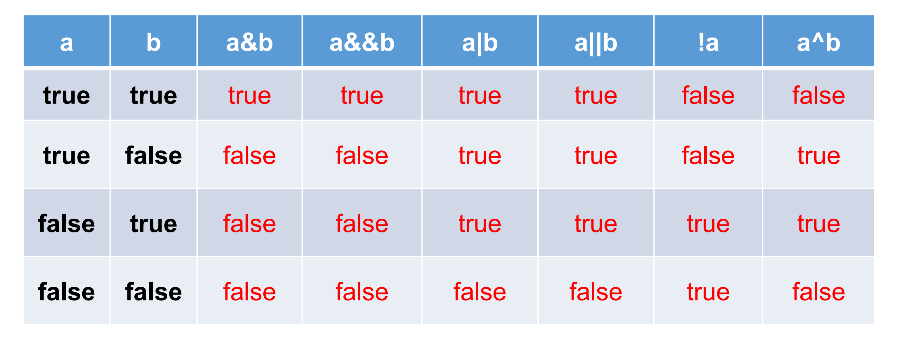
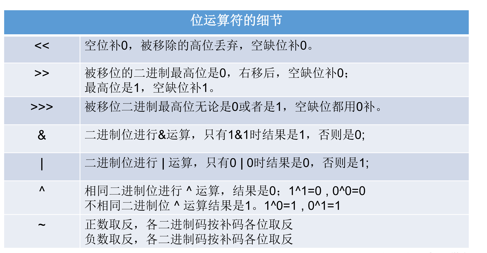

## 运算符

#### 什么是运算符

运算符是一种特殊的符号，用以表示数据的运算、赋值和比较等。

#### 运算符分类详解：

1. 算术运算符

   

   要注意的问题：

   - 如果对负数取模，可以把模数负号忽略不记，如：5%-2=1。 但被模数是负数则不可忽略。此外，取模运算的结果不一定总是整数。

   - 对于除号“/”，它的整数除和小数除是有区别的：整数之间做除法时，只保留整数部分而舍弃小数部分。 例如：intx=3510;x=x/1000*1000; x的结果是？

   - “+”除字符串相加功能外，还能把非字符串转换成字符串.例如：System.out.println(“5+5=”+5+5); //打印结果是？ 5+5=55 ?

2. 赋值运算符

   - 符号：= 

     当“=”两侧数据类型不一致时，可以使用自动类型转换或使用强制类型转换原则进行处理。 

     支持连续赋值。 

   - 扩展赋值运算符： +=, -=, *=, /=, %=

3. 比较运算符（关系运算符）

   

   比较运算符的结果都是boolean型，也就是要么是true，要么是false。 比较运算符“==”不能误写成“=” 。

   

4. 逻辑运算符

   `&`逻辑与  

   `|`逻辑或     

   `！`逻辑非

   `&&` 短路与

   `||`短路或

   ` ^` 逻辑异或

   

   逻辑运算符用于连接布尔型表达式，在Java中不可以写成3<x<6，应该写成x>3 & x<6 。 

   

   - “&”和“&&”的区别：

     单&时，左边无论真假，右边都进行运算；

     双&时，如果左边为真，右边参与运算，如果左边为假，那么右边不参与运算。 

   - “|”和“||”的区别同理，||表示：当左边为真，右边不参与运算。 

   - 异或( ^ )与或( | )的不同之处是：当左右都为true时，结果为false。

     理解：异或，追求的是“异”!

5. 位运算符

   

   位运算是直接对整数的二进制进行的运算

   

   如果是在右移的情况下，

   - 正数来说，空出来的最高位拿0补 ，

   

   - 对于负数来说：

     \>>右移以后，最高空出来的位拿1去补

     \>>> 右移以后，高空出来的位拿0去补

6. 三元运算符

   - 格式：

     

     三元运算符与if-else的联系与区别：

     1）三元运算符可简化if-else语句

     2）三元运算符要求必须返回一个结果。

     3）if后的代码块可有多个语句

#### 运算符优先级

