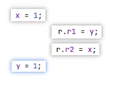
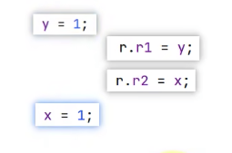
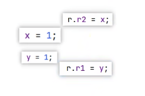

## 多线程编程下的线程安全问题及产生原因


#### 1、为什么多线程下会有线程安全问题

因为在多线程下，java代码的执行并没有先后顺序，线程的执行是根据CPU的调度进行的，多线程下cpu的调度每次都不会一样。


#### 2、有哪些线程安全问题

1. 原子性问题

   - 概念：原子性是指一个操作(或一组操作)在执行过程中，另外一个操作不能插足，这一个操作要么全部执行成功,要么全部执行失败。

   - 例子：多个线程一起获取JVM堆中的一个变量，并且修改这个变量的时候，一个操作一旦开始，就不会被其它的线程干扰。

   - 如何保证原子性：java中要么使用锁、要么CAS操作。

   - java代码演示原子性问题

     

     线程操作资源类

     ```java
     public class WaitAndNotifyThreadResource {
     
         int num;
     
         public int getNum() {
          		
             return num++; //没法保证num++的原子性
         }
     
     }
     ```

     多线程并发复现原子性问题

     ```java
     public static void main(String[] args) throws InterruptedException {
     
       WaitAndNotifyThreadResource res = new WaitAndNotifyThreadResource();
       for (int i=0; i < 2; i++){
         new Thread(()->{
           while (true){
             System.out.println(Thread.currentThread().getName() + "----->" + res.getNum());
     
             try {
               Thread.sleep(100);
             } catch (InterruptedException e) {
               throw new RuntimeException(e);
             }
           }
     
         }).start();
       }
     
     
     }
     ```

     发现执行结果：

     ```java
     Thread-0----->0
     Thread-1----->1
     Thread-0----->3
     Thread-1----->2
     Thread-0----->4
     Thread-1----->4
       ......
     ```

     线程1、线程2会获取到相同的结果。为什么会有相同的值，原因分析！

     

   - 使用java提供的线程安全的方法修复上面的原子性问题

     

     线程操作资源类

     ```java
     public class WaitAndNotifyThreadResource {
     
         private AtomicInteger num = new AtomicInteger(0);
     
         public int getNum() {
             return num.getAndIncrement();
         }
     
     }
     ```

     多线程并发复现原子性问题

     ```java
     public static void main(String[] args) throws InterruptedException {
     
       WaitAndNotifyThreadResource res = new WaitAndNotifyThreadResource();
       for (int i=0; i < 2; i++){
         new Thread(()->{
           while (true){
             System.out.println(Thread.currentThread().getName() + "----->" + res.getNum());
     
             try {
               Thread.sleep(100);
             } catch (InterruptedException e) {
               throw new RuntimeException(e);
             }
           }
     
         }).start();
       }
     
     
     }
     ```

     发现执行结果：

     ```java
     Thread-1----->1
     Thread-0----->0
     Thread-1----->3
     Thread-0----->2
     Thread-0----->4
     Thread-1----->5
     Thread-0----->6
     Thread-1----->7
     Thread-0----->8
     Thread-1----->9
     Thread-0----->10
     Thread-1----->11
     Thread-0----->12
     Thread-1----->13
     Thread-0----->14
       ......
     ```

     并不会出现两个线程获取到相同的结果！

     

2. 可见性问题

   - 概念：在多线程编程中，一个线程对某个共享变量进行更新后，后续的线程可能无法读到这个更新的结果，就会出现可见性问题。

   - 图解：

     

   - 如何保证可见性：使用volatile关键字

   - java代码演示可见性问题

     

     线程操作的资源类

     ```java
     public class Resource {
     
         public boolean flag = false;
     
     }
     ```

     多线程复现可见性问题

     ```java
         public static void main(String[] args) {
           
             Resource rs = new Resource();//初始化上面的资源类
     
             new Thread(()->{
                 try {
                     Thread.sleep(1000L); //A线程休眠1秒
                 } catch (InterruptedException e) {
                     throw new RuntimeException(e);
                 }
                 rs.flag = true; //将资源类中的flag改为true
     
                 System.out.println("Thread----B:" + rs.flag);
     
             }, "B").start(); //启动A线程
     
             new Thread(()->{
                 int i = 0;
                 while(!rs.flag){ //判断资源类的flag属性，如果为false则进行循环
                     i++;
                 }
     
                 System.out.println("Thread----A:" + rs.flag); //循环退出打印
     
             }, "A").start(); //启动B线程
     
         }
     ```

     发现执行结果

     ```java
     Thread----A:true
     ```

     原因分析，A、B线程启动后，A线程一直在执行while(!rs.flag)的循环判断，而B线程休眠1秒后，把rs.flag改为了true，那么改成true后，A线程是不是要退出循环？而实际情况是A线程没有退出循环！复现了我们上面的可见性问题！

     

     

   - 使用volatile修复可见性问题

     只要在线程资源类的属性上加个vilatile关键字就行

     ```java
     public class Resource {
     
         public volatile boolean flag = false;
     
     
     }
     ```

     再观察输出

     ```java
     Thread----A:true
     Thread----B:true
     ```

     证明线程B的修改，对于线程A来说可见了！

     

     

     

3. 有序性问题

- 概念：我们的代码真实的执行过程，不是按照我们编写的代码顺序执行的。即指令重排！指令重排如果是在单线程情况下可以提供程序的性能。但是在多线程情况下会出现线程安全问题！

- 例子：复现有序性非常困难！需要结合第三方的线程插件经过上千万次的线程运行才能复现！

- 如何保证有序性：使用volatile关键字修饰类的成员属性

- 代码演示有序性问题：

  <font color="red">在java8的环境下玩的</font>

  

  使用如下命令创建一个maven项目

  ```shell
  mvn archetype:generate  -DinteractiveMode=false -DarchetypeGroupId=org.openjdk.jcstress -DarchetypeArtifactId=jcstress-java-test-archetype -DarchetypeVersion=0.16 -DgroupId=exam.offer -DartifactId=testJcstress2 -Dversion=1.0
  ```

  -DarchetypeVersion 是指定使用jcstress-core的版本

  创建好项目后，查看是否有如下依赖

  ```xml
  <!-- https://mvnrepository.com/artifact/org.openjdk.jcstress/jcstress-core -->
  <dependency>
    <groupId>org.openjdk.jcstress</groupId>
    <artifactId>jcstress-core</artifactId>
    <version>0.16</version>
  </dependency>
  ```

  编写代码

  ```java
  @JCStressTest // 标记此类为一个并发测试类
  @Outcome(id = {"0,0", "1,1", "0,1"}, expect = Expect.ACCEPTABLE , desc = "ACCEPTABLE")
  @Outcome(id = "1,0", expect = Expect.ACCEPTABLE_INTERESTING, desc = "INTERESTING")
  @State //标记此类是有状态的
  public class TestInstructionReorder {
  
      int x;
      int y;
  
      @Actor //被 @Actor标记的方法在测试的时候，都会开线程来执行
      public void actor1(){
          x = 1;
          y = 1;
      }
  
      @Actor //被 @Actor标记的方法在测试的时候，都会开线程来执行
      public void actor2(II_Result r){
          r.r1 = y; //获取y的值，放到II_Result中
          r.r2 = x; //获取x的值，放到II_Result中
          //最终存到r中去，会跟上面的@Outcome注解中的预期值进行对比，我们看到@Outcome注解中的预期值也是两两一组的。
      }
  }
  ```

  我们来分析下，两个被@Actor修饰的线程，收集到的结果，有哪些可能：

  - 可能性1：

    

    actor1()方法对应线程执行完毕，才执行actor2()方法对应线程，那么预期的结果就是 "1, 1"

    

  - 可能性2：

    

    actor2()方法对应线程执行完毕，才执行actor1()方法对应线程，那么预期的结果就是 "0, 0"

    

  - 可能性3：

    

    actor1()方法对应线程执行了一般，才执行actor2()方法对应线程，那么预期的结果就是 "0, 1"

    

    

    

    有没有可能出现"1,0"的情况？

    理论上来说，不可能！除非发生了指令重排（并非按照我们写的代码顺序去执行！）情况如下：

    

    或

    

    把项目打包，打包完成后，在target目录中会有`jcstress.jar`包，我们打开终端，运行如下命令

    ```shell
    java -jar jcstress.jar -t 我们编写的测试类TestInstructionReorder的全路径
    ```

    随后，jcstress就会开始跑我们写的测试类，发现如下结果

    ```shell
    RESULT        SAMPLES     FREQ       EXPECT  DESCRIPTION
    0, 0    230,892,979   16.93%    Forbidden  No default case provided, assume Forbidden
    0, 1     11,235,342    0.82%    Forbidden  No default case provided, assume Forbidden
    0,0              0    0.00%   Acceptable  ACCEPTABLE
    0,1              0    0.00%   Acceptable  ACCEPTABLE
    1, 0        172,867    0.01%    Forbidden  No default case provided, assume Forbidden
    1, 1  1,121,552,428   82.23%    Forbidden  No default case provided, assume Forbidden
    1,0              0    0.00%  Interesting  INTERESTING
    1,1              0    0.00%   Acceptable  ACCEPTABLE
    ```

    是不是出现了"1,0"的情况？证明指令重排确实存在！

  

  如何解决指令重排呢？

  我们只需要使用volatile关键字就行了！

  我们修改下测试代码

  ```java
  @JCStressTest // 标记此类为一个并发测试类
  @Outcome(id = {"0,0", "1,1", "0,1"}, expect = Expect.ACCEPTABLE , desc = "ACCEPTABLE")
  @Outcome(id = "1,0", expect = Expect.ACCEPTABLE_INTERESTING, desc = "INTERESTING")
  @State //标记此类是有状态的
  public class TestInstructionReorder {
  
      int x;
      volatile int y; 
  
      @Actor //被 @Actor标记的方法在测试的时候，都会开线程来执行
      public void actor1(){
          x = 1;
          y = 1;
      }
  
      @Actor //被 @Actor标记的方法在测试的时候，都会开线程来执行
      public void actor2(II_Result r){
          r.r1 = y; //获取y的值，放到II_Result中
          r.r2 = x; //获取x的值，放到II_Result中
          //最终存到r中去，会跟上面的@Outcome注解中的预期值进行对比，我们看到@Outcome注解中的预期值也是两两一组的。
      }
  }
  ```

  在上面的代码中，我们在 int y 这行加了`volatile`关键字，就解决了指令重排的问题！

  

  原理是，<font color="red">**针对被修饰的变量，在对变量进行写操作的时候会在变量的上方加个内存屏障，阻止上面的代码移到该语句的下面。在对变量进行读操作的时候会在变量的下方加个内存屏障，阻止下面的代码移动到该语句的上面。就阻止了指令的重排**。</font>

  

  