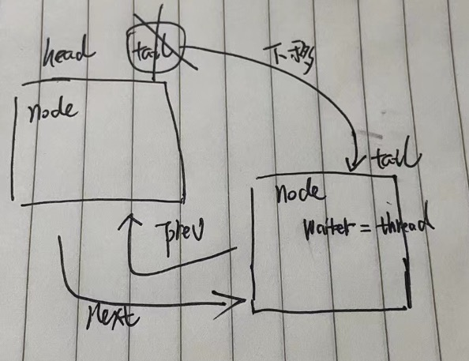

## ReentrantLock的源码分析


我们准备如下的代码去ReentrantLock

```java
public static void main(String[] args) throws InterruptedException {

  ReentrantLock lock = new ReentrantLock(true);
  Condition condition = lock.newCondition();

  //开启第一个线程
  Thread t1 = new Thread(()->{
    try {
      lock.lock(); //获取锁
      Thread.sleep(10000L);
    } catch (InterruptedException e) {
      throw new RuntimeException(e);
    }

    lock.unlock(); //解锁

  }, "t1");
  t1.start();

  //开启第二个线程
  Thread t2 = new Thread(()->{
    try {
      lock.lock(); //获取锁
      Thread.sleep(10000L);

    } catch (InterruptedException e) {
      e.printStackTrace();
    }finally {
      lock.unlock();
    }
  }, "t2");
  t2.start();

  //开启第三个线程
  Thread t3 = new Thread(()->{
    try {
      lock.lock();
      Thread.sleep(10000L);
    } catch (InterruptedException e) {
      e.printStackTrace();
    }finally {
      lock.unlock();
    }
  }, "t3");
  t3.start();
  
}
```

`new ReentrantLock(true/false)`根据你传入的布尔值确定new公平锁还是非公平锁

```java
public ReentrantLock(boolean fair) {
  sync = fair ? new FairSync() : new NonfairSync();
}
```

三个线程启动后，都会执行lock.lock()方法，会进入如下方法

```java
@ReservedStackAccess
final void lock() {
  if (!initialTryLock())
    acquire(1);
}
```

`initialTryLock()`在NonfairSync类（非公平锁）和`FairSync`类（公平锁）中都有各自的实现，我们以NonfairSync类（非公平锁）为例

```java
final boolean initialTryLock() {
  Thread current = Thread.currentThread();
  if (compareAndSetState(0, 1)) { // cas的操作，将AbstractQueuedSynchronizer类state状态由0变为1，只有第一个线程能成功
    setExclusiveOwnerThread(current); //设置 AbstractOwnableSynchronizer类的exclusiveOwnerThread 属性为当前Thread对象。
    return true; //返回true，第一个线程就已经成功获取锁了！
    
  } else if (getExclusiveOwnerThread() == current) { //当一个线程已经获取了lock后，再次调用lock()走这个判断
    int c = getState() + 1;
    if (c < 0) // overflow
      throw new Error("Maximum lock count exceeded");
    setState(c);
    return true;
  } else
    return false; //另外2个线程走这儿，直接返回false！
}
```

回到如下方法中

```java
@ReservedStackAccess
final void lock() {
  if (!initialTryLock()) //只有第一个会返回true，另外两个都会返回false
    acquire(1); //返回false走这个方法
}
```

acquire(1)方法，具体的内容如下

```java
public final void acquire(int arg) {
  if (!tryAcquire(arg)) //先走这儿，再次去尝试获取一次锁
    acquire(null, arg, false, false, false, 0L);
}
```

tryAcquire(arg)方法，在NonfairSync类（非公平锁）和`FairSync`类（公平锁）中都有各自的实现

- NonfairSync类（非公平锁）

  ```java
  protected final boolean tryAcquire(int acquires) {
    if (getState() == 0 && compareAndSetState(0, acquires)) { //getState()获取到当前获取到锁的线程数量， ==0就是没有获取到！前面的条件成立，在调用compareAndSetState(0, acquires)进行cas操作，将AbstractQueuedSynchronizer类state状态由0变为1
      setExclusiveOwnerThread(Thread.currentThread()); //如果上述判断执行成功，证明获取锁成功了，设置 AbstractOwnableSynchronizer类的exclusiveOwnerThread 属性为当前Thread对象。
      return true; //直接返回！
    }
    return false; //否则返回false
  }
  ```

​		非公平锁体现在，获取锁的时候，不管是不是刚刚准备加入到队列中的线程还是队列头节点下的第一个线程，都可以获取锁，


- `FairSync`类（公平锁）

  ```java
  protected final boolean tryAcquire(int acquires) {
    if (getState() == 0 && !hasQueuedPredecessors() &&  //hasQueuedPredecessors()判断当前线程是不是队列中的头节点的下一个节点，如果不是则不能获取锁，保证了获取锁的公平性！
        compareAndSetState(0, acquires)) {
      setExclusiveOwnerThread(Thread.currentThread());
      return true;
    }
    return false;
  }
  ```

  公平锁提现在，获取锁的时候，会通过hasQueuedPredecessors()判断当前线程是不是队列中的头节点的下一个节点，如果不是则不能获取锁，反之才能获取锁！


回到如下方法中

```java
public final void acquire(int arg) {
  if (!tryAcquire(arg)) //再次去尝试获取一次锁
    acquire(null, arg, false, false, false, 0L); //再次去尝试获取一次锁失败了
}
```

再次尝试获取锁失败了，就会执行acquire(.....)方法

```java
final int acquire(Node node, int arg, boolean shared,
                      boolean interruptible, boolean timed, long time) {
  Thread current = Thread.currentThread();
  //初始化一些参数
  byte spins = 0, postSpins = 0;   
  boolean interrupted = false, first = false;
  Node pred = null;                


	//这儿进入一个死循环
  for (;;) {
    if (!first && (pred = (node == null) ? null : node.prev) != null &&
        !(first = (head == pred))) {
      if (pred.status < 0) {
        cleanQueue();        
        continue;
      } else if (pred.prev == null) {
        Thread.onSpinWait(); 
        continue;
      }
    }
    if (first || pred == null) {
      boolean acquired;
      try {
        if (shared)
          acquired = (tryAcquireShared(arg) >= 0);
        else
          acquired = tryAcquire(arg); //每一次循环都尝试获取一次锁，如果线程从挂起中被唤醒也是循环去获取锁
      } catch (Throwable ex) {
        cancelAcquire(node, interrupted, false);
        throw ex;
      }
      if (acquired) { //获取到锁
        if (first) { //如果当前节点的前一个节点是head节点
          node.prev = null; //将head节点断开，方便被gc回收
          head = node; //将当前节点设置为head节点
          pred.next = null; //将head节点的next节点与当前节点断开
          node.waiter = null; //设置当前节点的等待状态为null
          if (shared)
            signalNextIfShared(node);
          if (interrupted)
            current.interrupt();
        }
        return 1;
      }
    }
    if (node == null) {//第一次循环node为null
      if (shared)
        node = new SharedNode();
      else
        node = new ExclusiveNode(); //第一次循环，创建一个ExclusiveNode对象，对象中有 Node prev、 Node next、Thread waiter、int status 这四大属性。
    } else if (pred == null) { //第二次循环pred为null。    第三次循环pred为null。
      node.waiter = current; //第二次循环设置node的waiter属性为当前线程。
      Node t = tail; //第二次循环tail为null。第三次循环tail不为null
      node.setPrevRelaxed(t); // 第二次循环设置node的prev属性为null。   第三次循环设置node的prev属性为AbstractQueuedSynchronizer类的head。
      if (t == null) //第二次循环tail为null。第三次循环tail不为null
        tryInitializeHead(); //第二次循环，new一个ExclusiveNode节点，并将AbstractQueuedSynchronizer类的head设置为当前创建的ExclusiveNode，并将head节点也赋值给tail
      else if (!casTail(t, node)) //第三次循环，将AbstractQueuedSynchronizer类的tail设置为当前的node
        node.setPrevRelaxed(null);  
      else
        t.next = node; //第三次循环，将AbstractQueuedSynchronizer类的head对应的node的next属性修改为当前的node
    } else if (first && spins != 0) {
      --spins;                       
      Thread.onSpinWait();
    } else if (node.status == 0) {
      node.status = WAITING;  //将当前的node的status设置为WAITING  
    } else {
      long nanos;
      spins = postSpins = (byte)((postSpins << 1) | 1);
      if (!timed)
        LockSupport.park(this); //将线程挂起，那么线程就停在这儿，不会再循环了，等待LockSupport.unpark(Thread thread)唤醒线程，然后从这儿继续执行！
      else if ((nanos = time - System.nanoTime()) > 0L)
        LockSupport.parkNanos(this, nanos);
      else
        break;
      node.clearStatus();
      if ((interrupted |= Thread.interrupted()) && interruptible)
        break;
    }
  }
  return cancelAcquire(node, interrupted, interruptible);
}
```

上面代码的第二次循环操作完成后，会形成如下图的结构：


上面代码的第三次循环后，会形成如下图的结构



如果有线程在并发操作，多个线程调用后，会形成如下图的结构


形成了一个双向链表！


当一个线程的业务操作完毕后，会调用lock.unlock()方法，unlock()的具体实现

```java
public void unlock() {
  sync.release(1);
}
```

```java
public final boolean release(int arg) {
  if (tryRelease(arg)) { //尝试释放锁
    signalNext(head); //释放锁成功后，唤醒head节点后的节点
    return true;
  }
  return false;
}
```

调用`tryRelease(arg)`释放锁

```java
@ReservedStackAccess
protected final boolean tryRelease(int releases) {
  int c = getState() - releases; //getState()获取到当前获取到锁的线程数量，然后 -1
  if (getExclusiveOwnerThread() != Thread.currentThread())
    throw new IllegalMonitorStateException();
  boolean free = (c == 0);
  if (free) //free 为true就可以释放锁
    setExclusiveOwnerThread(null);
  setState(c);
  return free; 
}
```

调用`signalNext(head)`去唤醒head后的节点的具体实现

```java
private static void signalNext(Node h) {
  Node s;
  if (h != null && (s = h.next) != null && s.status != 0) {
    s.getAndUnsetStatus(WAITING); 
    LockSupport.unpark(s.waiter); //获取到head节点的下一个节点中的waiter线程，将其唤醒
  }
}
```


