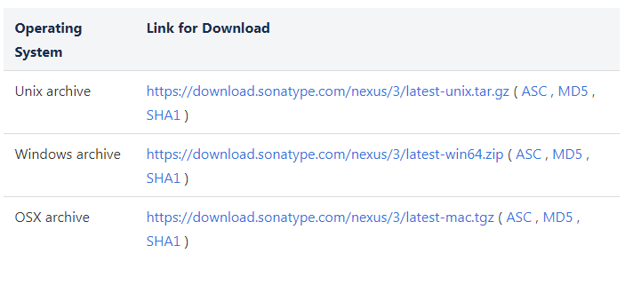

## 宿主机安装maven私有仓库

> 注意：Nexus是一个Java服务器应用程序，安装需要 **jdk1.8**以上的版本。

#### 1、下载安装maven仓库

下载地址：https://help.sonatype.com/repomanager3/download

下载解压后，用命令行到解压目录的bin目录下运行 ./nexus run），启动完成后会显示“Started Sonatype Nexus”：

#### 2、访问Nexus管理后台

Nexus管理后台地址：http://IP:8081/

点击右上角Sign in登录，默认账号admin、密码在登录的时候会提示修改

