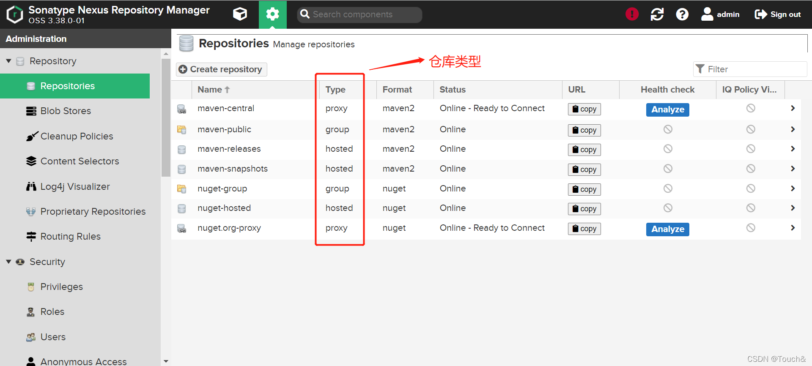

## nexus中仓库的种类

hosted：本地仓库，通常我们会部署自己的构件到这一类型的仓库。比如公司自己开发的jar包。如果本地仓库被group关联，那么我们deploy到本地仓库的包在group中也同样存在！

proxy：代理仓库，比如我们我们的项目需要maven中央仓库中的jar包，使用代理仓库，先会判断我们的代理仓库中有没有，没有代理仓库会去中央仓库拉包并存到代理仓库中，如果有就直接代理仓库中的包。如果代理仓库被group关联，那么我们在代理仓库的包在group中也同样存在！

group：仓库组，用来合并多个hosted、proxy仓库，当你的项目希望使用多个repository仓库时就不需要多次引用了，只需要引用一个group即可。只跟拉取依赖相关，跟项目的deploy无关

如下图：

