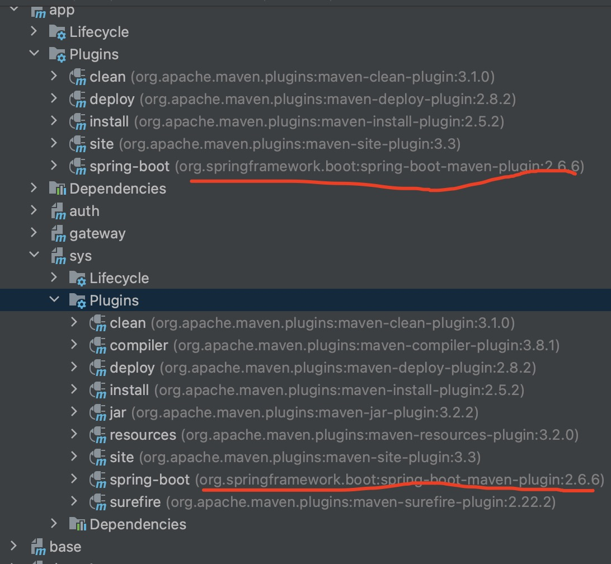

## 操作步骤

> 在使用modules标签创建多module项目的基础上，继续操作


我需要创建一个如下图的多父子module的项目


分析：

​	包分析：

	1. base做为整个项目的最底层package，base的父包是spring-boot-starter-parent。
	1. demo1、demo2、demo3的父包是base。
	1. app的父包是base。
	1. sys、gateway、auth的父包是app。


​	功能分析：

1.  base包的作用是使用<dependencyManagement>标签规定子包中需要引入依赖的版本，使用<pluginManagement>标签规定子包中需要使用的插件的版本和基本配置，使用<plugins>标签引入一些公共要使用的插件，使用<distributionManagement>标签配置项目包的deploy的仓库信息，使用<dependency>标签引入包，比如spring-boot-starter-web。从父包spring-boot-starter-parent中继承包依赖信息、包的版本规定信息、插件的依赖信息、插件的版本规定和配置信息。
1.  demo1、demo2、demo3包，继承父包的依赖和<font color="red">父包的版本</font>，引入自己的依赖完善自己的业务
1.  app包的作用是使用<dependencyManagement>标签规定子包中需要引入依赖的版本，使用<pluginManagement>标签规定子包中需要使用的插件的版本和基本配置，使用<plugins>标签引入一些公共要使用的插件，使用<dependency>标签引入包。从父包base中继承包依赖信息、包的版本规定信息、插件的依赖信息、插件的版本规定和配置信息。
1.  sys、gateway、auth包，继承父包的依赖和<font color="red">父包的版本</font>，引入自己的依赖完善自己的业务。


#### 具体操作

1. 创建一个module名叫base。

2. 因为base是做为底层的父包，有聚合包的功能，所以需要在其pom.xml文件中添加

   ```xml
   <packaging>pom</packaging>
   ```

   

3. 修改根目录的pom.xml，添加<module>base</module>即可

4. 修改demo1、demo2、demo3的pom.xml文件，将<parent></parent>之间的包，换成如下

   ```xml
   <parent>
     <groupId>com.example</groupId>
     <artifactId>base</artifactId>
     <version>0.0.1-SNAPSHOT</version>
     <relativePath>../base</relativePath>  <!-- 注意：这儿必须这样写才能找到base模块的pom.xml文件 -->
   </parent>
   
   ```

5. 因为在base模块中已经引入了spring-boot-starter-web，那么demo1、demo2、demo3中的pom.xml文件就可以去掉了

   ```xml
   <dependency> <!-- 干掉就行了 -->
     <groupId>org.springframework.boot</groupId>
     <artifactId>spring-boot-starter-web</artifactId>
   </dependency>
   ```

6. 创建一个module名叫app。

7. 修改app这个moduile的parent信息

   ```xml
   <parent>
     <groupId>com.example</groupId>
     <artifactId>base</artifactId>
     <version>0.0.1-SNAPSHOT</version>
     <relativePath>../base</relativePath>
   </parent>
   ```

8. 因为在base模块中已经引入了spring-boot-starter-web，那么app中的pom.xml文件就可以去掉了

9. 修改根目录的pom.xml，添加<module>app</module>即可

10. 删除app这个module下src及其子文件

11. 因为app下也有子模块，所以要往app中的pom.xml文件中，添加如下代码

    ```xml
    <packaging>pom</packaging>
    <modules>
    
    </modules>
    ```

12. 在app下创建module名为sys。

13. 修改app模块的pom.xml文件，添加

    ```xml
    <module>sys</module>
    ```

14. 修改sys模块的pom文件，修改其<parent>标签，指定sys的父包为app

    ```xml
    <parent>
      <groupId>com.example</groupId>
      <artifactId>app</artifactId>
      <version>0.0.1</version>
      <relativePath>../</relativePath> <!-- 这儿默认是../是满足要求的 -->
    </parent>
    ```

15. 注意sys的版本，是沿用父项目的版本，而自己不指定版本

    ```xml
    <artifactId>sys</artifactId>
    <name>sys</name>
    <description>sys</description>
    ```

    包括groupId也是沿用父项目的版本！

15. 因为在base模块中已经引入了spring-boot-starter-web，那么sys中的pom.xml文件就可以去掉了

    <font color="red">这儿充分证明了，父包中的父包中的....N个父包的<dependency>具体隔代的传递性！</font>

16. 按照sys的创建步骤，继续创建gateway、auth模块。

17. 在sys模块中引入依赖lombok是无需指定版本的

    ```xml
    <dependency>
      <groupId>org.projectlombok</groupId>
      <artifactId>lombok</artifactId>
    </dependency>
    ```

    因为在其父包app的父包base的父包spring-boot-starter-parent的父包spring-boot-dependencies中使用<dependencyManagement>标签定好了lombok的版本，所以这儿是不用指定版本的！

    <font color="red">这儿充分证明了，父包中的父包中的....N个父包的<dependencyManagement>具有隔代的传递性！</font>
    
17. 在app模块的pom.xml文件中使用<dependencyManagement>标签去设定一个mybatis-plus的版本

    ```xml
    <dependency>    
      <groupId>com.baomidou</groupId>
      <artifactId>mybatis-plus-boot-starter</artifactId>
      <version>3.4.1</version>
    </dependency>
    ```
    
20. 在sys模块中，引入mybatis-plus-boot-starter，也是不需要加版本的，因为在app的pom.xml文件中已经定义好了版本

    ```xml
    <dependency>
      <groupId>com.baomidou</groupId>
      <artifactId>mybatis-plus-boot-starter</artifactId>
    </dependency>
    ```

21. 因为在base模块中已经引入了spring-boot-maven-plugin插件，那么在app模块和sys模块中就不用重复引入该插件，就可以删除掉关于spring-boot-maven-plugin插件的内容

    ```xml
    <build>
      <plugins>
        <plugin>
          <groupId>org.springframework.boot</groupId>
          <artifactId>spring-boot-maven-plugin</artifactId>
        </plugin>
      </plugins>
    </build>
    ```

    删掉之后，如下图 spring-boot-maven-plugin还是被app和sys依赖的

    

    但是，如果把base中的spring-boot-maven-plugin插件删除了，你会发现如下图

    

    spring-boot-maven-plugin插件不见了！

    <font color="red">这儿充分证明了，父包中的父包中的....N个父包的<plugin>具有隔代的传递性！</font>

​		同样的，我们在base、app、sys中引入spring-boot-maven-plugin插件，都不要写版本和配置细节，因为在spring-boot-dependencies中的<pluginManagement>标签中已经配置好了spring-boot-maven-plugin插件的版本和配置细节，那么就充分证明了，<font color="red">父包中的父包中的.....N个父包的<pluginManagement>具有隔N代的传递性！</font>