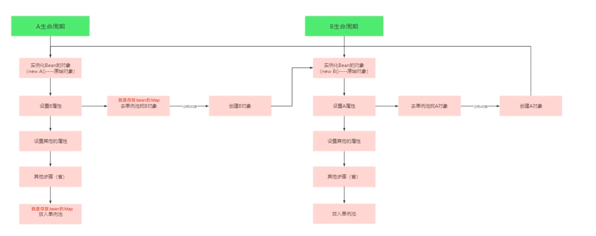
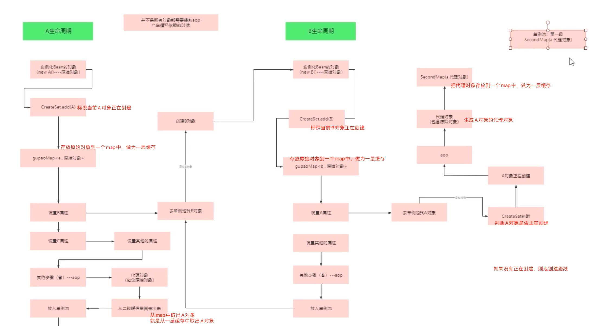

## springbean循环依赖的解决


#### 什么是循环依赖

在A类中依赖B类，在B类中依赖A类

```java
class A{
  @Autowired
  public B b;
}

Class B{
  @Autowired
  public A a;
}
```

在Bean的生命周期范围内（Bean的生命周期是一步一步往下走的，卡在哪一步就不会往下走），第三步是填充对象的属性，上面A类中有属性B类、B类中有属性A类，都是去Bean的Map中去找对应的Bean对象，没有该Bean对象就会去创建对应的Bean对象，就会发生一个死循环，如下图：




#### 为什么二级缓存解决不了循环依赖

- 什么是二级缓存

  就是在初始化A对象之后，填充A对象属性之前，把初始化好的A对象存放到一个map中，后续如果一个对象B中的属性要使用到A对象，那么直接从这个map中去对象A直接使用，就不会存在循环依赖的问题！如下图：

  

- 二级缓存存在的问题

  对象在整个spring bean的生命周期中，最后放入到map中供开发者使用的的A对象的代理对象，不是原始的A对象（因为要经过BeanPostProcess之后要有aop的能力）所以最后放入到map中的都是一个A对象的代理对象，而我们现在使用二级缓存，在填充对象属性的时候其实放入的都是原始对象，而不是具体aop能力的代理对象，而最后往map中存放的是有aop能力的代理对象。正常的情况下，对象属性中要存放的都是具体aop能力的代理对象，这里显然就不对了！所以不能用二级缓存！


#### 三级缓存为什么能解决问题

- 什么是三级缓存

  就是在初始化A对象之后，填充A对象属性之前，把初始化好的A对象存放到一个map中，后续如果一个对象B中的属性要使用到A对象，那么判断A对象是否正在初始化且最终的map中没有A对象。从这个map中取对象A进行aop的相关操作，放到一个新的map中，后面需要用的A对象的话，从这个新的map中去取就可以，就不会存在循环依赖的问题！如下图：
  
  
  
  单例池是一级缓存
  
  存放原始对象的是二级缓存
  
  存放对二级缓存中的原始对象进行aop代理一段lambda表达式是三级缓存

​		


