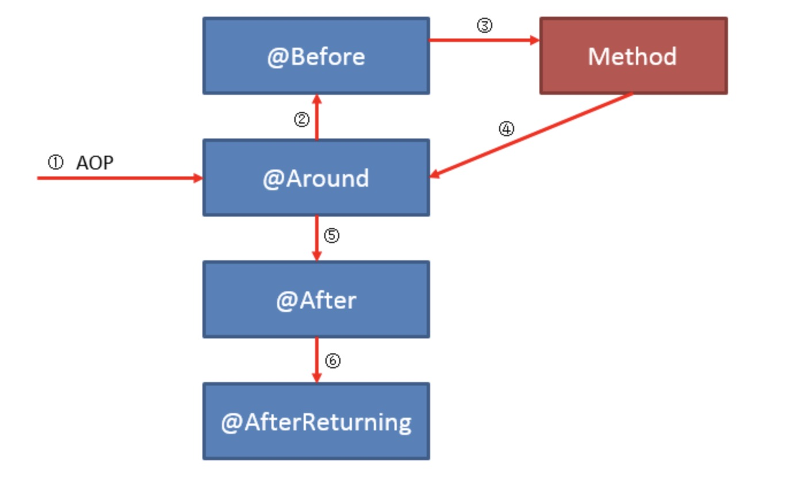

## @Aspect注解使用AOP功能

一、引入依赖：

```xml
<dependency>
  <groupId>org.springframework.boot</groupId>
  <artifactId>spring-boot-starter-aop</artifactId>
</dependency>
```


二、编写切面即可使用

```java
package com.example.demolog.aop;


import lombok.extern.slf4j.Slf4j;
import org.aspectj.lang.JoinPoint;
import org.aspectj.lang.ProceedingJoinPoint;
import org.aspectj.lang.annotation.*;
import org.springframework.stereotype.Component;

@Slf4j
@Aspect
@Component
public class HelloAspect {

    @Pointcut("execution(public * com.banmoon.test.controller..*.*(..) throws Exception)")
    public void pointcut() {
    }

    @Before("pointcut()")
    public void before(JoinPoint point){
        log.info("前置通知");
    }

    @After("pointcut()")
    public void after(JoinPoint point) {
        log.info("后置通知");
    }

    @Around("pointcut()")
    public Object around(ProceedingJoinPoint joinPoint) {
        log.info("环绕通知");
        try {

            // 执行方法，连接点
            Object result = joinPoint.proceed();

            return result;
        } catch (Throwable throwable) {
            return throwable.getMessage();
        }
    }

    @AfterReturning("pointcut()")
    public void afterReturning(JoinPoint point) {
        log.info("返回通知");
    }

    @AfterThrowing(value = "pointcut()", throwing = "t")
    public void afterThrowing(JoinPoint point, Throwable t) {
        log.info("异常通知");
    }

}


```


三、aop执行流程：



四、aop的表达式解析


常用表达式：

```java
// 所有方法
execution(* *..*(..))
// 指定参数，即入参本身的类型，不能放其接口、父类
execution(* *..*(java.lang.String, java.lang.String)
// 指定方法前缀
execution(* *..*.prefix*(..))
// 指定方法后缀
execution(* *..*.*suffix(..))
// 组合，增强所有方法，但是去掉指定前缀和指定后缀的方法
execution(* *..*(..)) && (!execution(* *..prefix*(..)) || !execution(* *..*suffix(..)))

```


五、在aop中可以使用如下方法获取到切面的方法，然后还可以获取到方法上的切面，从而拿到切面的属性数据

```java
MethodSignature signature = (MethodSignature) proceedingJoinPoint.getSignature();

注解类 zhujielei = signature.getMethod().getDeclaredAnnotation(注解名.class)

zhujielei.xxxx();//这儿是获取到注册中的属性
```


