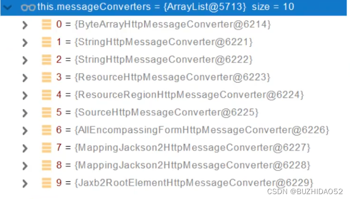

## springboot响应处理源码分析


#### 尝试写一个controller返回一个UserVo给用户

```java
@Slf4j
@RestController
public class IndexController {
    @PostMapping("/add-user")
    public UserVo addUser(@CurrentUser UserVo userInfo){
        return userInfo;
    }

}

```

当用户调用的时候，会直接返回json数据

```json
{
    "age": 91,
    "name": "tangwei",
    "score": 100.0
}
```

为什么会直接返回json呢？


#### 源码分析

我们回到`springboot请求处理源码分析`一文的`doDispatch方法中`，代码如下

```java
protected void doDispatch(HttpServletRequest request, HttpServletResponse response) throws Exception {
  // 封装一下Request请求
  HttpServletRequest processedRequest = request;
  // 初始化HandlerExecutionChain
  HandlerExecutionChain mappedHandler = null;
  boolean multipartRequestParsed = false;

  WebAsyncManager asyncManager = WebAsyncUtils.getAsyncManager(request);

  try {
    ModelAndView mv = null;
    Exception dispatchException = null;

    try {
      // 检查是否文件上传
      processedRequest = checkMultipart(request);
      multipartRequestParsed = (processedRequest != request);
      // 寻找到Request对应哪一个Hander（controller）方法
      mappedHandler = getHandler(processedRequest);
      if (mappedHandler == null) {
        noHandlerFound(processedRequest, response);
        return;
      }

      // Determine handler adapter for the current request.
      HandlerAdapter ha = getHandlerAdapter(mappedHandler.getHandler());

      // Process last-modified header, if supported by the handler.
      String method = request.getMethod();
      boolean isGet = "GET".equals(method);
      if (isGet || "HEAD".equals(method)) {
        long lastModified = ha.getLastModified(request, mappedHandler.getHandler());
        if (new ServletWebRequest(request, response).checkNotModified(lastModified) && isGet) {
          return;
        }
      }

      if (!mappedHandler.applyPreHandle(processedRequest, response)) {
        return;
      }

      // Actually invoke the handler.
      mv = ha.handle(processedRequest, response, mappedHandler.getHandler());

      if (asyncManager.isConcurrentHandlingStarted()) {
        return;
      }

      applyDefaultViewName(processedRequest, mv);
      mappedHandler.applyPostHandle(processedRequest, response, mv);
    }
    catch (Exception ex) {
      dispatchException = ex;
    }
    catch (Throwable err) {
      // As of 4.3, we're processing Errors thrown from handler methods as well,
      // making them available for @ExceptionHandler methods and other scenarios.
      dispatchException = new NestedServletException("Handler dispatch failed", err);
    }
    processDispatchResult(processedRequest, response, mappedHandler, mv, dispatchException);
  }
  catch (Exception ex) {
    triggerAfterCompletion(processedRequest, response, mappedHandler, ex);
  }
  catch (Throwable err) {
    triggerAfterCompletion(processedRequest, response, mappedHandler,
                           new NestedServletException("Handler processing failed", err));
  }
  finally {
    if (asyncManager.isConcurrentHandlingStarted()) {
      // Instead of postHandle and afterCompletion
      if (mappedHandler != null) {
        mappedHandler.applyAfterConcurrentHandlingStarted(processedRequest, response);
      }
    }
    else {
      // Clean up any resources used by a multipart request.
      if (multipartRequestParsed) {
        cleanupMultipart(processedRequest);
      }
    }
  }
}


```

调用`ha.handle()`执行目标方法

```java
// Actually invoke the handle 
mv = ha.handle(processedRequest, response, mappedHandler.getHandler());
```

进入后发现执行 HandleInternal

```java
return handleInternal(request, response, (HandlerMethod) handler);
```

再深入发现进入了RequestMappingHandlerAdapter类中的handleInternal方法

```java
@Override
protected ModelAndView handleInternal(HttpServletRequest request,
                                      HttpServletResponse response, HandlerMethod handlerMethod) throws Exception {

  ModelAndView mav;
  checkRequest(request);

  // Execute invokeHandlerMethod in synchronized block if required.
  if (this.synchronizeOnSession) {
    HttpSession session = request.getSession(false);
    if (session != null) {
      Object mutex = WebUtils.getSessionMutex(session);
      synchronized (mutex) {
        mav = invokeHandlerMethod(request, response, handlerMethod);
      }
    }
    else {
      // No HttpSession available -> no mutex necessary
      mav = invokeHandlerMethod(request, response, handlerMethod);
    }
  }
  else {
    // No synchronization on session demanded at all...
    mav = invokeHandlerMethod(request, response, handlerMethod);
  }

  if (!response.containsHeader(HEADER_CACHE_CONTROL)) {
    if (getSessionAttributesHandler(handlerMethod).hasSessionAttributes()) {
      applyCacheSeconds(response, this.cacheSecondsForSessionAttributeHandlers);
    }
    else {
      prepareResponse(response);
    }
  }

  return mav;
}
```

其中`invokeHandlerMethod(.....)`方法，我们进去

```java
@Nullable
protected ModelAndView invokeHandlerMethod(HttpServletRequest request,
                                           HttpServletResponse response, HandlerMethod handlerMethod) throws Exception {

  ServletWebRequest webRequest = new ServletWebRequest(request, response);
  WebDataBinderFactory binderFactory = getDataBinderFactory(handlerMethod);
  ModelFactory modelFactory = getModelFactory(handlerMethod, binderFactory);

  ServletInvocableHandlerMethod invocableMethod = createInvocableHandlerMethod(handlerMethod);
  if (this.argumentResolvers != null) {
    invocableMethod.setHandlerMethodArgumentResolvers(this.argumentResolvers);
  }
  if (this.returnValueHandlers != null) {
    invocableMethod.setHandlerMethodReturnValueHandlers(this.returnValueHandlers);
  }
  invocableMethod.setDataBinderFactory(binderFactory);
  invocableMethod.setParameterNameDiscoverer(this.parameterNameDiscoverer);

  ModelAndViewContainer mavContainer = new ModelAndViewContainer();
  mavContainer.addAllAttributes(RequestContextUtils.getInputFlashMap(request));
  modelFactory.initModel(webRequest, mavContainer, invocableMethod);
  mavContainer.setIgnoreDefaultModelOnRedirect(this.ignoreDefaultModelOnRedirect);

  AsyncWebRequest asyncWebRequest = WebAsyncUtils.createAsyncWebRequest(request, response);
  asyncWebRequest.setTimeout(this.asyncRequestTimeout);

  WebAsyncManager asyncManager = WebAsyncUtils.getAsyncManager(request);
  asyncManager.setTaskExecutor(this.taskExecutor);
  asyncManager.setAsyncWebRequest(asyncWebRequest);
  asyncManager.registerCallableInterceptors(this.callableInterceptors);
  asyncManager.registerDeferredResultInterceptors(this.deferredResultInterceptors);

  if (asyncManager.hasConcurrentResult()) {
    Object result = asyncManager.getConcurrentResult();
    mavContainer = (ModelAndViewContainer) asyncManager.getConcurrentResultContext()[0];
    asyncManager.clearConcurrentResult();
    LogFormatUtils.traceDebug(logger, traceOn -> {
      String formatted = LogFormatUtils.formatValue(result, !traceOn);
      return "Resume with async result [" + formatted + "]";
    });
    invocableMethod = invocableMethod.wrapConcurrentResult(result);
  }

  invocableMethod.invokeAndHandle(webRequest, mavContainer);
  if (asyncManager.isConcurrentHandlingStarted()) {
    return null;
  }

  return getModelAndView(mavContainer, modelFactory, webRequest);
}
```

- invocableMethod.setHandlerMethodArgumentResolvers(this.argumentResolvers);把系统中所有的参数解析器获取到。

- invocableMethod.setHandlerMethodReturnValueHandlers(this.returnValueHandlers); 把系统中所有的返回值解析器获取到。

- invocableMethod.invokeAndHandle(webRequest, mavContainer); 执行 invokeForRequest 方法，断点就会直接到 Controller中去，所以 invokeForRequest 方法中就是最终的方法

  ```java
  public Object invokeForRequest(NativeWebRequest request, @Nullable ModelAndViewContainer mavContainer, Object... providedArgs) throws Exception {
    // 确定所有参数，将所有参数获取在 args 这个数组中，调用Controller中的方法时传入这个参数
    Object[] args = this.getMethodArgumentValues(request, mavContainer, providedArgs);
    if (logger.isTraceEnabled()) {
      logger.trace("Arguments: " + Arrays.toString(args));
    }
    // 通过反射来执行我们 Controller 中的方法
    return this.doInvoke(args);
  }
  
  ```

  我们再回头看invokeAndHandle(......)方法

  ```java
  public void invokeAndHandle(ServletWebRequest webRequest, ModelAndViewContainer mavContainer,
  			Object... providedArgs) throws Exception {
  
    Object returnValue = invokeForRequest(webRequest, mavContainer, providedArgs);
    setResponseStatus(webRequest);
  
    if (returnValue == null) {
      if (isRequestNotModified(webRequest) || getResponseStatus() != null || mavContainer.isRequestHandled()) {
        disableContentCachingIfNecessary(webRequest);
        mavContainer.setRequestHandled(true);
        return;
      }
    }
    else if (StringUtils.hasText(getResponseStatusReason())) {
      mavContainer.setRequestHandled(true);
      return;
    }
  
    mavContainer.setRequestHandled(false);
    Assert.state(this.returnValueHandlers != null, "No return value handlers");
    try {
      this.returnValueHandlers.handleReturnValue(returnValue, getReturnValueType(returnValue), mavContainer, webRequest);
    }
    catch (Exception ex) {
      if (logger.isTraceEnabled()) {
        logger.trace(formatErrorForReturnValue(returnValue), ex);
      }
      throw ex;
    }
  }
  ```

  调用了`invokeForRequest`方法执行对应的方法后，调用了`setResponseStatus(webRequest)`，我们需要的返回的所有<font color="red"> **数据值**</font>已经在returnValue里面了！打个断点看下！

  

  然后继续执行invokeAndHandle(.....)方法，直到`this.returnValueHandlers.handleReturnValue(returnValue, getReturnValueType(returnValue), mavContainer, webRequest);`这段代码中，getReturnValueType(returnValue)对我们的返回值进行了处理，得到了我们现在的返回值<font color="red"> **类型**</font>是一个UserVo类型的对象。

  

  然后通过`this.returnValueHandlers.handleReturnValue(.....)`进入到handleReturnValue方法内部，

  ```java
  	@Override
  	public void handleReturnValue(@Nullable Object returnValue, MethodParameter returnType,
  			ModelAndViewContainer mavContainer, NativeWebRequest webRequest) throws Exception {
  
  		HandlerMethodReturnValueHandler handler = selectHandler(returnValue, returnType);
  		if (handler == null) {
  			throw new IllegalArgumentException("Unknown return value type: " + returnType.getParameterType().getName());
  		}
  		handler.handleReturnValue(returnValue, returnType, mavContainer, webRequest);
  	}
  ```

  进入`selectHandler`方法内

  ```java
  	@Nullable
  	private HandlerMethodReturnValueHandler selectHandler(@Nullable Object value, MethodParameter returnType) {
  		boolean isAsyncValue = isAsyncReturnValue(value, returnType);
  		for (HandlerMethodReturnValueHandler handler : this.returnValueHandlers) {
  			if (isAsyncValue && !(handler instanceof AsyncHandlerMethodReturnValueHandler)) {
  				continue;
  			}
  			if (handler.supportsReturnType(returnType)) {
  				return handler;
  			}
  		}
  		return null;
  	}
  ```

  遍历所有的ReturnValueHandler，通过每一个ReturnValueHandler的supportsReturnType方法判断是否匹配！

  如何判断是否匹配？<font color="red">**我们传入了我们的返回值类型returnType（person类型），是不是和当前循环到的返回值处理器类型一样，如果不一样就下一个**</font>，但是`RequestResponseBodyMethodProcessor`这个返回值解析器是判断返回的方法是否有@ResponseBody注解。

  springboot默认支持以下的返回值

  

  我们现在确定了RequestResponseBodyMethodProcessor`这个返回值解析器，我们回到handleReturnValue方法

  ```java
  	@Override
  	public void handleReturnValue(@Nullable Object returnValue, MethodParameter returnType,
  			ModelAndViewContainer mavContainer, NativeWebRequest webRequest) throws Exception {
  
  		HandlerMethodReturnValueHandler handler = selectHandler(returnValue, returnType);
  		if (handler == null) {
  			throw new IllegalArgumentException("Unknown return value type: " + returnType.getParameterType().getName());
  		}
  		handler.handleReturnValue(returnValue, returnType, mavContainer, webRequest);
  	}
  ```

  随后进入具体的返回值解析器中的handleReturnValue方法中去解析返回值！以下是RequestResponseBodyMethodProcessor的方法

  ```java
  @Override
  public void handleReturnValue(@Nullable Object returnValue, MethodParameter returnType,
        ModelAndViewContainer mavContainer, NativeWebRequest webRequest)
        throws IOException, HttpMediaTypeNotAcceptableException, HttpMessageNotWritableException {
  
     mavContainer.setRequestHandled(true);
     ServletServerHttpRequest inputMessage = createInputMessage(webRequest);
     ServletServerHttpResponse outputMessage = createOutputMessage(webRequest);
  
     if (returnValue instanceof ProblemDetail detail) {
        outputMessage.setStatusCode(HttpStatusCode.valueOf(detail.getStatus()));
        if (detail.getInstance() == null) {
           URI path = URI.create(inputMessage.getServletRequest().getRequestURI());
           detail.setInstance(path);
        }
     }
  
     // Try even with null return value. ResponseBodyAdvice could get involved.
     writeWithMessageConverters(returnValue, returnType, inputMessage, outputMessage);
  }
  ```

  在writeWithMessageConverters中会拼装http的响应头等信息，还有把我们方法返回的数据转换成需要的格式。比如转换成json格式等等。

  ```java
  if (selectedMediaType != null) {
  			selectedMediaType = selectedMediaType.removeQualityValue();
  			for (HttpMessageConverter<?> converter : this.messageConverters) {
  				GenericHttpMessageConverter genericConverter =
  						(converter instanceof GenericHttpMessageConverter ghmc ? ghmc : null);
  				if (genericConverter != null ?
  						((GenericHttpMessageConverter) converter).canWrite(targetType, valueType, selectedMediaType) :
  						converter.canWrite(valueType, selectedMediaType)) {
  					body = getAdvice().beforeBodyWrite(body, returnType, selectedMediaType,
  							(Class<? extends HttpMessageConverter<?>>) converter.getClass(),
  							inputMessage, outputMessage);
  					if (body != null) {
  						Object theBody = body;
  						LogFormatUtils.traceDebug(logger, traceOn ->
  								"Writing [" + LogFormatUtils.formatValue(theBody, !traceOn) + "]");
  						addContentDispositionHeader(inputMessage, outputMessage);
  						if (genericConverter != null) {
  							genericConverter.write(body, targetType, selectedMediaType, outputMessage);
  						}
  						else {
  							((HttpMessageConverter) converter).write(body, selectedMediaType, outputMessage);
  						}
  					}
  					else {
  						if (logger.isDebugEnabled()) {
  							logger.debug("Nothing to write: null body");
  						}
  					}
  					return;
  				}
  			}
  		}
  ```

  其中this.messageConverters中放着所有的HttpMessageConverter

  

