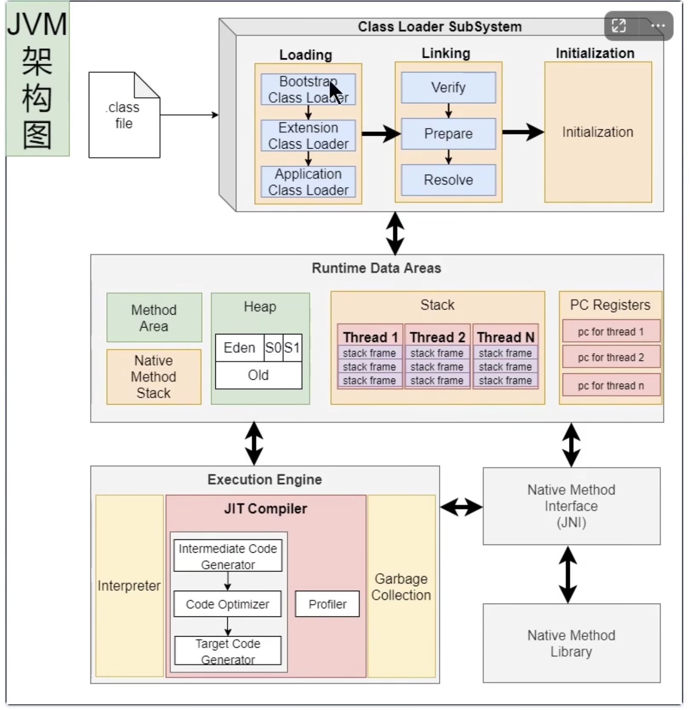
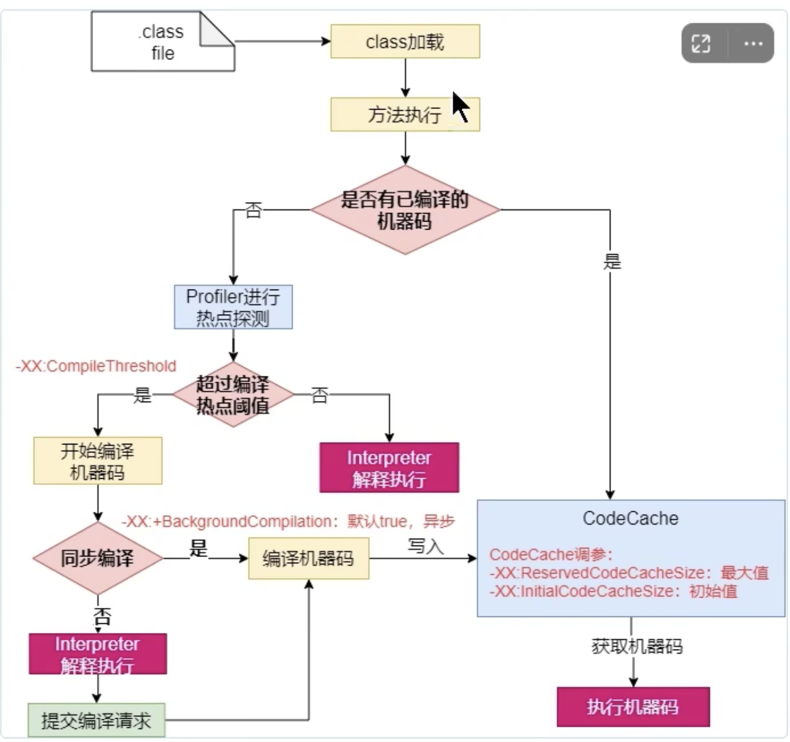

## JVM半编译半解释的流程

在JVM的执行器中，编译执行器（JIT）和解释执行器都存在，如下图：

看`Execution Engine`部分，解释执行器`Interpreter`和编译器`JIT Compiler`都是默认被JVM包含的。

当我们的java被转换成.class文件后，当程序运行时，解释器首先发挥作用，代码可以直接解释执行。随着时间推移，即时编译器逐渐发挥作用，把越来越多的代码编译优化成本地代码，来获取更高的执行效率。解释器这时可以作为编译运行的降级手段，在一些不可靠的编译优化出现问题时，再切换回解释执行，保证程序可以正常运行。

那么java代码的大致执行和编译的流程如下图：

