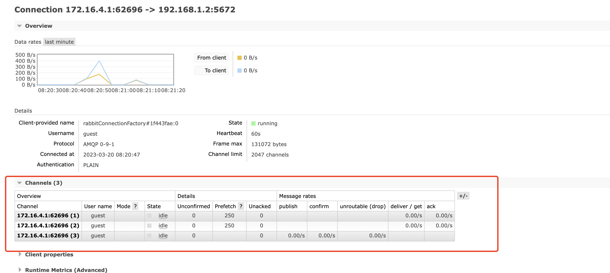

## 实践一个连接多个信道


#### 1、springboot集成rabbitmq

- 引入依赖

  ```xml
  <!-- https://mvnrepository.com/artifact/org.springframework.boot/spring-boot-starter-amqp -->
  <dependency>
      <groupId>org.springframework.boot</groupId>
      <artifactId>spring-boot-starter-amqp</artifactId>
      <version>2.6.6</version> <!-- 具体的版本由你的springboot版本决定 -->
  </dependency>
  ```

- 新增配置

  ```yaml
  spring:
    rabbitmq:
       host: 192.168.6.108
       port: 5672
       virtual-host: /
       username: tangwei
       password: 123456
  ```

- 入口文件添加注解，@EnableRabbit

  

#### 2、代码创建exchange、queue、并建立绑定关系

```java
@Configuration
public class DelayedMessageConfig {

    private static final String DELAYED_MESSAGE_EXCHANGE = "delayed.message.exchange";

    private static final String DELAYED_MESSAGE_QUEUE = "delayed.message.queue";

    private static final String DELAYED_MESSAGE_ROUTINGKEY = "delayed.message.routingkey";

    //声明一个交换机
    //内置交换机类型 DirectExchange、FanoutExchange、TopicExchange
    @Bean
    public CustomExchange delayedExchange(){

        

        //自定义交换机的参数
        //1. 交换机的名字
        //2. 交换机的类型
        //3. 交换机数据是否需要持久化
        //4. 交换机是否需要自动删除
        //5. 其它配置参数
        return new CustomExchange(DELAYED_MESSAGE_EXCHANGE, "direct", true, false);
    }

    //声明一个Queue
    @Bean
    public Queue delayedQueue(){
        return new Queue(DELAYED_MESSAGE_QUEUE);
    }

    //将Exchange与Queue进行绑定
    @Bean
    public Binding delayedBinding(
            @Qualifier("delayedQueue") Queue queue,
            @Qualifier("delayedExchange") CustomExchange customExchange){
        return BindingBuilder.bind(queue).to(customExchange).with(DELAYED_MESSAGE_ROUTINGKEY).noargs();
    }

}
```

到这一步，rabbitmq的dashboard中看不到任何区别。

#### 3、（发送消息）往消息队列中写数据

```java
import org.springframework.amqp.core.Message;
import org.springframework.amqp.core.MessageDeliveryMode;
import org.springframework.amqp.core.MessageProperties;
import org.springframework.amqp.rabbit.core.RabbitTemplate;


@Autowired
RabbitTemplate rabbitTemplate;

@GetMapping("/index")
public void index(){
  MessageProperties messageProperties = new MessageProperties();//设置消息持久化存储到磁盘上
  messageProperties.setDeliveryMode(MessageDeliveryMode.PERSISTENT);
  rabbitTemplate.convertAndSend("demo-direct", "demo3", new Message("要发送的消息内容".getBytes(), messageProperties)); //只有消息用Message对象包裹才能实现持久化
}
```

发送一个消息之后，进入rabbitmq的dashboard中就可以看到连接了


且当前的channel没有绑定消费队列，只是生产者


#### 4、再次代码创建exchange、queue、并建立绑定关系

```java
@Configuration
public class DelayedConfig {

    private static final String DELAYED_MESSAGE_EXCHANGE2 = "delayed.message.exchange3";

    private static final String DELAYED_MESSAGE_QUEUE2 = "delayed.message.queue3";

    private static final String DELAYED_MESSAGE_ROUTINGKEY2 = "delayed.message.routingkey3";

    //声明一个交换机
    //内置交换机类型 DirectExchange、FanoutExchange、TopicExchange
    @Bean
    public CustomExchange delayedExchange2(){


        //自定义交换机的参数
        //1. 交换机的名字
        //2. 交换机的类型
        //3. 交换机数据是否需要持久化
        //4. 交换机是否需要自动删除
        //5. 其它配置参数
        return new CustomExchange(DELAYED_MESSAGE_EXCHANGE2, "direct", true, false);
    }

    //声明一个Queue
    @Bean
    public Queue delayedQueue2(){
        return new Queue(DELAYED_MESSAGE_QUEUE2);
    }

    //将Exchange与Queue进行绑定
    @Bean
    public Binding delayedBinding2(
            @Qualifier("delayedQueue2") Queue queue,
            @Qualifier("delayedExchange2") CustomExchange customExchange){
        return BindingBuilder.bind(queue).to(customExchange).with(DELAYED_MESSAGE_ROUTINGKEY2).noargs();
    }

}
```

此时没有调用第二次创建的queue、exchange和绑定关系，此时还是一个连接里面一个信道


#### 5、往第二次创建的exchange、queue和绑定关系中写入数据

```java
@GetMapping("/index")
public void index(){
  MessageProperties messageProperties = new MessageProperties();//设置消息持久化存储到磁盘上
  messageProperties.setDeliveryMode(MessageDeliveryMode.PERSISTENT);
  rabbitTemplate.convertAndSend("demo-direct", "demo3", new Message("要发送的消息内容".getBytes(), messageProperties)); //只有消息用Message对象包裹才能实现持久化
}
```

发现次数，还是一个连接一个信道


由此证明：生产者是共用同一个连接的同一个信道！


#### 6、在项目中新增消费者

- 新增第一个消费者

  ```java
  @Component
  @RabbitListener(queues = {"demo2"})
  public class QueueListener {
  
      @RabbitHandler
      public void getMessage(byte[] message) throws InterruptedException {
          Thread.sleep(20000);
          System.out.println(new String(message));
      }
  }
  ```

  启动项目，发送一个消息到指定队列，然后指定队列的消息会被消费掉，此时一个连接就会有2个信道

  

- 新增第二个消费者

  ```java
  @Component
  @RabbitListener(queues = {"demo3"})
  public class QueueListener {
  
      @RabbitHandler
      public void getMessage(byte[] message) throws InterruptedException {
          Thread.sleep(20000);
          System.out.println(new String(message));
      }
  }
  ```

  启动项目，发送一个消息到指定队列，然后指定队列的消息会被消费掉，此时一个连接就会有3个信道

  


总结，生产者的信道共用，但是消费者会开启自己的信道去消费消息！