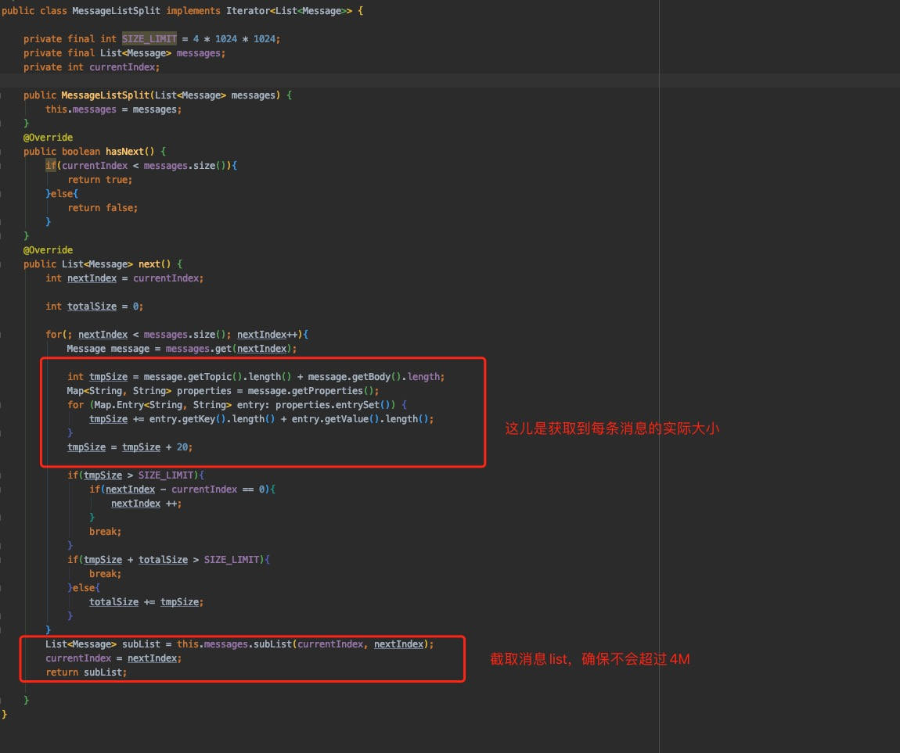

## Producer批量发送消息及实践

#### 批量发送消息的前提

1. 批量发送的消息必须具有相同的Topic
2. 批量发送的消息具有相同的刷盘策略
3. 批量发送的消息不能是延时消息和事务消息

#### 批量发送消息注意点

批量发送消息的总大小不能超过4M，如果超过4M了，可以把消息拆成多个小于4M的消息集合分批发送，也可以修改Producer和Broker两端的属性，Producer端在发送之前设置maxMessageSize属性，Broker端在其加载配置文件中maxMessageSize属性。

#### 代码实现

- 批量消息生产者

  

- 消息列表分割器代码

  

