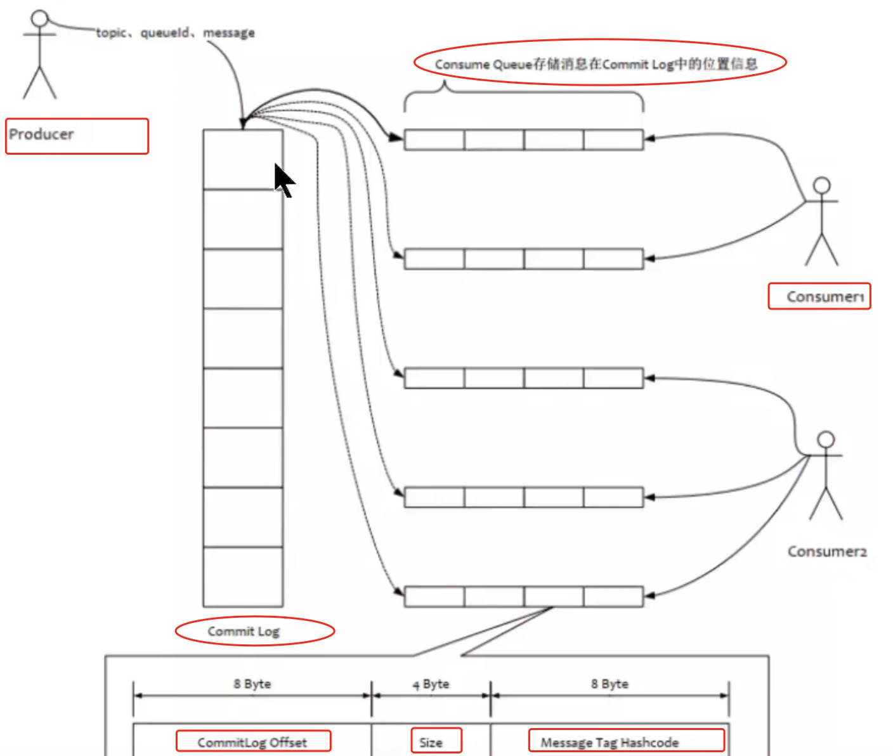

## Message带key与不带key是如何被消费和查询的


#### Message带key与不带key是如何被消费的

RocketMQ本身并不直接支持只消费带有key的消息。如果一个消费者只对带有一个key的消息感兴趣，只能获取所有的消息，然后自己解析消息中的key让然后处理，这就会有一个问题，不带key的消息被该Consumer消费了，但是这些不带key的消息只是被忽略了，不会进行任何处理！同时带key的消息只是少数，那么会占用Consumer端太多的性能！

```java
public class TopicSearch {

    public static void main(String[] args) throws Exception {
        DefaultMQPushConsumer consumer = new DefaultMQPushConsumer("ConsumerGroupName");
        consumer.setNamesrvAddr("127.0.0.1:9876");
        consumer.subscribe("TopicTest", "*");

        consumer.registerMessageListener(new MessageListenerConcurrently() {
            @Override
            public ConsumeConcurrentlyStatus consumeMessage(List<MessageExt> msgs, ConsumeConcurrentlyContext context) {
                for (MessageExt msg : msgs) {
                    // 这里检查消息的key
                    if ("yourKey".equals(msg.getKeys())) {
                        // 处理你的逻辑
                        System.out.println(new String(msg.getBody()));
                    }
                }
                return ConsumeConcurrentlyStatus.CONSUME_SUCCESS;
            }
        });

        consumer.start();
    }

}
```


#### 不带key的消息的查询过程




#### 带Key的消息可以被快速查询，过程是什么


