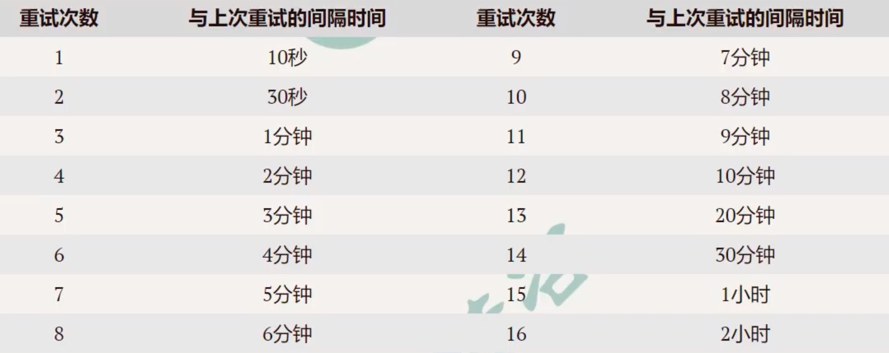

## Consumer消费消息失败会触发消费重试


#### 什么情况下叫消费失败

在消费消息的时候，返回 ConsumeConcurrentlyStatus.RECONSUME_LATER、返回Null、抛出异常 都叫消费失败，会触发消费重试！

推荐返回ConsumeConcurrentlyStatus.RECONSUME_LATER。


#### 不同的消息，消费失败的重试机制

- 顺序消息的消费重试

  当consumer消费消息失败后，为了保证消息的顺序性，其会自动不断地进行消费重试，直到消费成功，在重试期间会出现消费被阻塞的情况。消费重试默认时间为1000毫秒。所以在消费顺序性消息的时候一定要监控并处理，避免永久性阻塞。

  ```java
  consumer.setSuspendCurrentQueueTimeMillis(100);  //修改顺序消费重试的时间间隔，其取值范围为 10-30000
  ```

  

  

- 普通消息、延时消息、事务消息的消费重试：

  只有在集群方式下才有消息消费失败重试，广播方式下消费失败，继续消费后续消息。当consumer消费消息失败时，可以通过设置返回状态达到消息重试的效果。


#### 消费重试的次数与间隔



代码修改重试次数：

```java
consumer.setMaxReconsumeTimes(10);  //设置最多重试10次，默认是重试16次的（对应上图中，如果超过16次，那么每次重试间隔时间都是2小时）。如果consumer group中一个consumer修改了重试次数，则group中所有的consumer都会应用上修改了的重试次数！如果一个group中多个consumer修改了，那么则覆盖生效（后面覆盖前者）。
```

<font color="red">**如果经过上限次重试之后还是消费失败，则把该消息扔到死信队列！！！**</font>

