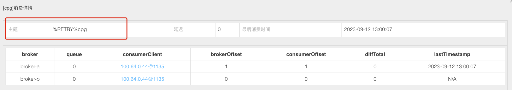

## Consumer消费重试与重试队列

#### 什么是重试队列

对于延时消息、普通消息、事务消息的需要重试的消息，并不是Consumer在等待了指定时长后再次去拉取原来的消息进行消费，而是将这些需要重试消费的消息放入到一个特殊Topic的队列中，而后进行再次消费的。这个特殊的队列就是重试队列！

#### 重试队列的底层原理

> 内部使用延时消息实现

当出现需要进行重试消费的消息时，先将消息保存到SCHEDULE_TOPIC_XXXX延时队列（因为重试的时间可以对应上延时的等级，先等待10S重试就先往等级为3的队列中扔，如果还消费失败，再扔到等级为4的队列中，然后......），延时消息到期后，会将消息投递到“%RETRY%consumerGroup”Topic中。

当消费者消费消息失败，就会自动订阅名为：“%RETRY%consumerGroup” 的Topic

 