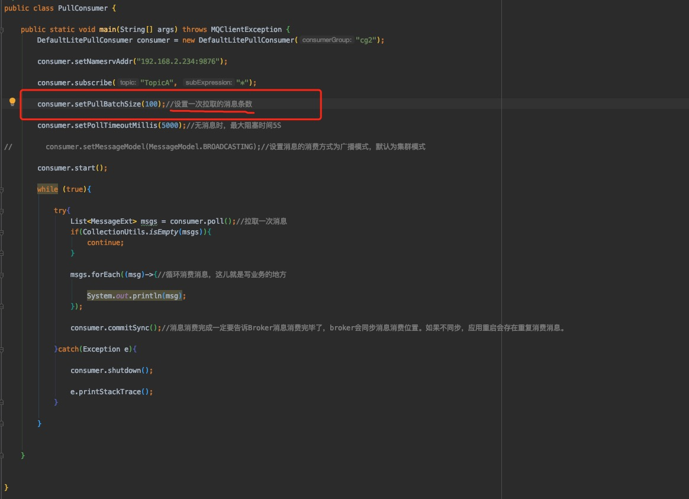
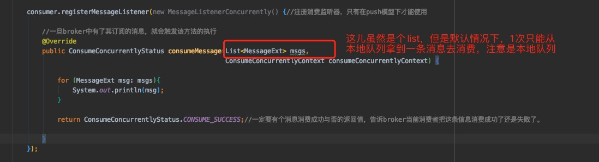

## Consumer批量消费消息及实践

#### 在不同消费模式下批量消费的参数设置不同

- 在pull模式下

  

  

- 在push模式下

  

  默认每次从本地队列中取出一条数据，可以通过修改consumeMessageBatchMaxSise来修改一次性从本地队列拿到的消息数量，而不是默认的一条消息，但是一次不能拿到超过32条消息，因为消费者每次去broker拿消息最多就是32条，这个32是系统默认值，可以通过修改consuser的pullBatchSize属性来修改。

  

#### pullBatchSize和consumeMessageBatchMaxSise 是不是越大越好？

pullBatchSize越大，那么一次拉取消息的时间就越长，因为网络不可靠，其中一条消息出现文件，整个批量消息全部要重新拉取！！

consumeMessageBatchMaxSise越大，因为在并发消费下一个consumeMessageBatchMaxSise的消息就会开一个线程去处理，（本地队列中有30条消息，consumeMessageBatchMaxSise为5，那么就是开6个线程去处理），在任意线程中任意消息消费异常，那么这批消息全部需要重新消费！

#### 代码实现Consumer批量消费

