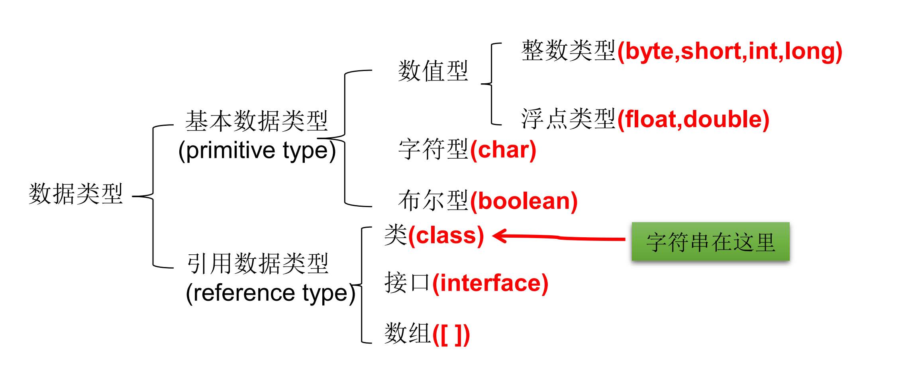

## 变量


#### 1、变量的概念

变量是程序中最基本的存储单元。包含变量类型、变量名和存储的值。用于在代码中存储数据和传递数据。

比如，我需要定义一个人年龄是35岁，可以这样定义`int age = 35`

或者这样定义

```java
int age;
age=35;
```


#### 2、变量的使用注意项

1. Java中每个变量必须先声明，后使用
2. 使用变量名来访问这块区域的数据
3. 变量的作用域：其定义所在的一对{ }内 
4. 变量只有在其作用域内才有效
5. 同一个作用域内，不能定义重名的变量


#### 3、变量的分类

- 基本类型和引用类型



- 在方法体外，类体内声明的变量称为"成员变量"。

- 在方法体内部声明的变量称为局部变量。

  