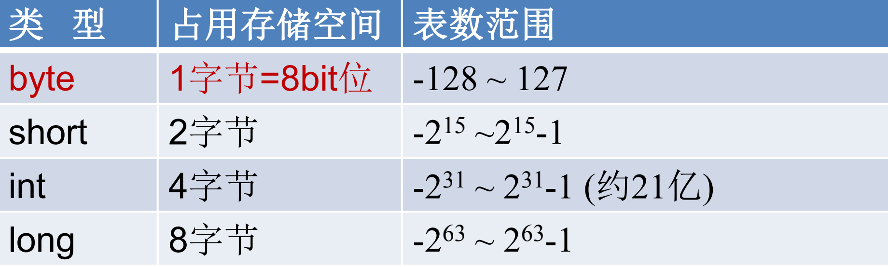
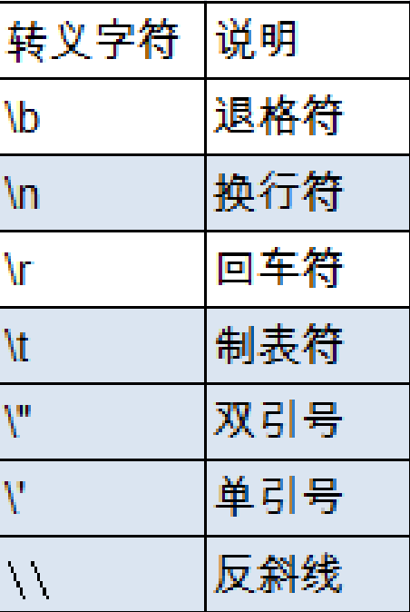

## 变量数据类型详述

> 注意是基本数据类型


#### 1、整型 byte、short、int、long

- Java各整数类型有固定的表数范围和字段长度，不受具体OS的影响，以保证java程序的可移植性。




- byte类型，可以是数组或者字母，如果是字母，不能用""包裹

  ```java
  byte a = "a" //这样写是错误的
  ```

  

- java的整型变量默认为 int 型，声明long型变量最好在数值后加‘l’或‘L’，注意是最好，如果不写也没错。但是如果是包装类型Long必须加“L”

  ```java
  long a = 5;//这样写没错
  
  Long a = 5;// 这样写不行！
  ```

  

- java程序中变量通常声明为int型，除非不足以表示较大的数，才使用long


思考计算：500MB 1MB = 1024KB 1KB= 1024B B= byte ? bit?


```java
 public class VariableTest {
   public static void main(String[] args) {
     
     int number1;
     number1 = 10;

     int number2;
     number2 = 20;

     int number3;
     number3 = number1 + number2;
     System.out.println("Number3 = " + number3);

     int number4 = 50;
     int number5 = number4 - number3;
     System.out.println("Number5 = " + number5);
   }
 }
```


#### 2、浮点类型：float、double

- 与整数类型类似，Java 浮点类型也有固定的表数范围和字段长度，不受具体操作系统的影响。


表数范围是如何求得的？

float：1bit(符号位) 8bits(指数位) 23bits(尾数位)

double：1bit(符号位) 11bits(指数位) 52bits(尾数位)

于是，float的指数范围为-127~+128，而double的指数范围为-1023~+1024，并且指数位是按补码的形式来划分的。其中负指数决定了浮点数所能表达的绝对值最小的非零数；而正指数决定了浮点数所能表达的绝对值最大的数，也即决定了浮点数的取值范围。

float的范围为-2^128 ~ +2^128，也即-3.40E+38 ~ +3.40E+38；double的范围为-2^1024 ~ +2^1024，也即-1.79E+308 ~ +1.79E+308。

- 浮点型常量有两种表示形式：
  - 十进制数形式：如：5.12  512.0f  .512 (必须有小数点）
  - 科学计数法形式:  如：5.12e2  512E2  100E-2

- float:单精度，尾数可以精确到7位有效数字。很多情况下，精度很难满足需求。
- double:双精度，精度是float的两倍。通常采用此类型。
- Java 的浮点型常量默认为double型，声明float型常量，须后加‘f’或‘F’。

​	

附：

浮点型数据在内存中如何存储！

举个例子：78.375，是一个正小数。要在计算机中存储这个数，需要把它表示为浮点数的格式，先执行二进制转换：

78.375 的整数部分： ( 78 ) 10 = (1001110)2

小数部分:  ( 0.375 ) 10 = 乘2取整法，即将小数部分乘以2，然后取整数部分，剩下的小数部分继续乘以2，然后取整数部分，剩下的小数部分又乘以2，一直取到小数部分为零为止。如果永远不能为零，就同十进制数的四舍五入一样，按照要求保留多少位小数时，就根据后面一位是0还是1，取舍，如果是零，舍掉，如果是1，向入一位。换句话说就是0舍1入。读数要从前面的整数读到后面的整数 = ( 0.011 ) 2

所以，78.375 的二进制形式就是 1001110.011

然后，使用**二进制科学记数法**，有

( 78.375 ) 10 = ( 1001110.011 ) 2 = 1.001110011 × 2 6 (78.375)_{10}=(1001110.011)_2=1.001110011×2^6(78.375)10=(1001110.011)2=1.001110011×26

注意，转换后用二进制科学记数法表示的这个数，有底有指数有小数部分，这个就叫做**浮点数**


#### 3、字符类型：char

- char 型数据用来表示通常意义上“字符”(2字节) 

- Java中的所有字符都使用Unicode编码，故一个字符可以存储一个字母，一个汉字，或其他书面语的一个字符。

- 字符型变量的三种表现形式：

  - 字符常量是用单引号(‘ ’)括起来的单个字符。例如：char c1 = 'a'; char c2 = '中'; char c3 = '9'; <font color="red">只能用' '，不能用 ""</font>

  - Java中还允许使用转义字符‘\’来将其后的字符转变为特殊字符型常量。

    例如：char c3 = ‘\n’; // '\n'表示换行符

    

  - 直接使用 Unicode 值来表示字符型常量：‘\uXXXX’。其中，XXXX代表一个十六进制整数。如：\u000a 表示 \n。

- <font color="red">char类型是可以进行运算的。因为它都对应有Unicode码。</font>

- 了解三种码

  - ASCII 码：在计算机内部，所有数据都使用二进制表示。每一个二进制位（bit）有 0 和 1 两种状态，因此 8 个二进制位就可以组合出 256 种状态，这被称为一个字节（byte）。一个字节一共可以用来表示 256 种不同的状态，每一个状态对应一个符号，就是 256 个符号，从0000000 到 11111111。上个世纪60年代，美国制定了一套字符编码，对英语字符与二进制位之间的关系，做了统一规定。这被称为ASCII码。ASCII码一共规定了128个字符的编码，比如空格“SPACE”是32（二进制00100000），大写的字母A是65（二进制01000001）。这128个符号（包括32个不能打印出来的控制符号），只占用了一个字节的后面7位，最前面的1位统一规定为0。缺点：1.不能表示所有字符。2.相同的编码表示的字符不一样：比如，130在法语编码中代表了é，在希伯来语编码中却代表了字母Gimel(ג) 

    看下ASCII码表

  - Unicode 编码：

    - 乱码的出现，是因为世界上存在着多种编码方式，同一个二进制数字可以被解释成不同的符号。因此，要想打开一个文本文件，就必须知道它的编码方式，否则用错误的编码方式解读，就会出现乱码。
    - unicode编码的作用，一种编码，将世界上所有的符号都纳入其中。每一个符号都给予一个独一无二的编码，使用 Unicode 没有乱码的问题。
    - unicode编码的缺点：Unicode 只规定了符号的二进制代码，却没有规定这个二进制代码应该如何存储：无法区别 Unicode 和 ASCII：计算机无法区分三个字节表示一个符号还是分别表示三个符号。另外，我们知道，英文字母只用一个字节表示就够了，如果unicode统一规定，每个符号用三个或四个字节表示，那么每个英文字母前都必然有二到三个字节是0，这对于存储空间来说是极大的浪费。

  - UTF-8编码：

    - UTF-8 是在互联网上使用最广的一种 Unicode 的实现方式。
    - UTF-8 是一种变长的编码方式。它可以使用 1-6 个字节表示一个符号，根据不同的符号而变化字节长度。
    - UTF-8的编码规则：
      - 对于单字节的UTF-8编码，该字节的最高位为0，其余7位用来对字符进行编码（等同于ASCII码）。
      - 对于多字节的UTF-8编码，如果编码包含 n 个字节，那么第一个字节的前 n 位为1，第一个字节的第 n+1 位为0，该字节的剩余各位用来对字符进行编码。在第一个字节之后的所有的字节，都是最高两位为"10"，其余6位用来对字符进行编码。


#### 4、布尔类型：boolean

- boolean 类型用来判断逻辑条件，一般用于程序流程控制：
  - if条件控制语句；
  - while循环控制语句；
  - do-while循环控制语句；
  - for循环控制语句；
- boolean类型数据只允许取值true和false，无null。
  - 不可以使用0或非 0 的整数替代false和true，这点和C语言不同。
  - Java虚拟机中没有任何供boolean值专用的字节码指令，Java语言表达所操作的boolean值，在编译之后都使用java虚拟机中的int数据类型来代替：true用1表示，false用0表示。


#### 5、基本数据类型转换

- 自动类型转换：

  容量小的类型自动转换为容量大的数据类型。数据类型按容量大小排序为：


```java
void contextLoads() {
  char a = 'a';

  System.out.println(a + 1);

}

void contextLoads() {
  byte a = 'a';

  System.out.println(a + 1);

}
```

​	自动转换的方式：

1. 有多种类型的数据混合运算时，系统首先自动将所有数据转换成容量最大的那种数据类型，然后再进行计算。
2. byte,short,char之间不会相互转换，他们三者在计算时首先转换为int类型。
3. boolean类型不能与其它数据类型运算。
4. 当把任何基本数据类型的值和字符串(String)进行连接运算时(+)，基本数据类型的值将自动转化为字符串(String)类型。


- 强制类型转换

  自动类型转换的逆过程，将容量大的数据类型转换为容量小的数据类型。使用时要加上强制转换符：()，但可能造成精度降低或溢出,格外要注意。通常，字符串不能直接转换为基本类型，但通过基本类型对应的包装类则可以实现把字符串转换成基本类型。

  

  判断能够通过编译

  ```java
  short s = 5;
  s = s-2; //判断：no   因为2是int型，然后s-2会把s转成int型再去-2，然后得到int型，赋给s，而s是short型，不能转换
  
  byte b = 3;
  b = b + 4; //判断：no
  b = (byte)(b+4); //判断：yes
  
  
  char c = 'a';
  int i = 5;
  float d = .314F;
  double result = c+i+d; //判断：yes
  
  byte b = 5;
  short s = 3;
  short t = s + b; //判断：no
  ```

  

  

#### 6、字符串类型：String

- String不是基本数据类型，属于引用数据类型

- 使用方式与基本数据类型一致。例如：String str = “abcd”;

- 一个字符串可以串接另一个字符串，也可以直接串接其他类型的数据。例如：

  str = str + “xyz” ; 

  int n = 100;

  str = str + n;

- 示例

  ```java
  public class StringTest {
    public static void main(String[] args) {
       int no = 10;
       String str = "abcdef";
       String str1 = str + "xyz" + no;
  
       str1 = str1 + "123";
       char c = '国';
  
       double pi = 3.1416;
       str1 = str1 + pi;
       boolean b = false;
       str1 = str1 + b;
       str1 = str1 + c;
  
       System.out.println("str1 = " + str1);
    }
  }
  ```

- 练习

  ```java
  String str1 = 4; //判断对错：no
  String str2 = 3.5f + ""; //判断str2对错：yes
  System.out.println(str2); //输出：”3.5”
  System.out .println(3+4+"Hello!"); //输出：7Hello!
  System.out.println("Hello!"+3+4); //输出：Hello!34
  System.out.println('a'+1+"Hello!"); //输出：98Hello!  注意：这儿的'a' 不能改为 "a"
  System.out.println("Hello"+'a'+1); //输出：Helloa1
  ```


