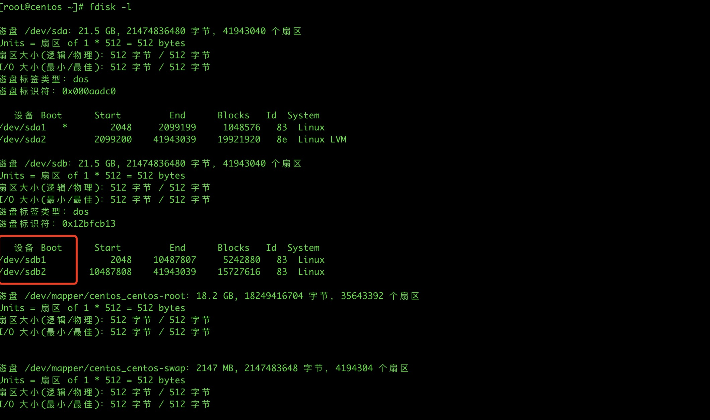

## 磁盘操作

> 在很多情况下，随着服务器投入生产的时间越来越长，数据量也会越来越多，磁盘容量不够是一个很常见的问题，如果磁盘空间紧张，那么就需要挂载一块新的磁盘上去使用，那么如何操作呢？


#### 1、新硬盘分区

- 分区概念

  1. 主分区

     至少有1个，最多4个。主分区 + 扩展分区 不能超过4个。一旦划定了主分区，其内部不可再划分。

  2. 扩展分区

     扩展分区可以没有，最多1个。至少有1个，最多4个。内部可继续划分逻辑分区。

  3. 逻辑分区

     可以有若干个。被包含在扩展分区中。

  <font color="red">一块硬盘可以只设主分区，这时主分区可设置4个分区号。也可以设置成主分区+逻辑分区，这时也是最多4个分区号码，但是变成了4 = 3 + 1。扩展分区中再去分配逻辑分区！</font>

- 分区操作

  使用`lsblk`查看现在的硬盘的使用情况。

  - 20G的硬盘，分成2个主分区操作

    分区操作省略

    最后分出来的硬盘使用`fdisk -l`查看硬盘位置

    

    

  - 20G硬盘，分成1个主分区 + 1个扩展分区（扩展分区中有2个逻辑分区）

​			略

#### 2、格式化硬盘

使用`mkfs -t xfs /dev/sdb1` 就会进行格式化了！


#### 3、挂载使用

创建好要硬盘要挂载的目录，然后修改/etc/fstab文件，进行挂载操作，新增如下内容

```shell
/dev/被挂载的硬盘 /.../.../挂载目录 xfs defaults 0 0
```

随后，执行`mount -a`进行挂载

挂载执行后，使用`mount -l` 和`lsblk`查看是否被成功挂载！


