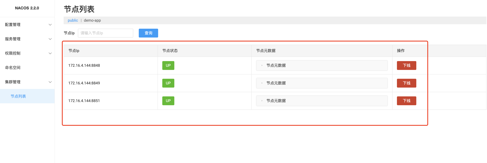
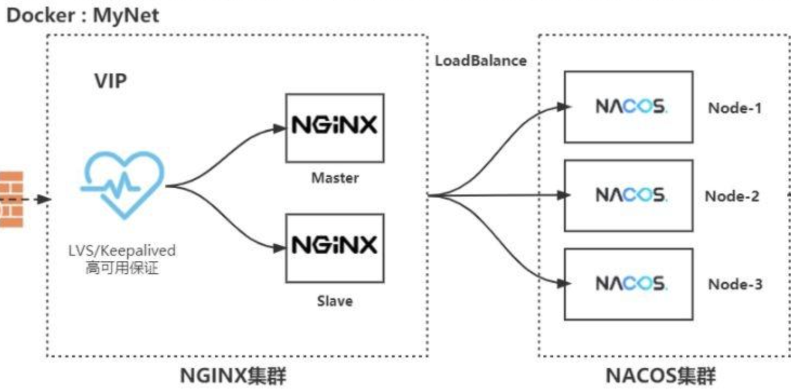

## docker搭建nacos集群

参考官方搭建：https://github.com/nacos-group/nacos-docker

> 使用nacos2.2.1以下版本
>
> 我们参考使用ip做为集群的方案，不用hostname的方式。

#### 1、准备好一个mysql

因为集群间的数据需要同步，如果把数据统一存放那么集群数据同步问题就解决了！


#### 2、将nacos需要的数据表导入到mysql的一个database中

下载nacos，下载地址：https://github.com/alibaba/nacos/tags

下载好之后，解压压缩包，找到conf中的mysql-schema.sql文件，导入到MySQL中，库名称就叫nacos_config


#### 3、准备一个.env配置文件

```env
REFER_HOST_MODE=ip  #这儿支持hostname或者ip。一般我们就用ip就行。
NACOS_SERVERS=nacos1:8848 nacos2:8848 nacos3:8848  #表明nacos的集群的成员，注意nacos1...3需要改为nacos所在docker容器的IP(我们在后续步骤中会设定每个容器的 IP)，端口需要填写容器内的8848，集群间同步信息会自动调用指定端口+1001
SPRING_DATASOURCE_PLATFORM=mysql
MYSQL_SERVICE_HOST=172.16.4.142
MYSQL_SERVICE_DB_NAME=nacos_config
MYSQL_SERVICE_PORT=13306
MYSQL_SERVICE_USER=root
MYSQL_SERVICE_PASSWORD=xsdfopNdfret
MYSQL_SERVICE_DB_PARAM=characterEncoding=utf8&connectTimeout=1000&socketTimeout=3000&autoReconnect=true&useSSL=false&allowPublicKeyRetrieval=true
NACOS_AUTH_IDENTITY_KEY=2222 #nacos2.2.0以上版本才需要配置
NACOS_AUTH_IDENTITY_VALUE=2xxx #nacos2.2.0以上版本才需要配置
NACOS_AUTH_TOKEN=SecretKey012345678901234567890123456789012345678901234567890123456789 #nacos2.2.0以上版本才需要配置
```

更多常量配置参考：https://github.com/nacos-group/nacos-docker


#### 5、准备docker-compose文件，启动3个nacos

```yaml
version: "3.8"
services:
  nacos1:
    container_name: nacos1
    networks:
      nacos2_net2:
        ipv4_address: 10.16.238.5
    image: nacos/nacos-server:v2.2.0
    volumes:
      - ./cluster-logs/nacos1:/home/nacos/logs
    ports:
      - "8848:8848"
      - "9848:9848" #映射出的9848端口，一定要在8848的映射端口8848上+1000
    env_file:
      - ./nacos-cluster.env  #指向上面的.env配置文件
    restart: always

  nacos2:
    image: nacos/nacos-server:v2.2.0
    container_name: nacos2
    networks:
      nacos2_net2:
        ipv4_address: 10.16.238.6
    volumes:
      - ./cluster-logs/nacos2:/home/nacos/logs
    ports:
      - "8853:8848"
      - "9853:9848"
    env_file:
      - ./nacos-cluster.env #指向上面的.env配置文件
    restart: always
  nacos3:
    image: nacos/nacos-server:v2.2.0
    container_name: nacos3
    networks:
      nacos2_net2:
        ipv4_address: 10.16.238.7
    volumes:
      - ./cluster-logs/nacos3:/home/nacos/logs
    ports:
      - "8851:8848"
      - "9851:9848"
    env_file:
      - ./nacos-cluster.env #指向上面的.env配置文件
    restart: always
networks:
  nacos2_net2:
    driver: bridge
    ipam:
      driver: default
      config:
        - subnet: 10.16.238.0/24
```

`docker-compose -f xxxxx.yaml up -d`启动成功后，打开nacos，需要看到的样子是：（千万不能有别的主机地址！）



- 验证集群是否同步数据成功，

  客户端集成nacos-client，注册到nacos集群中任意一台nacos-server中，再去查看部署时指定的cluster-logs中某一个nacos的protocol-distro.log文件，只有被注册的nacos-server中的`result： `的结果是否为true。其余的nacos-server都是`[DISTRO] Receive distro data type:`,则证明集群能够正常同步！

- 验证集群是否启动成功

  运行：curl -X POST 'http://主机IP:8848/nacos/v1/ns/instance?port=8848&healthy=true&ip=11.11.11.11&weight=1.0&serviceName=nacos.test.3&encoding=GBK&namespaceId=n1' 查看是否返回ok


docker搭建的集群，后期可以考虑做成如下架构



