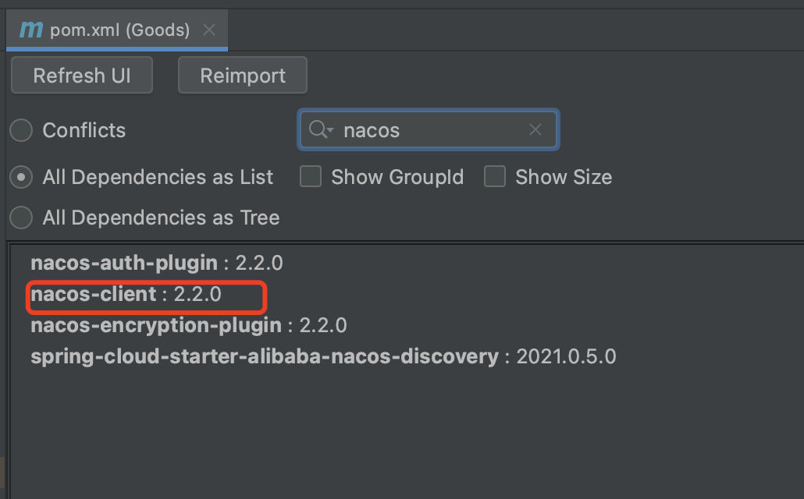

## 将微服务注册到nacos中


#### 1、打开project目录中的项目

项目中有Goods、User两个module，我们需要将这两个模块分别注册到nacos中


#### 2、引入springcloud alibaba依赖

因为我们项目中springboot的版本是2.6.13，对照springboot、springcloud、springcloud alibaba的版本对应关系，可以知道，我们需要引入的springcloud alibaba的版本


先引入spring cloud alibaba组件版本限制依赖

```xml
<dependencyManagement>
  <dependencies>

    <dependency> <!-- 引入这个之后，关于springcloud alibaba的所有组件，引入的时候都不需要加版本号了！ -->
      <groupId>com.alibaba.cloud</groupId>
      <artifactId>spring-cloud-alibaba-dependencies</artifactId>
      <version>2021.0.5.0</version>
      <type>pom</type>
      <scope>import</scope>
    </dependency>

  </dependencies>
</dependencyManagement>
```


再引入使用注册中心的nacos（服务发现功能）依赖

```xml
<dependency>
  <groupId>com.alibaba.cloud</groupId>
  <artifactId>spring-cloud-starter-alibaba-nacos-discovery</artifactId>
</dependency>
```

这样引入，我们查看maven真实会引入如下几个包



其中标红的是nacos-client，是用来跟nacos-server端建立连接的。但是，有个坑，在nacos-client2.x的版本中是使用grpc跟nacos-server端建立连接的。而nacos-client1.x的版本中是使用http2跟nacos-server端建立连接的。


####  3、配置客户端注册到server端

如果使用nacos-clien2.x的版本，跟nacos-server2.x建立连接，方案有2种

- 方案一：exclude掉nacos-client2.x，引入nacos-client1.4的版本

  ```xml
  <dependency>
    <groupId>com.alibaba.cloud</groupId>
    <artifactId>spring-cloud-starter-alibaba-nacos-discovery</artifactId>
    <exclusions>
      <exclusion>
        <groupId>com.alibaba.nacos</groupId>
        <artifactId>nacos-client</artifactId>
      </exclusion>
    </exclusions>
  </dependency>
  
  <!-- https://mvnrepository.com/artifact/com.alibaba.nacos/nacos-client -->
  <dependency>
    <groupId>com.alibaba.nacos</groupId>
    <artifactId>nacos-client</artifactId>
    <version>1.4.3</version>
  </dependency>
  
  ```

​		注意：<font color="red">该方法测试下来，只能在nacos-server为单机的基础上使用，不能在nacos-server的基础上使用。</font>


- 方案二：在nacos-server的上层搭建一个nginx，nginx主要是跟nacos-client保持长连接并且把nacos-client的grpc请求反向代理给nacos-server

  - 拉取支持http_stream的nginx镜像

    ```shell
    docker pull undownding/nginx-http2
    ```

    可以先用该镜像启动一个容器，运行`nginx -V`查看是否有`--with-stream`的扩展，如果有，则可以使用。

  - 准备nginx的配置文件,叫nginx.conf，用于反向代理grpc请求

    ```nginx
    worker_processes  1;
    
    #error_log  logs/error.log;
    #error_log  logs/error.log  notice;
    #error_log  logs/error.log  info;
    
    #pid        logs/nginx.pid;
    
    
    events {
        worker_connections  1024;
    }
    
    http {
      	include       mime.types;
        default_type  application/octet-stream;
      
        # nacos服务器http相关地址和端口
        upstream nacos-server {
            server 172.16.4.143:8848;  #这儿的8848、8849、8851是docker容器内的nacos的8848端口的映射端口
            server 172.16.4.143:8849;
            server 172.16.4.143:8851;
        }
        server {
            listen 8808;
            location / {
                proxy_pass http://nacos-server/;
            }
        }
    }
    
    stream { 
      	# 这儿是配置nacos的grpc流的反向代理
        upstream nacos-server-grpc { # 这儿的9868、9869、9871是docker容器内的nacos的9848端口的映射端口
            server 172.16.4.143:9868;
            server 172.16.4.143:9869;
            server 172.16.4.143:9871;
        }
        server {
            listen 9808;   #注意这儿一定要比上面的8808 多 1000，否则测试不通
            proxy_pass nacos-server-grpc;
        }
    }
    
    
    ```

  - 使用上述配置启动nginx容器

    ```shell
    docker run -id -v /root/nacos/nginx.conf:/etc/nginx/nginx.conf -p 8808:8808 -p 9808:9808 --name nginx4nacos --network=network-name 12983b496cfb
    ```

    注意：network与nacos需不需要在同一个网络中，要看情况
  
    
  
  - 使用http://IP:8808/nacos 可以打开nacos的界面
  
  - 运行命令：curl -X POST 'http://172.16.4.144:8808/nacos/v1/ns/instance?port=8848&healthy=true&ip=11.11.11.11&weight=1.0&serviceName=nacos.test.3&encoding=GBK&namespaceId=n1' 查看是否返回ok


#### 4、修改项目配置并启动项目

springboot项目的配置文件中配置

```yaml
server:
  port: 8099
spring:
  cloud:
    nacos:
      discovery:
        server-addr: 172.16.4.143:8808 #nacos的注册地址，如果是grpc的方式注册，会默认对端口+1000，即注册的端口会被改为9808，9808是nginx暴露端口，会反向代理到nacos的9848端口。如果是http的方式注册，则就是8808端口，因为8808端口是nginx暴露的端口，会反向代理到nacos的8848端口。
        group: DEFAULT_GROUP
        namespace: 9e7100d2-c897-45b7-b65d-65c34cb471de #nacos的namespace
      username: nacos #nacos的用户名
      password: nacos #nacos的密码
  application:
    name: Goods

```

启动项目，会发现nacos-client成功被注册了！


