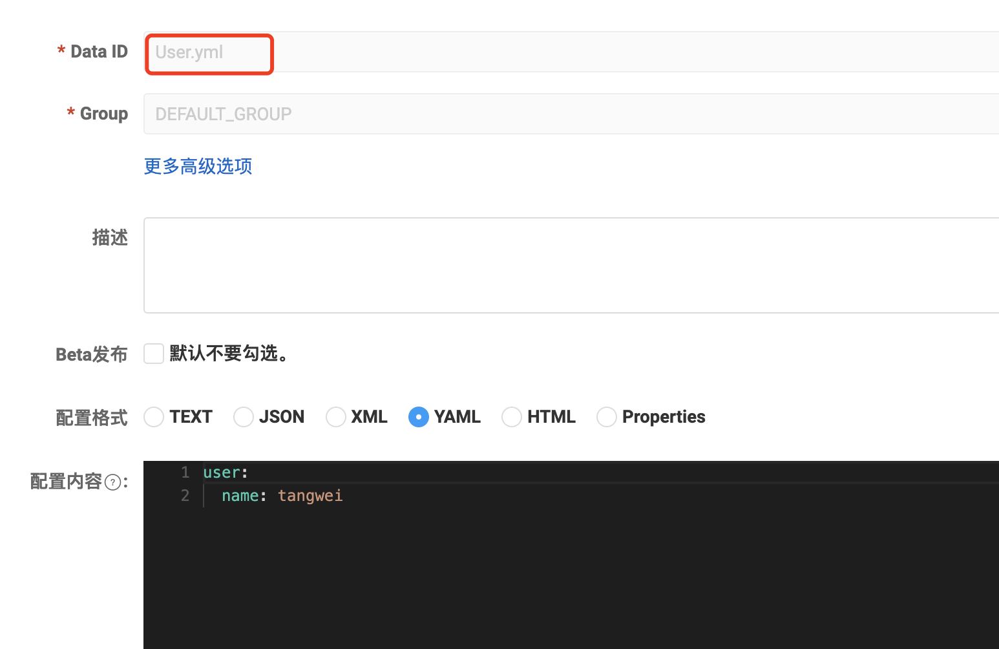

## 微服务从nacos的配置文件中读取配置


#### 1、打开project目录中的项目

项目中有Goods、User两个module，选择User模块从nacos配置文件中读取配置


#### 2、引入springcloud alibaba依赖

因为我们项目中springboot的版本是2.6.13，对照springboot、springcloud、springcloud alibaba的版本对应关系，可以知道，我们需要引入的springcloud alibaba的版本


先引入spring cloud alibaba组件版本限制依赖

```xml
<dependencyManagement>
  <dependencies>

    <dependency> <!-- 引入这个之后，关于springcloud alibaba的所有组件，引入的时候都不需要加版本号了！ -->
      <groupId>com.alibaba.cloud</groupId>
      <artifactId>spring-cloud-alibaba-dependencies</artifactId>
      <version>2021.0.5.0</version>
      <type>pom</type>
      <scope>import</scope>
    </dependency>
    
    <dependency>
      <groupId>org.springframework.cloud</groupId>
      <artifactId>spring-cloud-dependencies</artifactId>
      <version>2021.0.5</version>
      <type>pom</type>
      <scope>import</scope>
    </dependency>

  </dependencies>
</dependencyManagement>
```

再引入使用配置中心的nacos（配置读取功能）依赖

```xml
<dependency>
    <groupId>com.alibaba.cloud</groupId>
    <artifactId>spring-cloud-starter-alibaba-nacos-config</artifactId>
</dependency>
```


#### 3、新增配置

> 配置文件加载顺序：<font color="red">先加载bootstrap，再加载nacos中的配置，最后加载application</font>。所以如下配置最好写到bootstrap.yaml文件中。

```yaml
spring:
  application:
    name: mem
  cloud:
    nacos:
      config:
        server-addr: 172.16.4.144:8808 #指定nacos 配置中心的地址
        prefix: user #需要监听的配置文件的名称，在nacos中叫dataId,如果不写这个，默认会使用spring.application.name取代
        file-extension: yaml #需要监听的配置文件的文件类型。
        namespace: 9e7100d2-c897-45b7-b65d-65c34cb471de #要监听文件所在namespace
        group: MEM_GROUP #要监听文件的group
        username: nacos
        password: nacos
```

说明：项目启动时，springboot会到nacos中找namespace为9e7100d2-c897-45b7-b65d-65c34cb471de的下面的group为MEM_GROUP的prefix−{spring.profile.active}.{file-extension}的配置文件。其中prefix如果在本地配置文件中配置了spring.cloud.nacos.config.prefix就用配置的，如果没有配置就用spring.application.name的值，spring.profile.active为项目启动时的参数，如果不配置就为空。file-extension是配置的配置文件类型。

综上：<font color="red">上述配置会监听: user、user.yaml文件，如果配置了spring.profile.active，监听user-spring.profile.active、user-spring.profile.active.yaml文件</font>


然而，新版本的springboot已经默认吧 Bootstrap给禁用了，所以，需要引入 Bootstrap的依赖才能启动项目

```xml
<dependency>
    <groupId>org.springframework.cloud</groupId>
    <artifactId>spring-cloud-starter-bootstrap</artifactId>
</dependency>
```


#### 4、在nacos的管理界面中，新增一个配置文件，并写入内容



这儿新增完配置后，因为nacos-server是集群的，所以所有的nacos-server管理页面中都会有该配置文件。


#### 5、读取nacos中的配置进行测试

启动项目时，终端会提示` [Nacos Config] Listening config: dataId=User, group=DEFAULT_GROUP` 就是给出提示，本地nacos-client已经监听了dataId指定的文件了！


编写代码

```java
package com.ll.user.controller;

import org.springframework.beans.factory.annotation.Autowired;
import org.springframework.core.env.Environment;
import org.springframework.web.bind.annotation.GetMapping;
import org.springframework.web.bind.annotation.RestController;

/**
 * @Auther: tangwei
 * @Date: 2023/4/21 3:07 PM
 * @Description: 类描述信息
 */
@RestController
public class IndexController {

    @Autowired
    private Environment env;

    @GetMapping("/index")
    public void idnex(){
        System.out.println(env.getProperty("user.name")); //注意一定要用env.getProperty去读取，不能用@Value
    }
}

```

测试能够正常读取到配置文件中的内容


#### 6、测试修改nacos中的配置文件，项目中能实时响应

如果修改了nacos配置文件的内容，在项目的日志中出现，如下

```shell
Refresh keys changed: ......
```

就证明修改的配置内容刷新到了项目中，项目中使用的是最新的值了！

