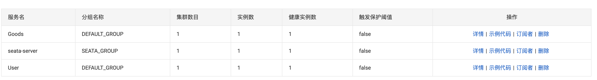

## 项目集成seata


#### 1、确保User、Goods正确注册到nacos



注意，最好把seata-server、Goods、User注册到一个分组下。


#### 2、引入seata依赖

```xml
<!-- https://mvnrepository.com/artifact/com.alibaba.cloud/spring-cloud-starter-alibaba-seata -->
<dependency>
    <groupId>com.alibaba.cloud</groupId>
    <artifactId>spring-cloud-starter-alibaba-seata</artifactId>
</dependency>
```

为什么不用指定具体的seata版本？

#### 3、准备好数据库及数据表

一个数据库叫`user`库，有一张user表，建表语句如下：

```sql
create table `goods`(
	`id` int(11) unsigned auto_increment comment "",
	`goods_name` varchar(255) not null default '' comment "",
	primary key(`id`)
)engine=innodb default charset=utf8;
```


一个数据库叫`goods`库，有一张goods表，建表语句如下：

```sql
create table `goods`(
	`id` int(11) unsigned auto_increment comment "",
	`goods_name` varchar(255) not null default '' comment "",
	primary key(`id`)
)engine=innodb default charset=utf8;
```


#### 4、到User、Goods服务中分别配置好mysql并往各自的表中新增一条数据

使用mybatis-plus就行 


#### 5、尝试在User服务中使用openfeign调用goods的接口

目标是同时往两张表中插入数据


#### 6、在调用方User中，尝试发生异常，看看整体数据会不会回滚

发现，user的数据会被回滚掉，但是goods中的数据还是插入了！


#### 7、开始集成seata

在user、goods服务的配置文件中添加seata的配置

```yaml
seata:
  enabled: true
  application-id: User  #这个随便写
  tx-service-group: my_test_tx_group #在配置seata-server时，指定的service.vgroupMapping.my_test_tx_group中的my_test_tx_group一致
  config: #从nacos中过去配置文件
    nacos:
      server-addr: 10.10.210.24:8808 #这儿可以指向到nacos的地址，也可以指向到nacos的上层nginx的地址，端口是8808端口是nginx反向代理nacos8848端口端口。
      group: SEATA_GROUP #配置所在的group
      username: nacos
      password: nacos
      data-id: seataServer.properties #读取seata-server启动的配置文件
    type: nacos #这个不能少
  registry:  #client会根据这儿的register提供的信息，找到TC的地址，并把自己注册到TC中去
    type: nacos #这个不能少
    nacos:
      application: seata-server
      server-addr: 10.10.210.24:8808
      username: nacos
      password: nacos
      group: SEATA_GROUP
  service:
    vgroup-mapping: #这儿设置一个map值，key为上面tx-service-group的值，value为register.conf中cluster的值、也同配置到nacos中service.vgroupMapping.key=这个的值
      my_test_tx_group: default
```


#### 8、分别到User、Goods两个服务对应的数据库中新增一张表，建表语句如下

```sql
CREATE TABLE `undo_log` (
	`id` bigint(20) NOT NULL AUTO_INCREMENT,
	`branch_id` bigint(20) NOT NULL,
	`xid` varchar(100) NOT NULL,
	`context` varchar(128) NOT NULL,
	`rollback_info` longblob NOT NULL,
	`log_status` int(11) NOT NULL,
	`log_created` datetime NOT NULL,
	`log_modified` datetime NOT NULL,
	`ext` varchar(100) DEFAULT NULL,
	PRIMARY KEY (`id`),
	UNIQUE KEY `ux_undo_log` (`xid`,`branch_id`)
) ENGINE=InnoDB AUTO_INCREMENT=1 DEFAULT CHARSET=utf8;
```


#### 9、在全局事务的入口，添加注解

@GlobalTransactional()


#### 10、在分支事务上添加注解

@Transactional


#### 11、分别启动User、Goods两个服务

1. 注意，注册到nacos中，分组名称最好不要叫`SEATA_GROUP`
1. 注意观察是否成功注册到seata的TC中。如果出现`register TM success.....`则证明客户端注册成功了！


#### 12、调用User中的接口，并且出现异常看看是否同时回滚


