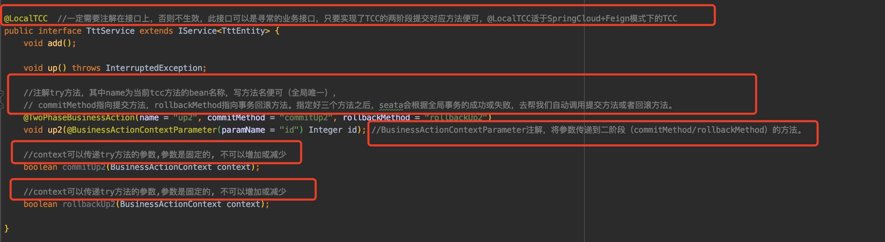
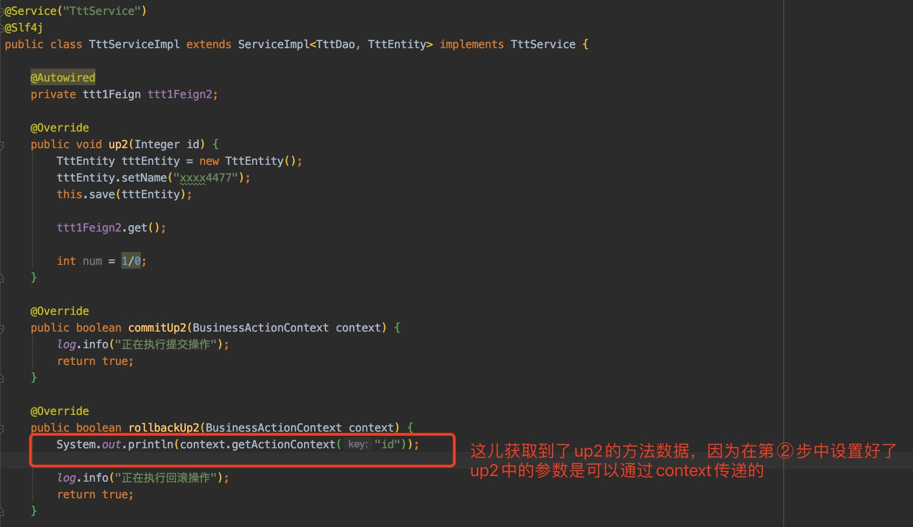
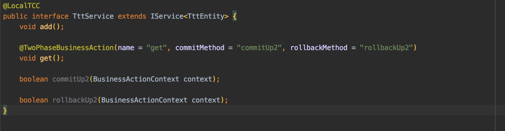
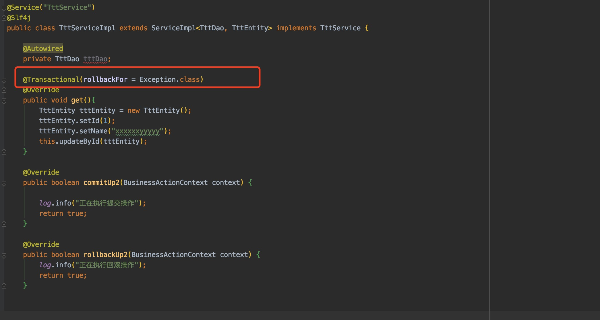

## 使用TCC模式

> 与AT模式的区别：AT模式是seata生成执行前的镜像，回滚时去拿镜像自动补偿，提交则删除镜像数据。而TCC模式，是需要自己编写回滚和提交的逻辑的。

#### 1、跟AT模式一样集成seata

区别在于，AT模式下，需要到对应的服务的数据库中新增一张undo_log表，而TCC模式不需要。

#### 2、事务发起服务中处理

- 新增@GlobalTransactional注解，注意这个注解不能修饰在下一步具体的业务方法上，所以最好放在controller

- 新增一个接口（如果是关系型数据库如mysql，就是各自的service接口，如果是非关系型数据库如redis，就是各自的操作的接口），以下以mysql为例子：

  

  

- 编写具体的业务：

  

#### 3、子事务中处理

- 定义一个接口（跟发起处一样的用法）：

  

- 具体的执行业务：

  