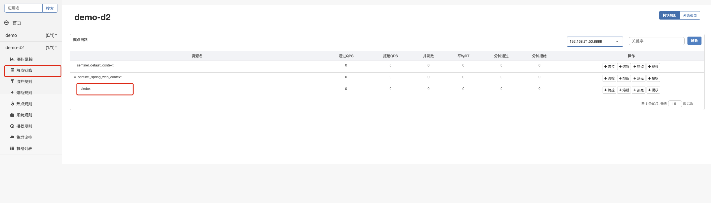

## springboot简单使用sentinel


#### 1、引入依赖

```xml
<!-- 引入sentinel的依赖 -->
<dependency>
  <groupId>com.alibaba.cloud</groupId>
  <artifactId>spring-cloud-starter-alibaba-sentinel</artifactId>
</dependency>


<!-- 引入spring cloud alibaba的依赖版本管理工具-->
<dependencyManagement>
  <dependencies>
    <dependency>
      <groupId>com.alibaba.cloud</groupId>
      <artifactId>spring-cloud-alibaba-dependencies</artifactId>
      <version>2022.0.0.0-RC2</version>
      <type>pom</type>
      <scope>import</scope>
    </dependency>
  </dependencies>

</dependencyManagement>
```

引入依赖的版本，需要参考springboot、springcloud alibaba的版本对应关系。且，需要保证引入的sentinel-core的版本与dashboard的版本一致！

#### 2、添加配置

```yaml
spring:
  cloud:
    sentinel:
      transport:
        dashboard: 172.16.4.144:8080 #把自己注册到哪里去，这儿是sentinel的地址
        port: 8888 #这里的 spring.cloud.sentinel.transport.port 端口配置会在应用对应的机器上启动一个 Http Server，该 Server 会与 Sentinel 控制台做交互。比如 Sentinel 控制台添加了一个限流规则，控制台会把规则数据 push 给这个 Http Server 接收，Http Server 再将规则注册到 Sentinel 中。
  application:
    name: demo
```


#### 3、写个controller

> 在web项目中，Controller的每一个方法入口都是一个resource，该resource会存放在默认名为sentinel_spring_web_context的context下。

```java
@GetMapping("/index")
public void index() throws InterruptedException {
  System.out.println("xxxxx");
}
```


#### 4、启动项目，去/index地址进行多次访问


#### 5、打开sentinel的dashboard

找到簇点链路，看看我们的请求的地址是不是在这里面



此时证明，我们集成sentinel已经成功了！

