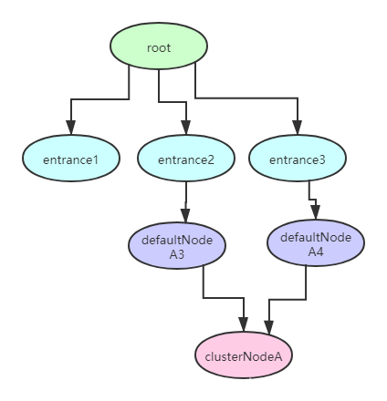

## Sentinel的几个核心概念

#### 1、Resource

任何需要保护的内容都可抽象成为资源，通过资源来保护具体的业务代码或其他后方服务。用户只需要为受保护的代码或服务定义一个资源，然后针对这个资源定义规则即可。当我们定义完资源，可以通过在程序中埋点来保护我们的服务，通常有两种方式：

- 使用SphU.entry(…)方法，一般在try{…}catch{…}中使用，当 catch 到BlockException时执行异常处理
- 使用SphO.entry(…)方法，一般在if{…}else{…}中使用，当返回false时执行异常处理

Sentinel中具体的资源类为：ResourceWrapper，这是一个抽象包装类，包装了name和EntryType。默认有两个实现类：StringResourceWrapper（对字符串包装，这是一个通用的资源类）和MethodResourceWrapper（针对方法调用的包装）

#### 2、Entry

 Sentinel 中用来表示是否通过限流的一个凭证，就像一个token一样。每次执行 SphU.entry() 或 SphO.entry() 都会返回一个 Entry 给调用者，意思就是告诉调用者，如果正确返回了 Entry 给你，那表示你可以正常访问被 Sentinel 保护的后方服务了，否则 Sentinel 会抛出一个BlockException(如果是 SphO.entry() 会返回false)，这就表示调用者想要访问的服务被保护了，也就是说调用者本身被限流了。

entry中保存了本次执行 entry() 方法的一些基本信息，包括：

- createTime：当前Entry的创建时间，主要用来后期计算rt
- node：当前Entry所关联的node，该node主要是记录了当前context下该资源的统计信息
- origin：当前Entry的调用来源，通常是调用方的应用名称，在 `ClusterBuilderSlot.entry()` 方法中设置的
- resourceWrapper：当前Entry所关联的资源

#### 3、Slot

Sentinel的整个工作流程就是围绕一个个插槽组成的插槽链展开的。每个插槽都有自己的职责，通过一定的编排顺序，来达到最终限流降级的目的。默认提供的插槽执行顺序是固定的，因为有的插槽需要其他插槽的执行结果才能工作。Sentinel的插槽编排顺序通过SlotChainBuilder的SPI接口来实现，默认使用DefaultSlotChainBuilder。

Sentinel默认提供了8个插槽，每个Slot各司其职：

- NodeSelectorSlot 负责收集资源的路径，并将这些资源的调用路径，以树状结构存储起来，用于根据调用路径来限流降级。
- ClusterBuilderSlot 用于存储资源的统计信息以及调用者信息，例如该资源的 RT, QPS, thread count 等等，这些信息将用作为多维度限流，降级的依据
- LogSlot 异常情况记录日志
- StatisticSlot 用于记录，统计不同纬度的 runtime 信息
- AuthoritySlot 根据黑白名单，来做黑白名单控制
- SystemSlot 通过系统的状态，例如 load1 等，来控制总的入口流量
- FlowSlot 用于根据预设的限流规则，以及前面 slot 统计的状态，来进行限流
- DegradeSlot 通过统计信息，以及预设的规则，来做熔断降级

​		注意：每一个Resource都会对应一个SlotChain

 我们可以通过ProcessorSlot的SPI接口来加入自定义的Slot并编排slot间的顺序，以实现特定功能

#### 4、Context

Sentinel运行时一个调用链的元数据存储区。主要的元数据有：

- entranceNode：当前调用链的入口节点
- curEntry：当前调用链的当前entry
- node：与当前entry所对应的curNode
- origin：当前调用链的调用源

Context存储在ThreadLocal中的，也就是说他是一个线程上下文。当我们执行entry完成后，需要清理这个ThreadLocal，需要执行entry.exit()方法，该方法也会进行链式调用，当发现parent==null时，也就代表执行到了最上层的节点，此时会清空Context。

#### 5、Node

保存了资源的实时统计数据，例如：passQps，blockQps，rt等实时数据。正是有了这些统计数据后， Sentinel 才能进行限流、降级等一系列的操作。

node是一个接口，他有一个实现类：StatisticNode，但是StatisticNode本身也有两个子类，一个是DefaultNode，另一个是ClusterNode，DefaultNode又有一个子类叫EntranceNode。

其中entranceNode是每个上下文的入口，该节点是直接挂在root下的，是全局唯一的，每一个context都会对应一个entranceNode。另外defaultNode是记录当前调用的实时数据的，每个defaultNode都关联着一个资源和clusterNode，有着相同资源的defaultNode，他们关联着同一个clusterNode。

#### 6、Metric

Metric 是 Sentinel 中用来进行实时数据统计的度量接口，node就是通过metric来进行数据统计的。而metric本身也并没有统计的能力，他也是通过Window来进行统计的。
