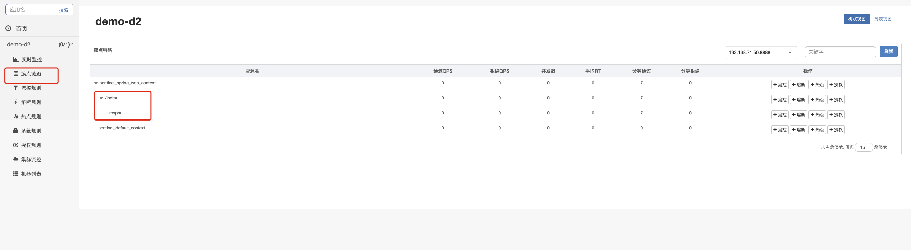

## 各种方式定义sentinel的resource并配置流控触发流控


#### 方式一、默认情况下，controller层的每个方法都是一个默认的资源，资源名称就是访问路径


#### 方式二、使用SphU.entry("xxx")定义资源

- 定义资源

```java
@Component
public class TokenUtils { //类名只是假的
    public void tt(){
        try {
            Entry entry = SphU.entry("msphu");
            System.out.println("yyyyyy");
          
          	entry.exit();
        } catch (BlockException e) {
            System.out.println("触发流控");
        }
    }
}
```

- 调用资源

  ```java
  @Autowired
  TokenUtils tokenUtils;
  
  @GetMapping("/index")
  public void index() throws InterruptedException {
  
    tokenUtils.tt();
  
  }
  ```

- 启动项目并多次调用，然后去看sentinel中的dashboard的簇点链路

  

  定义的资源确实在index资源下

- 在dashboard中配置msphu的流控，进行测试

  

  

#### 方式三、使用SphO.entry("xxx")定义资源

- 定义资源

  ```java
  @Component
  public class TokenUtils {
  
  
      public void tt(){
          boolean res = SphO.entry("msphu");
  
          if(res){
              System.out.println("yyyyyy");
              SphO.exit();
          }else{
  
              System.out.println("触发流控");
          }
  
      }
  
  }
  ```

- 其余跟SphU.entry("xxx")的一样使用


#### 方式四、使用@SentinelResource注解来定义资源

- 定义资源

  ```java
  @SentinelResource(blockHandler = "blockHandlerForGetUser") //blockHandler用于指定触发流控执行的方法
  public void tt(){
    System.out.println("yyyyyy");
  }
  ```

- 定义触发流控的方法

  >  <font color="red">注意该方法的返回值、传参 必须与被@SentinelResource标注的方法一致，传参要在@SentinelResource标注的参数基础上加一个BlockException参数！</font>

  ```java
  public void blockHandlerForGetUser(BlockException exception){
  System.out.println("触发流控！");
  }
  ```

- 调用资源

  ```java
  @Autowired
  TokenUtils tokenUtils;
  
  @GetMapping("/index")
  public void index() throws InterruptedException {
  
    tokenUtils.tt();
  
  }
  ```

- 启动项目并多次调用，然后去看sentinel中的dashboard的簇点链路

  

  定义的资源确实在index资源下

- 在dashboard中配置@SentinelResource对应资源的流控，进行测试

