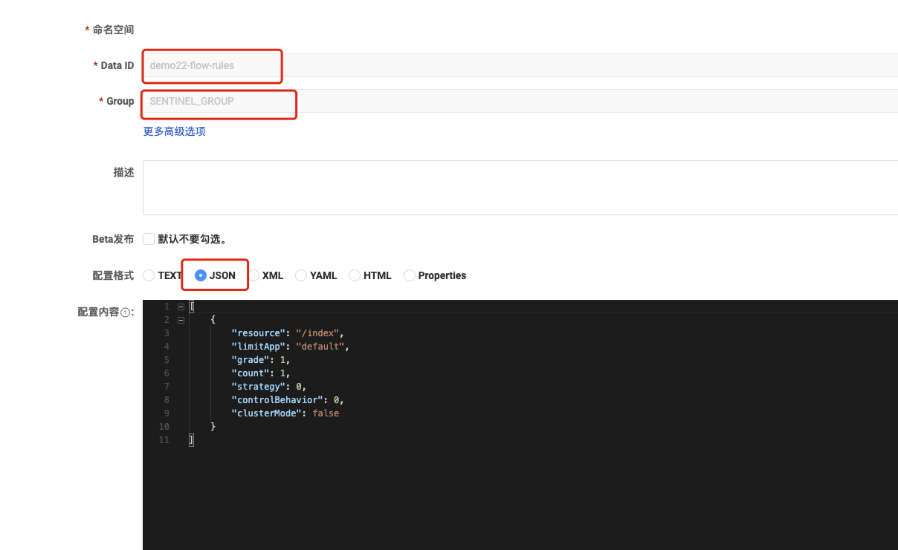
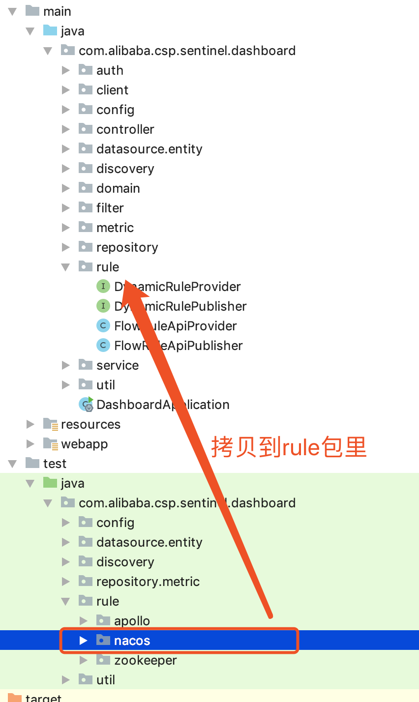

## sentinel流控规则推送到nacos中保证规则持久化


#### 1、现阶段使用的问题

我们对资源进行了流控的配置，但是每当重启应用之后，之前配置的规则在sentinel dashboard中、在对应的应用中都没有了，因为此时规则仅仅是放在内存中临时存储的，重启应用后内存释放了，数据自然就没有了，那这种方式在生产中是绝对不能使用的。


#### 2、解决流控配置数据的持久化

之前的数据是存在内存中的，如果要对数据持久化，就必须要使用第三方的工具来存储，这儿我们选择nacos。sentinel将流控规则推送到nacos中以配置文件的形式存储，sentinel重启后也会再次读取配置文件将流控规则展示到dashboard中，应用中也会读取nacos的配置文件，即便应用重启也会重新读取配置文件，让流控配置生效！


#### 4、具体操作步骤

- 前提准备
  1. 有可用的nacos
  2. 应用成功接入nacos的配置中心，能顺利读取配置
  3. 应用成功接入sentinel，能顺利使用sentinel进行限流

- 在应用服务中引入依赖，注意sentinel-datasource-nacos版本要跟本地的sentinel-core的版本一致

  ```xml
  <!-- https://mvnrepository.com/artifact/com.alibaba.csp/sentinel-datasource-nacos -->
  <dependency>
      <groupId>com.alibaba.csp</groupId>
      <artifactId>sentinel-datasource-nacos</artifactId>
      <version>1.8.6</version>
  </dependency>
  
  <!-- https://mvnrepository.com/artifact/com.alibaba.fastjson2/fastjson2 -->
  <dependency>
      <groupId>com.alibaba.fastjson2</groupId>
      <artifactId>fastjson2</artifactId>
      <version>2.0.33</version>
  </dependency>
  
  ```

  

- 在应用服务中添加如下配置

  ```yaml
  spring:
    cloud:
      nacos:
        config:
          server-addr: 172.16.4.144:8848
          username: nacos
          password: nacos
          file-extension: yaml
      sentinel:
        transport: # transport的配置与下面的datasource配置不能共存，只能使用一个，如果两个都使用了transport的相关配置就失效了！
          dashboard: 172.16.4.144:8080
          port: 8888
        datasource: # sentinel的流控数据来源配置开始
          ds: #给数据源起个名字，这儿起的是ds，可以随便起
            nacos:
              server-addr: 172.16.4.144:8848
              data-id: ${spring.application.name}-flow-rules #最好就叫xxx-flow-rules，因为后面使用sentinel自动生成文件，就是xxx-flow-rules
              group-id: SENTINEL_GROUP
              data-type: json
              rule-type: flow
    application:
      name: demo22
  ```

- 在应用服务中添加Nacos数据源配置类，目的是从nacos读取配置，并注册到本地的sentinel中。

  ```java
  import com.alibaba.cloud.sentinel.SentinelProperties;
  import com.alibaba.cloud.sentinel.datasource.config.NacosDataSourceProperties;
  import com.alibaba.csp.sentinel.datasource.ReadableDataSource;
  import com.alibaba.csp.sentinel.datasource.nacos.NacosDataSource;
  import com.alibaba.csp.sentinel.slots.block.degrade.DegradeRule;
  import com.alibaba.csp.sentinel.slots.block.degrade.DegradeRuleManager;
  import com.alibaba.csp.sentinel.slots.block.flow.FlowRule;
  import com.alibaba.csp.sentinel.slots.block.flow.FlowRuleManager;
  import com.alibaba.fastjson2.JSON;
  import com.alibaba.fastjson2.TypeReference;
  import org.slf4j.Logger;
  import org.slf4j.LoggerFactory;
  import org.springframework.beans.factory.annotation.Autowired;
  import org.springframework.context.annotation.Bean;
  import org.springframework.context.annotation.Configuration;
  
  import java.util.List;
  
  /**
   * @Auther: tangwei
   * @Date: 2023/8/22 9:37 AM
   * @Description: 类描述信息
   */
  @Configuration
  public class DataSourceInitFunc {
  
      Logger logger = LoggerFactory.getLogger(DataSourceInitFunc.class);
  
      @Autowired
      private SentinelProperties sentinelProperties;
  
      @Bean
      public DataSourceInitFunc init() throws Exception {
  
          logger.info("[NacosSource初始化,从Nacos中获取熔断规则]");
  
          sentinelProperties.getDatasource().entrySet().stream().filter(map -> {
              return map.getValue().getNacos() != null;
          }).forEach(map -> {
              NacosDataSourceProperties nacos = map.getValue().getNacos();
  
              System.out.println("需要从nacos中获取的dataId：" + nacos.getDataId());
  
              // 限流规则，需要Nacos的dataId中包含flow字符串
              if (nacos.getDataId().contains("flow")) {
                  ReadableDataSource<String, List<FlowRule>> flowRuleDataSource = new NacosDataSource<>(nacos.getServerAddr(),
                          nacos.getGroupId(), nacos.getDataId(),
                          source -> JSON.parseObject(source, new TypeReference<List<FlowRule>>() {
                          }));
                  FlowRuleManager.register2Property(flowRuleDataSource.getProperty());
              }
  
              // 降级规则，需要Nacos的dataId中包含degrade字符串
              if (nacos.getDataId().contains("degrade")) {
                  ReadableDataSource<String, List<DegradeRule>> degradeRuleDataSource = new NacosDataSource<>(nacos.getServerAddr(),
                          nacos.getGroupId(), nacos.getDataId(),
                          source -> JSON.parseObject(source, new TypeReference<List<DegradeRule>>() {
                          }));
                  DegradeRuleManager.register2Property(degradeRuleDataSource.getProperty());
              }
  
          });
          return new DataSourceInitFunc();
      }
  }
  ```

- 到nacos中新增一个配置文件，配置的信息跟我们在应用中写的配置信息保持一致

  

  配置的内容如下：

  ```json
  [
      {
          "resource": "/index", //要流控的资源名称，我们之前说过每个controller的方法的路径就是一个资源
          "limitApp": "default",
          "grade": 1, // 1来自RuleConstant.FLOW_GRADE_QPS，就是QPS流控
          "count": 1, //流控阈值
          "strategy": 0,
          "controlBehavior": 0, //0 来自 RuleConstant.CONTROL_BEHAVIOR_DEFAULT
          "clusterMode": false
      }
  ]
  ```

- 重启应用，访问/index查看是否被会有限流提示！如果有再次重启，看看流控是否扔然起作用！如果起作用，证明本地应用已经能从nacos读取配置并放到流控规则中！

  <font color="red">这时，我们已经能够从nacos读取流控配置并让流控规则生效了，我们会发现，我们的应用不会再出现到sentinel dashboard中，因为应用不再跟sentinel dashboard直接通讯（不再让sentinel dashboard直接推送流控规则到应用了！）！</font>


- 虽然应用已经能直接读取nacos中的流控配置，但是流控的规则需要我们手写，我们又不是特别了解，那怎么办？

  这时，就需要我们修改sentinel dashboard的源码，让sentinel dashboard把流控规则推送到nacos的配置文件中去！

  

  1. 下载对应版本的sentinel的源码包

     下载地址：https://github.com/alibaba/Sentinel/releases

  2. 找到源码包中的sentinel-dashboard，用idea打开

  3. 找到sentinel-datasource-nacos依赖，去掉<scope>test</scope>一行

  4. 找到 sentinel-dashboard/src/test/java/com/alibaba/csp/sentinel/dashboard/rule/nacos目录，将整个目录拷贝到 sentinel-dashboard/src/main/java/com/alibaba/csp/sentinel/dashboard/rule/

     

  5. 修改NacosConfig类中的nacos的地址，注意修改地址端口也填在里面

     ```java
     @Bean
     public ConfigService nacosConfigService() throws Exception {
       return ConfigFactory.createConfigService("172.16.4.144:8848");
     }
     ```

     

  6. 修改FlowControllerV1类，自动注入provider和publisher

     为什么是FlowControllerV1？我们可以去sentinel dashboard中尝试推送一个流控规则，发现推送的地址为：/v1/flow/rule

     ```java
     @Autowired
     @Qualifier("flowRuleNacosProvider")
     private DynamicRuleProvider<List<FlowRuleEntity>> ruleProvider;
     
     @Autowired
     @Qualifier("flowRuleNacosPublisher")
     private DynamicRulePublisher<List<FlowRuleEntity>> rulePublisher;
     ```

     

  7. 修改FlowControllerV1类，修改/v1/flow/rules路径对应的代码，读取nacos的配置

     ```java
     if (StringUtil.isEmpty(app)) {
       return Result.ofFail(-1, "app can't be null or empty");
     }
     try {
       List<FlowRuleEntity> rules = ruleProvider.getRules(app); //会自动获取Group为SENTINEL_GROUP，DataId为app名称-flow-rules配置的内容
       if (rules != null && !rules.isEmpty()) {
         for (FlowRuleEntity entity : rules) {
           entity.setApp(app);
           if (entity.getClusterConfig() != null && entity.getClusterConfig().getFlowId() != null) {
             entity.setId(entity.getClusterConfig().getFlowId());
           }
         }
       }
       rules = repository.saveAll(rules);
       return Result.ofSuccess(rules);
     } catch (Throwable throwable) {
       logger.error("Error when querying flow rules", throwable);
       return Result.ofThrowable(-1, throwable);
     }
     ```

     

  8. 修改FlowControllerV1类，publishRules方法

     ```java
     private CompletableFuture<Void> publishRules(String app, String ip, Integer port) {
     
       List<FlowRuleEntity> rules = repository.findAllByMachine(MachineInfo.of(app, ip, port));//根据app等信息获取到缓存中所有的流控规则
       try {
         rulePublisher.publish(app, rules); //将流控规则发布到nacos中
         logger.info("添加限流规则成功.....");
       } catch (Exception e) {
         e.printStackTrace();
         logger.info("添加限流规则失败.....");
       }
       return sentinelApiClient.setFlowRuleOfMachineAsync(app, ip, port, rules);
     }
     ```

     处理完成，启动sentinel dashboard，然后打开dashboard页面去配置，看看能不能把数据写到nacos的配置文件中！

  9. 将sentinel dashboard打成jar包就可以使用了！