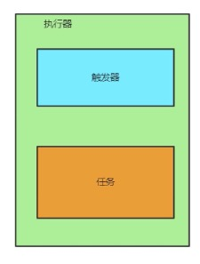

## 单体应用下计划任务基础概念

#### 计划任务的组成部分

1. 执行器：可以理解为我们的application应用
2. 触发器：就是我们的计划任务中写的 @Scheduled(cron = "0/5 * * * * ?") 
3. 任务：就是我们编写的代码，要做什么事情！

#### 在单体应用下的计划任务

执行器、触发器、任务都是在一起的 （无论触发器和任务有多少，下图只是简单画一下）

