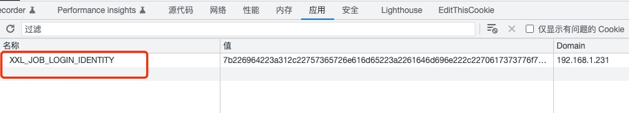

## xxl-job的执行器和任务自动注册

> 本项目使用前提是，xxl-job客户端已经完成了集成并正常使用！
>
> 本文参考：https://mp.weixin.qq.com/s/SK_uWVZ9S9xWepKH6WTmSw

#### 1、项目初衷

在使用xxl-job的时候，我们需要先到xxl-job的任务调度中心页面上，配置**执行器executor**和具体的**任务job**，这一过程如果项目中的定时任务数量不多还好说，如果任务多了的话还是挺费工夫的。假设项目中有上百个这样的定时任务，那么每个任务都需要走一遍绑定`jobHander`或`xxlJob`后端接口，填写`cron`表达式这个流程，填多了谁能不迷糊？

有了上面这些问题，如果执行器和任务能够自动注册，那么这一步早在项目编码过程中就已经完成了。不仅解决了后期逐个添加的繁琐费时间，还避免了可能因为填写太多而出错！

#### 2、原理分析

其实我们要做的很简单，只要在项目启动时主动注册执行器(executor)和各个任务(jobHandler、xxljob)到调度中心就可以了。如下图：

>  xxl-job本身也有个自动注册，不过是根据项目中配置的`xxl.job.executor.appname`，将配置的机器地址自动注册到这个执行器的地址（OnLine机器地址）列表中。但是如果你之前没有手动创建过执行器，那么是不会给你自动添加一个新执行器到调度中心的。


然后，去https://github.com/xuxueli/xxl-job/ 选择需要的版本，拉一份源码，导入idea，看到如下的项目结构：


xxl-job-admin：任务调度中心，启动后就可以访问管理页面，进行执行器和任务的注册、以及任务调用等功能

xxl-job-core：公共依赖，客户端项目中使用到xxl-job时要引入的依赖包

xxl-job-executor-samples：执行示例，分别包含了springboot版本和不使用框架的版本


启动xxl-job-admin，分析其中的功能。

去`执行器管理`菜单中 ，使用执行器的`新增`和`搜索`功能，会发现如下接口：

- `/jobgroup/pageList`：执行器列表的条件查询

  > 注意：在2.1.x的版本中，执行器的条件查询接口是不存在的。整个执行器列表页是一个未前后端分离的页面，也没有分页，我们后续代码中，不是去请求接口，取而代之的是去请求整个页面，然后通过正则匹配的方式获取我们要的数据。

- `/jobgroup/save`：添加执行器

去`任务管理`菜单中，使用任务的`新增`和`搜索`功能，会发现如下接口：

- `/jobinfo/pageList`：任务列表的条件查询

- `/jobinfo/add`：添加任务

  

如果单独请求上述接口或者页面，会发现被重定向到了登录页面了，分析在获取接口或页面数据之前需要登录下，那么就去看下登录功能，发现，登录之后会有一个cookie存在本地浏览器中，每次请求都需要带着这个cookie才能访问接口或页面，如下图：



#### 3、项目开发

> 开发目标：只要引入当前项目的包，就能够实现执行器和任务的自动注册。

- 构建2个Entity，分别为执行器实体和任务实体，用于存储执行器和任务的数据

  > 具体的实体类，是从我们上面下载的xxl-job的源码中直接拿来用的，不同的版本，实体类可能不一样，需要严格对应版本！

  

  - 执行器实体类

    ```java
    package org.ssh.boot.xxljobautoregister.entity;
    
    import java.util.ArrayList;
    import java.util.Arrays;
    import java.util.Date;
    import java.util.List;
    
    /**
     * @Auther: tangwei
     * @Date: 2022/10/21 上午9:30
     * @Description: 类描述信息
     */
    public class XxlJobGroup {
    
        private int id;
        private String appName;
        private String title;
        private int addressType;        // 执行器地址类型：0=自动注册、1=手动录入
        private String addressList;     // 执行器地址列表，多地址逗号分隔(手动录入)
        private Date updateTime;
    
        // registry list
        private List<String> registryList;  // 执行器地址列表(系统注册)
        public List<String> getRegistryList() {
            if (addressList!=null && addressList.trim().length()>0) {
                registryList = new ArrayList<String>(Arrays.asList(addressList.split(",")));
            }
            return registryList;
        }
    
        public int getId() {
            return id;
        }
    
        public void setId(int id) {
            this.id = id;
        }
    
        public String getAppname() {
            return appName;
        }
    
        public void setAppname(String appname) {
            this.appName = appname;
        }
    
        public String getTitle() {
            return title;
        }
    
        public void setTitle(String title) {
            this.title = title;
        }
    
        public int getAddressType() {
            return addressType;
        }
    
        public void setAddressType(int addressType) {
            this.addressType = addressType;
        }
    
        public String getAddressList() {
            return addressList;
        }
    
        public Date getUpdateTime() {
            return updateTime;
        }
    
        public void setUpdateTime(Date updateTime) {
            this.updateTime = updateTime;
        }
    
        public void setAddressList(String addressList) {
            this.addressList = addressList;
        }
    
    }
    
    ```

    

  - 任务实体类

    ```java
    package org.ssh.boot.xxljobautoregister.entity;
    
    import java.util.Date;
    
    /**
     * @Auther: tangwei
     * @Date: 2022/10/21 上午9:30
     * @Description: 类描述信息
     */
    public class XxlJobInfo {
    
        private int id;				// 主键ID
    
        private int jobGroup;		// 执行器主键ID
        private String jobCron;		// 任务执行CRON表达式
        private String jobDesc;
    
        private Date addTime;
        private Date updateTime;
    
        private String author;		// 负责人
        private String alarmEmail;	// 报警邮件
    
        private String executorRouteStrategy;	// 执行器路由策略
        private String executorHandler;		    // 执行器，任务Handler名称
        private String executorParam;		    // 执行器，任务参数
        private String executorBlockStrategy;	// 阻塞处理策略
        private int executorTimeout;     		// 任务执行超时时间，单位秒
        private int executorFailRetryCount;		// 失败重试次数
    
        private String glueType;		// GLUE类型	#com.xxl.job.core.glue.GlueTypeEnum
        private String glueSource;		// GLUE源代码
        private String glueRemark;		// GLUE备注
        private Date glueUpdatetime;	// GLUE更新时间
    
        private String childJobId;		// 子任务ID，多个逗号分隔
    
        private int triggerStatus;		// 调度状态：0-停止，1-运行
        private long triggerLastTime;	// 上次调度时间
        private long triggerNextTime;	// 下次调度时间
    
    
        public int getId() {
            return id;
        }
    
        public void setId(int id) {
            this.id = id;
        }
    
        public int getJobGroup() {
            return jobGroup;
        }
    
        public void setJobGroup(int jobGroup) {
            this.jobGroup = jobGroup;
        }
    
        public String getJobCron() {
            return jobCron;
        }
    
        public void setJobCron(String jobCron) {
            this.jobCron = jobCron;
        }
    
        public String getJobDesc() {
            return jobDesc;
        }
    
        public void setJobDesc(String jobDesc) {
            this.jobDesc = jobDesc;
        }
    
        public Date getAddTime() {
            return addTime;
        }
    
        public void setAddTime(Date addTime) {
            this.addTime = addTime;
        }
    
        public Date getUpdateTime() {
            return updateTime;
        }
    
        public void setUpdateTime(Date updateTime) {
            this.updateTime = updateTime;
        }
    
        public String getAuthor() {
            return author;
        }
    
        public void setAuthor(String author) {
            this.author = author;
        }
    
        public String getAlarmEmail() {
            return alarmEmail;
        }
    
        public void setAlarmEmail(String alarmEmail) {
            this.alarmEmail = alarmEmail;
        }
    
        public String getExecutorRouteStrategy() {
            return executorRouteStrategy;
        }
    
        public void setExecutorRouteStrategy(String executorRouteStrategy) {
            this.executorRouteStrategy = executorRouteStrategy;
        }
    
        public String getExecutorHandler() {
            return executorHandler;
        }
    
        public void setExecutorHandler(String executorHandler) {
            this.executorHandler = executorHandler;
        }
    
        public String getExecutorParam() {
            return executorParam;
        }
    
        public void setExecutorParam(String executorParam) {
            this.executorParam = executorParam;
        }
    
        public String getExecutorBlockStrategy() {
            return executorBlockStrategy;
        }
    
        public void setExecutorBlockStrategy(String executorBlockStrategy) {
            this.executorBlockStrategy = executorBlockStrategy;
        }
    
        public int getExecutorTimeout() {
            return executorTimeout;
        }
    
        public void setExecutorTimeout(int executorTimeout) {
            this.executorTimeout = executorTimeout;
        }
    
        public int getExecutorFailRetryCount() {
            return executorFailRetryCount;
        }
    
        public void setExecutorFailRetryCount(int executorFailRetryCount) {
            this.executorFailRetryCount = executorFailRetryCount;
        }
    
        public String getGlueType() {
            return glueType;
        }
    
        public void setGlueType(String glueType) {
            this.glueType = glueType;
        }
    
        public String getGlueSource() {
            return glueSource;
        }
    
        public void setGlueSource(String glueSource) {
            this.glueSource = glueSource;
        }
    
        public String getGlueRemark() {
            return glueRemark;
        }
    
        public void setGlueRemark(String glueRemark) {
            this.glueRemark = glueRemark;
        }
    
        public Date getGlueUpdatetime() {
            return glueUpdatetime;
        }
    
        public void setGlueUpdatetime(Date glueUpdatetime) {
            this.glueUpdatetime = glueUpdatetime;
        }
    
        public String getChildJobId() {
            return childJobId;
        }
    
        public void setChildJobId(String childJobId) {
            this.childJobId = childJobId;
        }
    
        public int getTriggerStatus() {
            return triggerStatus;
        }
    
        public void setTriggerStatus(int triggerStatus) {
            this.triggerStatus = triggerStatus;
        }
    
        public long getTriggerLastTime() {
            return triggerLastTime;
        }
    
        public void setTriggerLastTime(long triggerLastTime) {
            this.triggerLastTime = triggerLastTime;
        }
    
        public long getTriggerNextTime() {
            return triggerNextTime;
        }
    
        public void setTriggerNextTime(long triggerNextTime) {
            this.triggerNextTime = triggerNextTime;
        }
    }
    
    ```

    

- 为了实现登录并保存cookie到本地：

  创建一个JobLoginService，在调用接口或页面之前，去模拟登录获取cookie，并缓存到本地Map中

  ```java
  @Service
  public class JobLoginServiceImpl implements JobLoginService {
  
      @Value("${xxl.job.admin.addresses}")
      private String adminAddresses;
  
      @Value("${xxl.job.admin.username:admin}")
      private String username;
  
      @Value("${xxl.job.admin.password:123456}")
      private String password;
  
      private final Map<String,String> loginCookie=new HashMap<>();
  
      @Override
      public void login() {
          String url=adminAddresses+"/login";
          HttpResponse response = HttpRequest.post(url)
              .form("userName",username)
              .form("password",password)
              .execute();
          List<HttpCookie> cookies = response.getCookies();
          Optional<HttpCookie> cookieOpt = cookies.stream()
              .filter(cookie -> cookie.getName().equals("XXL_JOB_LOGIN_IDENTITY")).findFirst();
          if (!cookieOpt.isPresent())
              throw new RuntimeException("get xxl-job cookie error!");
  
          String value = cookieOpt.get().getValue();
          loginCookie.put("XXL_JOB_LOGIN_IDENTITY",value);
      }
  
    	
      @Override
      public String getCookie() {
        	// 获取cookie，最多重试3次
          for (int i = 0; i < 3; i++) {
            	//从本地缓存中获取cookie
              String cookieStr = loginCookie.get("XXL_JOB_LOGIN_IDENTITY");
              if (cookieStr !=null) {
                  return "XXL_JOB_LOGIN_IDENTITY="+cookieStr;
              }
            	//如果本地缓存中没有cookie，就去执行一次登录
              login();
          }
          throw new RuntimeException("get xxl-job cookie error!");
      }
  }
  
  ```

  

- 为了实现执行器的自动注册

  创建一个JobGroupService，判断当前执行器是否注册过，没有注册过，把当前执行器进行注册

  > 注意：在配置文件中`xxl.job.executor.appname`与`spring.application.name`最好保持一致

  ```java
  @Service
  public class JobGroupServiceImpl implements JobGroupService {
  
      @Value("${xxl.job.admin.addresses}")
      private String adminAddresses;
  
      @Value("${xxl.job.executor.appname}")
      private String appName;
  
      @Value("${spring.application.name}")
      private String title;
  
      @Autowired
      private JobLoginService jobLoginService;
  
    	//因为2.1.0没有/jobgroup/pageList接口，且后续注册任务需要执行器的ID，所以决定抓取/jobinfo这个页面，获取到执行器名称与属性title一致的执行器信息。
      @Override
      public XxlJobGroup getJobGroup() {
          XxlJobGroup xxlJobGroup = null;
  
          String url=adminAddresses+"/jobinfo";
          HttpResponse response = HttpRequest.get(url)
              .cookie(jobLoginService.getCookie())
              .execute();
  
          String body = response.body();
  
          String pattern = "<option value=\"\\d*\" \\s+>(.|\\n)*?</option>";
          Pattern r = Pattern.compile(pattern);
          Matcher matcher = r.matcher(body);
          List<String> optionList = new ArrayList<>();
          while (matcher.find()) {
              optionList.add(matcher.group());
          }
  
          for (String everyOptionStr: optionList){
  
  
              String id;
              String strWithTrim = everyOptionStr.replace(" ", "")
                  .replace("<optionvalue=\"", "")
                  .replace("\">", "")
                  .replace("</option>", "");
  
              String idStr = "[^0-9]+";
              Pattern idReg = Pattern.compile(idStr);
              String[] res = idReg.split(strWithTrim);
              id = res[0];
  
  
              String patternTmp = "<option value=\"\\d*\" \\s+>";
              Pattern reg = Pattern.compile(patternTmp);
              Matcher matcherEveryOption = reg.matcher(everyOptionStr);
              String re = matcherEveryOption.replaceAll("");
              re = re.replace("</option>", "");
              if (title.equals(re)){
                  xxlJobGroup = new XxlJobGroup();
                  xxlJobGroup.setId(Integer.parseInt(id));
                  xxlJobGroup.setTitle(title);
                  xxlJobGroup.setAppname(appName);
              }
          }
          return xxlJobGroup;
      }
  
    	//自动注册执行器
      @Override
      public boolean autoRegisterGroup() {
          String url=adminAddresses+"/jobgroup/save";
          HttpResponse response = HttpRequest.post(url)
              .form("appName", appName)
              .form("title", title)
              .form("order", 1)
              .cookie(jobLoginService.getCookie())
              .execute();
          Object code = JSONUtil.parse(response.body()).getByPath("code");
          return code.equals(200);
      }
  
    	//拉取/jobgroup页面的数据，如果有一个执行器名称与属性title一致，则返回true，一个都不一致，则返回false，用于判断当前执行是否被注册过。
      @Override
      public boolean preciselyCheck() {
  
          boolean res = false;
  
          String url=adminAddresses+"/jobgroup";
          HttpResponse response = HttpRequest.get(url)
              .cookie(jobLoginService.getCookie())
              .execute();
  
          String body = response.body();
  
          String pattern = "<td.*>(.|\\n)*?</td>";
          Pattern r = Pattern.compile(pattern);
          Matcher matcher = r.matcher(body);
          List<String> tdList = new ArrayList<>();
          while (matcher.find()) {
              tdList.add(matcher.group());
          }
          List<String> tdWord = tdList.stream().map(everyTd-> everyTd.replace("<td>", "").replace("</td>", "")).collect(Collectors.toList());
  
          for(String everyTdWord: tdWord){
              if (title.equals(everyTdWord)){
                  res = true;
                  break;
              }
  
          }
  
          return res;
  
      }
  }
  ```

  

- 为了实现执行器下的任务自动注册

  创建一个JobInfoService，判断当前任务是否注册过，没有注册过，把当前任务进行注册

  ```java
  @Service
  public class JobInfoServiceImpl implements JobInfoService {
  
      @Value("${xxl.job.admin.addresses}")
      private String adminAddresses;
  
      @Autowired
      private JobLoginService jobLoginService;
  
    	//根据执行器ID，判断当前执行器中是否已经注册了该任务
      @Override
      public List<XxlJobInfo> getJobInfo(Integer jobGroupId, String executorHandler) {
          String url=adminAddresses+"/jobinfo/pageList";
          HttpResponse response = HttpRequest.post(url)
              .form("jobGroup", jobGroupId)
              .form("executorHandler", executorHandler)
              .form("triggerStatus", -1)
              .cookie(jobLoginService.getCookie())
              .execute();
  
          String body = response.body();
          JSONArray array = JSONUtil.parse(body).getByPath("data", JSONArray.class);
  
          return array.stream()
              .map(o -> JSONUtil.toBean((JSONObject) o, XxlJobInfo.class))
              .collect(Collectors.toList());
      }
  
    	//注册当前任务
      @Override
      public Integer addJobInfo(XxlJobInfo xxlJobInfo) {
          String url=adminAddresses+"/jobinfo/add";
          Map<String, Object> paramMap = BeanUtil.beanToMap(xxlJobInfo);
          HttpResponse response = HttpRequest.post(url)
              .form(paramMap)
              .cookie(jobLoginService.getCookie())
              .execute();
  
          JSON json = JSONUtil.parse(response.body());
          Object code = json.getByPath("code");
          if (code.equals(200)){
              return Convert.toInt(json.getByPath("content"));
          }
          throw new RuntimeException("add jobInfo error!");
      }
  }
  ```

  

- 创建一个注解，任务的自动注册就是扫描的这个注解

  > 注意：注解中 有 任务描述、负责人、Cron表达式、调度类型、运行模式、运行参数、默认调度状态，这些参数都是一个任务的必要参数。

  ```java
  @Target({ElementType.TYPE})
  @Retention(RetentionPolicy.RUNTIME)
  public @interface XxlRegister {
  
      String cron();
  
      String jobDesc() default "default jobDesc";
  
      String author() default "default Author";
  
      String executorParam() default "";
  
  
  
      /*
       * 默认为 ROUND 轮询方式
       * 可选： FIRST 第一个
       * */
      String executorRouteStrategy() default "ROUND";
  		
    	//默认调度状态，0为停止状态，1为运行状态。
      int triggerStatus() default 0;
  
  ```

  

- 自动注册核心，串联上面的功能

  ```java
  @Component
  public class XxlJobAutoRegister implements ApplicationListener<ApplicationReadyEvent>, ApplicationContextAware {
  
      private static final Log log = LogFactory.get();
  
      private ApplicationContext applicationContext;
  
  
      @Autowired
      private JobGroupService jobGroupService;
  
      @Autowired
      private JobInfoService jobInfoService;
  
      @Value("${xxx.job.base.package}")
      private String basePackage;
  
      @Override
      public void setApplicationContext(ApplicationContext applicationContext) throws BeansException {
          this.applicationContext=applicationContext;
      }
  
      @Override
      public void onApplicationEvent(ApplicationReadyEvent event) {
          //注册执行器
          addJobGroup();
          //注册任务
          addJobInfo();
      }
  
      //自动注册执行器
      private void addJobGroup() {
          if (jobGroupService.preciselyCheck())
              return;
  
          if(jobGroupService.autoRegisterGroup())
              log.info("auto register xxl-job group success!");
      }
  
      private void addJobInfo() {
          XxlJobGroup xxlJobGroup = jobGroupService.getJobGroup();
  
          String base_package = this.basePackage;
          String resource_pattern = "/**/*.class";
  
          //spring工具类，可以获取指定路径下的全部类
          ResourcePatternResolver resourcePatternResolver = new PathMatchingResourcePatternResolver();
          try {
              String pattern = ResourcePatternResolver.CLASSPATH_ALL_URL_PREFIX +
                  ClassUtils.convertClassNameToResourcePath(base_package) + resource_pattern;
              Resource[] resources = resourcePatternResolver.getResources(pattern);
              //MetadataReader 的工厂类
              MetadataReaderFactory readerfactory = new CachingMetadataReaderFactory(resourcePatternResolver);
              for (Resource resource : resources) {
                  //用于读取类信息
                  MetadataReader reader = readerfactory.getMetadataReader(resource);
                  //扫描到的class
                  String classname = reader.getClassMetadata().getClassName();
                  Class<?> clazz = Class.forName(classname);
                  //判断是否有指定主解
                  XxlRegister xxlRegisterAnno = clazz.getAnnotation(XxlRegister.class);
                	//这儿扫描的是JobHandler，如果高版本请扫描XxlJob注解
                  JobHandler jobHandlerAnnotation = clazz.getAnnotation(JobHandler.class);
                  if (xxlRegisterAnno != null && jobHandlerAnnotation != null) {
                      List<XxlJobInfo> jobInfo = jobInfoService.getJobInfo(xxlJobGroup.getId(), jobHandlerAnnotation.value());
                      if (!jobInfo.isEmpty()){
                          //因为是模糊查询，需要再判断一次
                          Optional<XxlJobInfo> first = jobInfo.stream()
                              .filter(xxlJobInfo -> xxlJobInfo.getExecutorHandler().equals(jobHandlerAnnotation.value()))
                              .findFirst();
                          if (first.isPresent())
                              continue;
                      }
  										//构造新增任务需要的数据
                      XxlJobInfo xxlJobInfo = createXxlJobInfo(xxlJobGroup, jobHandlerAnnotation, xxlRegisterAnno);
                      jobInfoService.addJobInfo(xxlJobInfo);//Integer jobInfoId 这儿原本用个参数接收的
  
                  }
              }
          } catch (IOException | ClassNotFoundException e) {
              log.error("register job fail");
          }
      }
  
  		//构造新增任务需要的数据
      private XxlJobInfo createXxlJobInfo(XxlJobGroup xxlJobGroup, JobHandler xxlJob, XxlRegister xxlRegister){
          XxlJobInfo xxlJobInfo=new XxlJobInfo();
          xxlJobInfo.setJobGroup(xxlJobGroup.getId());
          xxlJobInfo.setJobDesc(xxlRegister.jobDesc());
          xxlJobInfo.setAuthor(xxlRegister.author());
          xxlJobInfo.setExecutorRouteStrategy("ROUND");
          xxlJobInfo.setJobCron(xxlRegister.cron());
          xxlJobInfo.setGlueType("BEAN");
          xxlJobInfo.setExecutorHandler(xxlJob.value());
          xxlJobInfo.setExecutorRouteStrategy(xxlRegister.executorRouteStrategy());
          xxlJobInfo.setExecutorBlockStrategy("SERIAL_EXECUTION");
          xxlJobInfo.setExecutorTimeout(0);
          xxlJobInfo.setExecutorFailRetryCount(0);
          xxlJobInfo.setGlueRemark("GLUE代码初始化");
          xxlJobInfo.setTriggerStatus(xxlRegister.triggerStatus());
          xxlJobInfo.setExecutorParam(xxlRegister.executorParam());
  
          return xxlJobInfo;
      }
  }
  
  ```

  

#### 4、测试

在项目中，引入以上项目的包。


在正常使用xxl-job的配置基础上，加入如下配置：

> xxl-job的配置建议：`xxl.job.executor.appname`与`spring.application.name`最好一致

```properties
xxx.job.base.package=要扫描的包路径
xxl.job.admin.username=登录用的用户名
xxl.job.admin.password=登录用的密码
```


引入依赖

```xml

引入上面的包

<dependency>
  <groupId>cn.hutool</groupId>
  <artifactId>hutool-all</artifactId>
  <version>5.4.2</version>
</dependency>
```


新建一个jobHandler，使用我们的注解XxlRegister

> 如果是2.1.x的版本就写，JobHandler，如果是高版本，就用XxlJob注解

```java
@Service
@XxlRegister(cron = "59 1-2 0 * * ?", triggerStatus = 1, executorParam = "test")
@JobHandler(value = "testJob3---new")
public class T2Service extends IJobHandler {

    @Override
    public ReturnT<String> execute(String param) throws Exception {
        System.out.println("yyy");
        return null;
    }
}

```


启动项目，查看功能是否正常！

