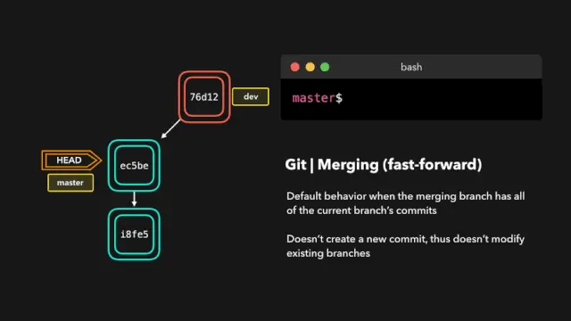
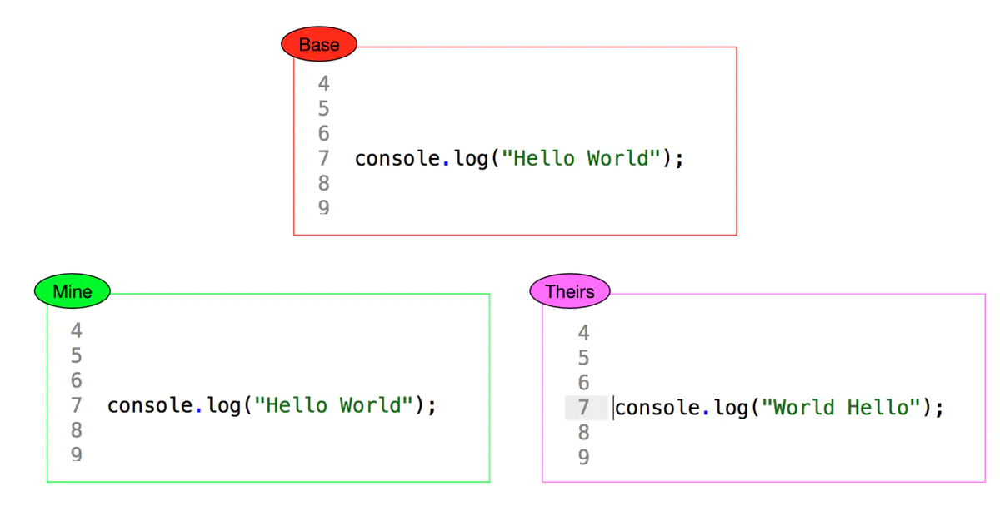
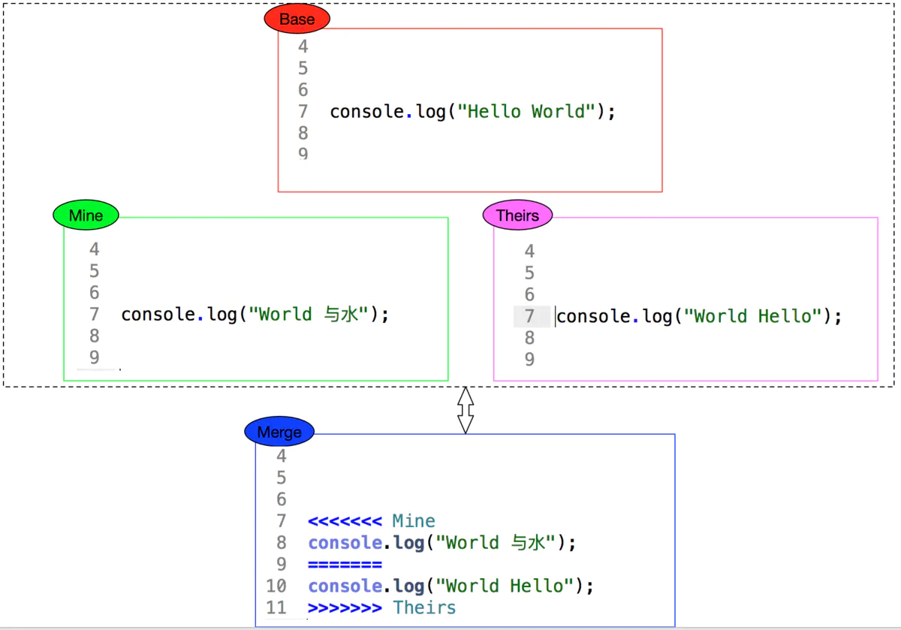
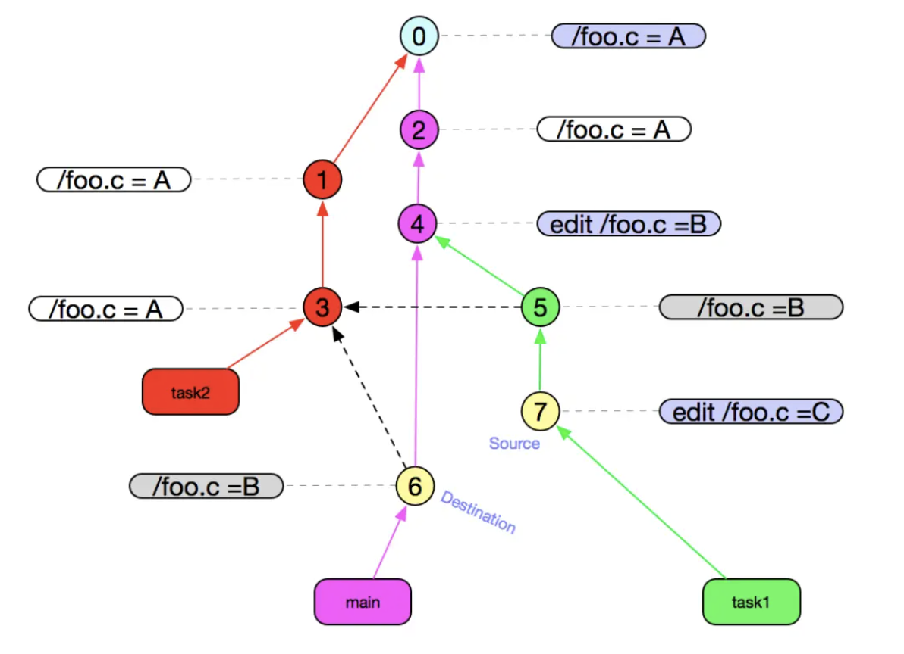
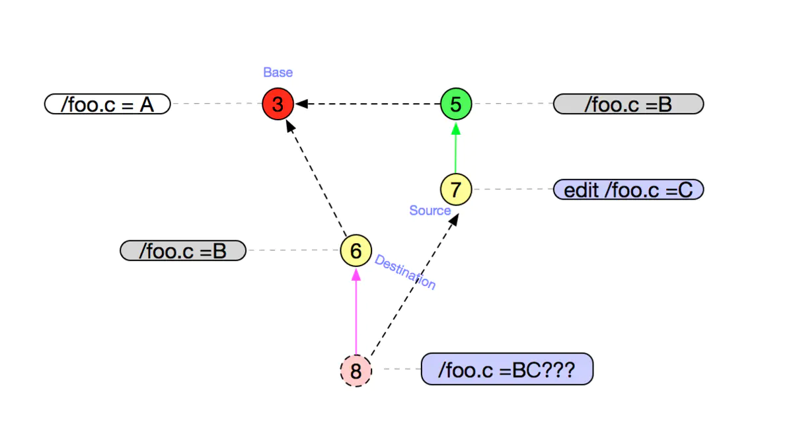
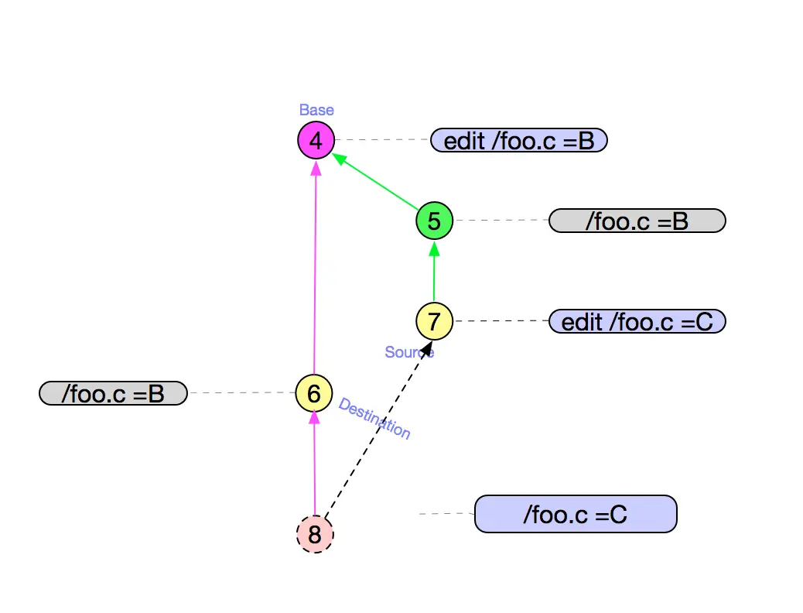
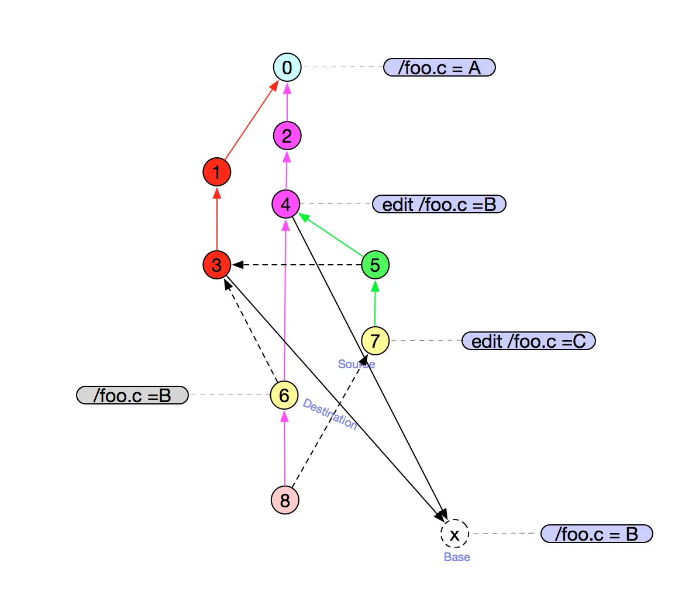

## merge操作

> 代码合并操作

#### 1、使用场景

在使用多分支开发的时候，需要将一个分支的代码合并到另一个分支的时候会使用merge操作

#### 2、合并策略

- 当前分支在合并分支前，没有做过额外提交

  合并分支的过程不会产生的新的提交记录，而是直接将分支上的提交添加进来

  

- 当前分支在合并分支前，做过额外提交，且被合并分支也做了提交

  合并分支的过程会在当前分支额外创建一个新的 合并提交（merging commit）。这条提交记录既指向当前分支，又指向合并分支。

  

#### 3、合并的底层原理

- 三路合并

  一个分支需要合并另一个分支的代码，首先需要找到这两个分支的基准，以基准为Base 进行合并。如果2个文件相对基准(base)都发生了改变 那git 就报冲突，然后让你人工决断。否则，git将取相对于基准(base)变化的那个为最终结果。

  

   Base 代表上一个版本，即公共祖先...
   Mine 代表你本地修改...
   Theirs 代表其他人修改...
   这样当git进行合并的时候，git就知道是其他人修改了，本地没有更改，git就会自动把最终结果变成如下：

  

  

  如果换成下面的这样，就需要人工解决了：

  

- 基准如何查找？

  其实就是找两个分支的公共的祖先节点。

  举例说明：

  

  红色为task2分支，绿色为task1分支，紫色为master分支。

  

  简短描述下 如何会出现上面的图：

  - 在master分支上新建文件foo.c ,写入数据”A”到文件里面
  - 新建分支task2 `git checkout -b task2 0`,0 代表commit Id
  - 改动其它文件，提交commit ① 和 ③
  - 切换分支到master，改动其它文件，提交commit ②
  - 在master分支上，修改foo.c文件中数据为”B”,并提交commit ④
  - 在master分支上，merge commit ③`git merge task2`,生成commit ⑥
  - 新建分支task1 `git chekcout -b task1 ④`
  - 在task1 merge ③ `git merge task2` 生成commit ⑤
  - 新建commit ⑦，并修改foo.c文件内容为”C”
  - 切换分支到master上，并准备merge task1 分支(merge ⑦ ->  ⑥)

  目前要合并task1的代码到master，那么就要找task1、master分支的公共祖先节点，可以找到2个祖先节点，分别为③、④。那么到底选择哪个做为基准呢？

  

  如果选择③作为公共祖先 根据最基本的三路合并，可以看到最终结果⑧ 将需要手动解决冲突 /foo.c = BC???

  

  如果选择④作为公共祖先 根据最基本的三路合并，可以看到最终结果⑧ 将得到 /foo.c=C

  

  我们可以手动合并下，看下实际的合并效果：

  最终得到的foo.c中的内容为C，就证明是以④为公共祖先节点（基准）的。

  有了结论了，那么git底层是怎么选择基准的呢？

  

  

- 基准节点的选择过程

  上面的例子中，在合并⑥、⑦的时候，其实选择的公共祖先节点既不是③也不是④，而是将③、④节点进行合并成一个虚拟的 X节点，然后节点⑥、⑦以X节点为基准进行合并。

  

  但是合并③、④节点的时候，基准节点又需要找，发现是0节点。如果③、④节点的公共祖先节点有2个，那么就需要再次往上找公共祖先节点，去合并，以此类推。

