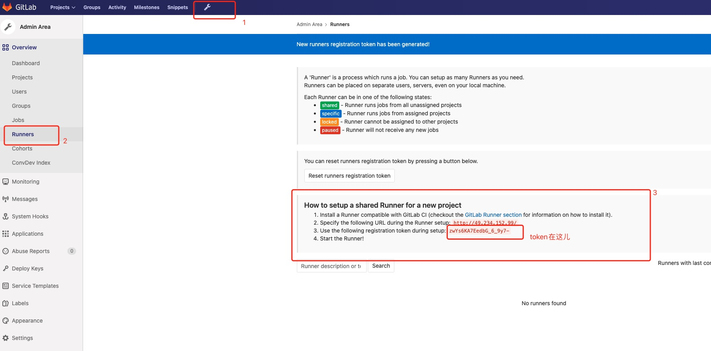
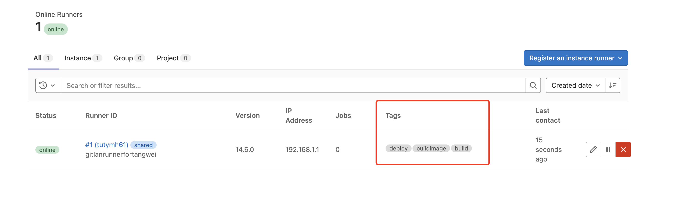

## docker部署gitlab-runner

#### 1、部署前提

1. docker的版本不能低于v1.13.0
2. gitlab runner的版本应与gitlab版本同步
3. 可以根据需要配置任意数量的gitlab runner

#### 2、部署步骤

参考官方文档：https://docs.gitlab.com/runner/install/docker.html#option-1-use-local-system-volume-mounts-to-start-the-runner-container

步骤写的很清楚！

此时部署完了，使用`docker logs -f 容器id`查看容器日志的时候，会提示`ERROR: Failed to load config stat /etc/gitlab-runner/config.toml: no such file or directory  builds=0`，暂时不用管，等注册好了gitlab-runner就不会有这个错误提示了！

#### 3、注册gitlab-runner

1. 根据gitlab-runner的类型，获取token

   - shared类型：

     

   - specific类型（具体的项目中）：

     

   - group类型：

     同specific的方式一致

2. 了解什么是执行器

   执行器就是当gitlab runner在执行作业的时候运行在一个什么样的环境中

   - shell执行器，就是在安装gitlab runner的机器或容器上执行作业
   - docker执行器，每次作业都会启动一个docker容器，在docker内以一个全新的环境进行作业，镜像就用alpine:latest就行，因为每次都会去创建一个容器去执行任务，gitlab-runner的默认拉取镜像的策略是always，我们要修改为if-not-present，找到gitlab-runner的配置文件config.toml，找到[runners.docker]，然后新增一项：pull_policy = "if-not-present”（docker安装的gitlab-runner的话，是隐射出来的配置文件地址）
   - k8s执行器，每次组偶也都会启动一个pod，在pod内以一个全新的环境构建

   

3. 拿到第一步获取的token，去gitlab runner中去注册，**这其中的tag非常重要，会根据.gitlab-ci.yml文件中的tag去找对应tag的runner执行任务。**

   - 注册方式一：交互式注册**（推荐）**

     运行gitlab-runner register 命令 ，随后交互式的输入，gitlab的地址带http的、token、描述信息、CI的tag、选择执行器、选择执行器默认镜像

     填写tag的时候，如果有多个，用","号隔开！tag仅支持英文

     

   - 注册方式二：参数式注册

     gitlab-runner register --non-interactive --executor “执行器类型" --url “gitlab的地址带http的" --registration-token "token" --description "描述" --tag-list "tag1,tag2" --run-untagged="是否运行没有标签的作业，true/false" --locked="false" --access-level="not_protected"

   

4. 第3步注册完成之后就去对应的runner类型找token的页面上去找，有没有对应的runner出现。

   

5. 因为装好gitlab runner之后会新增一个gitlab runner的用户，但是这个用户没有执行docker的权限，需要给他赋权：

   这一步可以省略

   - 将gitlab runner用户添加到docker组

     sudo usermod -aG docker gitlab-runner

   - 测试用gitlab runner的用户运行docker命令

     

附：gitlab runner的其它命令

注销所有已经注册好的gitlab runner：gitlab-runner unregister --all-runners

注销某一个特性的gitlab runner：gitlab-runner unregister --url url地址 --token token字符串

查看gitlab runner是否注册成功：gitlab-runner verify

查看当前的gitlab runner注册了多少个runner：gitlab-runner list

停止当前gitlab runner的服务：gitlab-runner stop

启动当前gitlab runner的服务：gitlab-runner start

重启当前gitlab runner的服务：gitlab-runner restart

卸载gitlab runner：gitlab-runner uninstall

查看gitlab runner的状态：gitlab-runner status