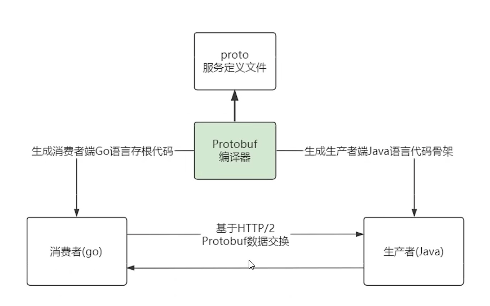

## protobuf的概念与使用流程

#### 1、概念

在grpc的客户端和服务端进行数据通讯中，负责对通讯数据进行编码和解码的工具库，仔细想想是不是有点类似于fastjson这个包，对数据进行encode和decode操作！

#### 2、使用流程

1. 遵循protobuf的语法，编写.proto的服务定义文件，服务定义文件中存储客户端和服务端需要使用的API接口以及API接口数据格式。
2. 使用protobuf的编译工具，将.proto的服务定义文件编译成客户端和服务端（根据语言不同生成不同的）需要的代码。
3. 客户端和服务端将第2步中编译出来的语言，按各自的需要放到各自的代码中。
4. 客户端和服务端进行数据交互，底层会自动使用protobuf进行数据格式的转换，保证转换效率。

