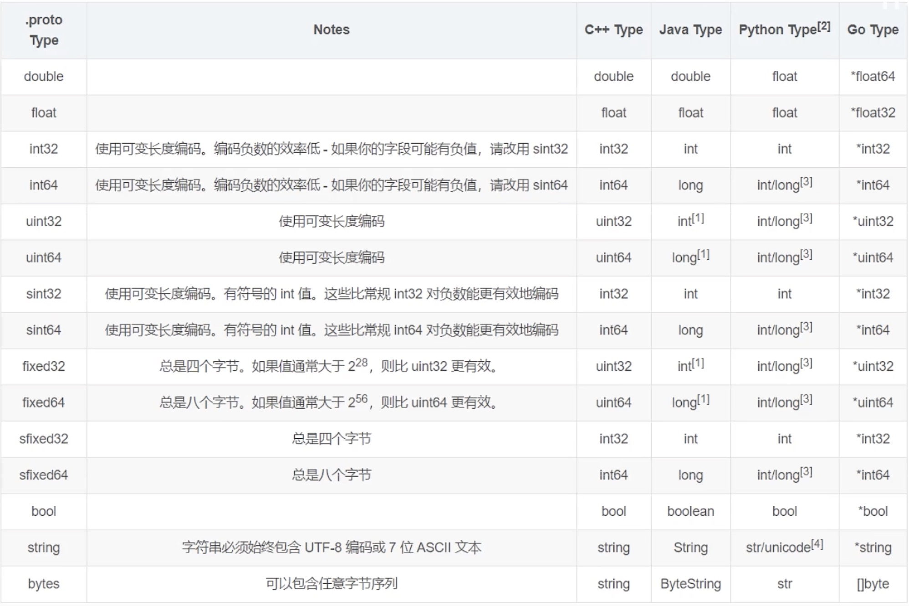

## message关键字内语法详解


#### 1、基本语法

在message内部的语法

```protobuf
message HelloReply {
  string name = 1;
}
```

`string name = 1` string是指定参数的类型、name为参数名、1为参数的顺序。

参数顺序，是底层netty在发送数据的时候对数据进行二进制处理，将数据放在哪一位上的描述！


#### 2、所有的字段类型对应java字段类型

大致如下图




当然，类型还是可以自己定义的message类型，比如

```protobuf
message HelloReply {
  News nnn = 1;
}

message News {
	
	......

}
```

如果被包含的News，不在当前.proto文件中定义的，需要引用的话，只要修改成如下即可

```protobuf
message HelloReply {
  被引用的.proto文件中的package.News nnn = 1;
}
```

