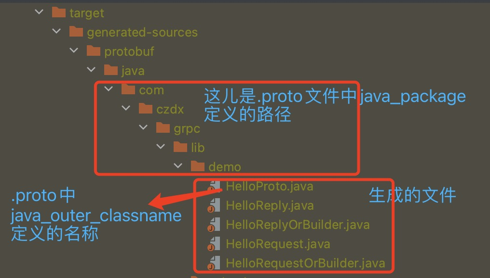
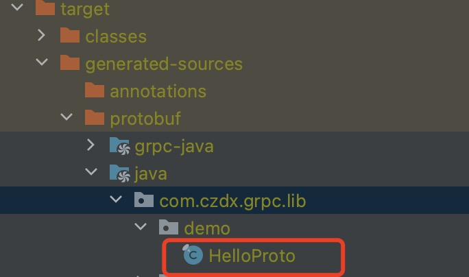
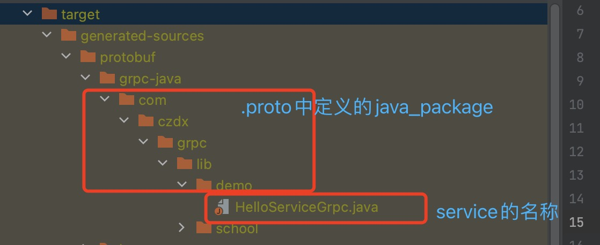

## 编译.proto文件

在springboot集成gPRC依赖的时候，我们已经集成了`protobuf-maven-plugin`的插件，并且在插件中我们定义了两个`goal`，一个

是`compile`一个是`compile-custom`，那么我们就需要使用这俩工具来编译.proto文件。

- 打开maven视窗

- 使用`protobuf:compile`：生成对应的.proto的编译文件。就是对.proto进行解析，按照.proto文件的配置生成对应的java代码。生成的文件在/target/generated-sources/protobuf中

  - 当`option java_multiple_files`为true生成文件如下图

    

    说明：HelloProto.java是生成的我们消息的大类，HelloReply.java、HelloRequest.java是具体的消息类实现，HelloReplyOrBuilder.java、HelloRequestOrBuilder.java是HelloReply.java、HelloRequest.java的接口类。

  - 当`option java_multiple_files`为false生成文件如下图

    

    变成只有一个文件了，因为java_multiple_files设置为false，HelloRequest等类都会成为HelloProto的静态内部类

    

- 使用`protobuf:compile-custom`：生成grpc通信文件。生成的文件在/target/generated-sources/protobuf/grpc-java

  - 当`option java_multiple_files`为true或者false生成文件如下图
  
    
  
    说明：HelloServiceGrpc.java是生成的gRPC的通信类，有很多静态内部类
  
    1. 其中有静态内部类 HelloServiceBlockingStub是客户端存根，用于客户端发起与服务端同步的阻塞的通讯的文件，支持一元通信（客户端发起一个请求等待从服务端获取一个响应）和服务器端的主动推送流（客户端发起一个请求会接收到服务端多次响应）。这个是最常用的。
    2. 有静态内部类HelloServiceFutureStub是客户端存根，用于客户端发起与服务端异步的通讯的文件，基于Guava Future实现，不支持流式传输（即只支持客户端发起请求从服务端获取响应的操作）。
    3. 有静态内部类HelloServiceStub是客户端存根，用于客户端发起与服务端异步通讯的文件，不仅支持一元通信（客户端发起一个请求等待从服务端获取一个响应）也支持双向流式传输（客户端可以源源不断向服务端发送流式数据、服务端在接收一次客户端请求后可以向客户端进行多次响应），这个是最不常用的。
    4. 有静态内部类HelloServiceImplBase是服务端的骨架类，所有的服务端都需要实现这个类以实现具体的业务逻辑。
  
- 注意：如果直接使用 `mvn clean package`那么打出来的包是直接可以使用的，不用把编译文件移动到开发目录中，因为根据.proto文件编译而来的文件会自动生成到了jar包中，不用我们管！

