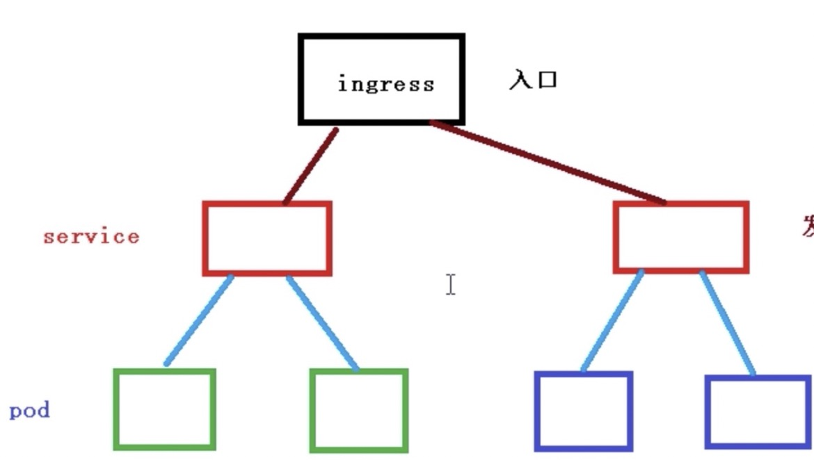

## Ingress概念


#### 什么是Ingress

使用service的NodePort暴露应用，每个节点都会启用一个端口，访问的时候通过任意一个节点的IP+port都能进行访问！但是这样只能局限于IP+Port的形式进行访问。而我们在实际工作中都是域名的形式访问，这个时候就需要使用ingress，在service上的基础上使用ingress配置域名，指向到service的IP+Port中。




#### 使用Ingress

- hostNetwork模式（只需要配置域名就可以访问）

  1. 给k8s内的一个node节点（非master节点）打上label标签

     kubectl label node nodename key=value

  2. 部署Ingress controller

     > 注意：修改Deployment部分的hostNetwork为true，nodeSelector改为上面第1步的label的值

     ```yaml
     apiVersion: v1
     kind: Namespace
     metadata:
       name: ingress-nginx
       labels:
         app.kubernetes.io/name: ingress-nginx
         app.kubernetes.io/part-of: ingress-nginx
     
     ---
     
     kind: ConfigMap
     apiVersion: v1
     metadata:
       name: nginx-configuration
       namespace: ingress-nginx
       labels:
         app.kubernetes.io/name: ingress-nginx
         app.kubernetes.io/part-of: ingress-nginx
     
     ---
     kind: ConfigMap
     apiVersion: v1
     metadata:
       name: tcp-services
       namespace: ingress-nginx
       labels:
         app.kubernetes.io/name: ingress-nginx
         app.kubernetes.io/part-of: ingress-nginx
     
     ---
     kind: ConfigMap
     apiVersion: v1
     metadata:
       name: udp-services
       namespace: ingress-nginx
       labels:
         app.kubernetes.io/name: ingress-nginx
         app.kubernetes.io/part-of: ingress-nginx
     
     ---
     apiVersion: v1
     kind: ServiceAccount
     metadata:
       name: nginx-ingress-serviceaccount
       namespace: ingress-nginx
       labels:
         app.kubernetes.io/name: ingress-nginx
         app.kubernetes.io/part-of: ingress-nginx
     
     ---
     apiVersion: rbac.authorization.k8s.io/v1beta1
     kind: ClusterRole
     metadata:
       name: nginx-ingress-clusterrole
       labels:
         app.kubernetes.io/name: ingress-nginx
         app.kubernetes.io/part-of: ingress-nginx
     rules:
       - apiGroups:
           - ""
         resources:
           - configmaps
           - endpoints
           - nodes
           - pods
           - secrets
         verbs:
           - list
           - watch
       - apiGroups:
           - ""
         resources:
           - nodes
         verbs:
           - get
       - apiGroups:
           - ""
         resources:
           - services
         verbs:
           - get
           - list
           - watch
       - apiGroups:
           - ""
         resources:
           - events
         verbs:
           - create
           - patch
       - apiGroups:
           - "extensions"
           - "networking.k8s.io"
         resources:
           - ingresses
         verbs:
           - get
           - list
           - watch
       - apiGroups:
           - "extensions"
           - "networking.k8s.io"
         resources:
           - ingresses/status
         verbs:
           - update
     
     ---
     apiVersion: rbac.authorization.k8s.io/v1beta1
     kind: Role
     metadata:
       name: nginx-ingress-role
       namespace: ingress-nginx
       labels:
         app.kubernetes.io/name: ingress-nginx
         app.kubernetes.io/part-of: ingress-nginx
     rules:
       - apiGroups:
           - ""
         resources:
           - configmaps
           - pods
           - secrets
           - namespaces
         verbs:
           - get
       - apiGroups:
           - ""
         resources:
           - configmaps
         resourceNames:
           # Defaults to "<election-id>-<ingress-class>"
           # Here: "<ingress-controller-leader>-<nginx>"
           # This has to be adapted if you change either parameter
           # when launching the nginx-ingress-controller.
           - "ingress-controller-leader-nginx"
         verbs:
           - get
           - update
       - apiGroups:
           - ""
         resources:
           - configmaps
         verbs:
           - create
       - apiGroups:
           - ""
         resources:
           - endpoints
         verbs:
           - get
     
     ---
     apiVersion: rbac.authorization.k8s.io/v1beta1
     kind: RoleBinding
     metadata:
       name: nginx-ingress-role-nisa-binding
       namespace: ingress-nginx
       labels:
         app.kubernetes.io/name: ingress-nginx
         app.kubernetes.io/part-of: ingress-nginx
     roleRef:
       apiGroup: rbac.authorization.k8s.io
       kind: Role
       name: nginx-ingress-role
     subjects:
       - kind: ServiceAccount
         name: nginx-ingress-serviceaccount
         namespace: ingress-nginx
     
     ---
     apiVersion: rbac.authorization.k8s.io/v1beta1
     kind: ClusterRoleBinding
     metadata:
       name: nginx-ingress-clusterrole-nisa-binding
       labels:
         app.kubernetes.io/name: ingress-nginx
         app.kubernetes.io/part-of: ingress-nginx
     roleRef:
       apiGroup: rbac.authorization.k8s.io
       kind: ClusterRole
       name: nginx-ingress-clusterrole
     subjects:
       - kind: ServiceAccount
         name: nginx-ingress-serviceaccount
         namespace: ingress-nginx
     
     ---
     
     apiVersion: apps/v1
     kind: Deployment
     metadata:
       name: nginx-ingress-controller
       namespace: ingress-nginx
       labels:
         app.kubernetes.io/name: ingress-nginx
         app.kubernetes.io/part-of: ingress-nginx
     spec:
       replicas: 1
       selector:
         matchLabels:
           app.kubernetes.io/name: ingress-nginx
           app.kubernetes.io/part-of: ingress-nginx
       template:
         metadata:
           labels:
             app.kubernetes.io/name: ingress-nginx
             app.kubernetes.io/part-of: ingress-nginx
           annotations:
             prometheus.io/port: "10254"
             prometheus.io/scrape: "true"
         spec:
           hostNetwork: true
           # wait up to five minutes for the drain of connections
           terminationGracePeriodSeconds: 300
           serviceAccountName: nginx-ingress-serviceaccount
           nodeSelector:
             app: ingress-controller
           containers:
             - name: nginx-ingress-controller
               image: lizhenliang/nginx-ingress-controller:0.30.0   #这儿的镜像可能要换
               args:
                 - /nginx-ingress-controller
                 - --configmap=$(POD_NAMESPACE)/nginx-configuration
                 - --tcp-services-configmap=$(POD_NAMESPACE)/tcp-services
                 - --udp-services-configmap=$(POD_NAMESPACE)/udp-services
                 - --publish-service=$(POD_NAMESPACE)/ingress-nginx
                 - --annotations-prefix=nginx.ingress.kubernetes.io
               securityContext:
                 allowPrivilegeEscalation: true
                 capabilities:
                   drop:
                     - ALL
                   add:
                     - NET_BIND_SERVICE
                 # www-data -> 101
                 runAsUser: 101
               env:
                 - name: POD_NAME
                   valueFrom:
                     fieldRef:
                       fieldPath: metadata.name
                 - name: POD_NAMESPACE
                   valueFrom:
                     fieldRef:
                       fieldPath: metadata.namespace
               ports:
                 - name: http
                   containerPort: 80
                   protocol: TCP
                 - name: https
                   containerPort: 443
                   protocol: TCP
               livenessProbe:
                 failureThreshold: 3
                 httpGet:
                   path: /healthz
                   port: 10254
                   scheme: HTTP
                 initialDelaySeconds: 10
                 periodSeconds: 10
                 successThreshold: 1
                 timeoutSeconds: 10
               readinessProbe:
                 failureThreshold: 3
                 httpGet:
                   path: /healthz
                   port: 10254
                   scheme: HTTP
                 periodSeconds: 10
                 successThreshold: 1
                 timeoutSeconds: 10
               lifecycle:
                 preStop:
                   exec:
                     command:
                       - /wait-shutdown
     
     ---
     
     apiVersion: v1
     kind: LimitRange
     metadata:
       name: ingress-nginx
       namespace: ingress-nginx
       labels:
         app.kubernetes.io/name: ingress-nginx
         app.kubernetes.io/part-of: ingress-nginx
     spec:
       limits:
       - min:
           memory: 90Mi
           cpu: 100m
         type: Container
     
     ```

     上面会创建一个名为ingress-nginx的namespace、一个名为nginx-ingress-controller的deployment、一个名为nginx-ingress-controller-xxxxx的pod（<font color="red">这个pod会根据Label的匹配，然后精准的放到对应的node节点上定到</font>）

  3. 部署ingress (就是指定域名指向到k8s内的service)

     ```yaml
     apiVersion: networking.k8s.io/v1beta1
     kind: Ingress
     metadata:
       name: example-ingress
       namespace: xxxxx
     spec:
       rules:
       - host: twmall-test.xiao5.cn #域名
         http:
           paths:
           - path: /
             backend:
               serviceName: twmall-product #域名要对应的svc的名称
               servicePort: 9111  #域名对应的svc内网端口，注意是内网，不是nodeport暴露的端口
     
     ```

  4. 域名服务商那边配置域名指向到第2步 ingress controller的pod所在node节点的IP地址，就能直接使用域名访问。


- 使用Ingress nginx的方式 （需要配置域名 + service的端口）

  1. 部署Ingress controller

     ```yaml
     apiVersion: v1
     kind: Namespace
     metadata:
       name: ingress-nginx
       labels:
         app.kubernetes.io/name: ingress-nginx
         app.kubernetes.io/instance: ingress-nginx
     
     ---
     # Source: ingress-nginx/templates/controller-serviceaccount.yaml
     apiVersion: v1
     kind: ServiceAccount
     metadata:
       labels:
         helm.sh/chart: ingress-nginx-3.33.0
         app.kubernetes.io/name: ingress-nginx
         app.kubernetes.io/instance: ingress-nginx
         app.kubernetes.io/version: 0.47.0
         app.kubernetes.io/managed-by: Helm
         app.kubernetes.io/component: controller
       name: ingress-nginx
       namespace: ingress-nginx
     automountServiceAccountToken: true
     ---
     # Source: ingress-nginx/templates/controller-configmap.yaml
     apiVersion: v1
     kind: ConfigMap
     metadata:
       labels:
         helm.sh/chart: ingress-nginx-3.33.0
         app.kubernetes.io/name: ingress-nginx
         app.kubernetes.io/instance: ingress-nginx
         app.kubernetes.io/version: 0.47.0
         app.kubernetes.io/managed-by: Helm
         app.kubernetes.io/component: controller
       name: ingress-nginx-controller
       namespace: ingress-nginx
     data:
     ---
     # Source: ingress-nginx/templates/clusterrole.yaml
     apiVersion: rbac.authorization.k8s.io/v1
     kind: ClusterRole
     metadata:
       labels:
         helm.sh/chart: ingress-nginx-3.33.0
         app.kubernetes.io/name: ingress-nginx
         app.kubernetes.io/instance: ingress-nginx
         app.kubernetes.io/version: 0.47.0
         app.kubernetes.io/managed-by: Helm
       name: ingress-nginx
     rules:
       - apiGroups:
           - ''
         resources:
           - configmaps
           - endpoints
           - nodes
           - pods
           - secrets
         verbs:
           - list
           - watch
       - apiGroups:
           - ''
         resources:
           - nodes
         verbs:
           - get
       - apiGroups:
           - ''
         resources:
           - services
         verbs:
           - get
           - list
           - watch
       - apiGroups:
           - extensions
           - networking.k8s.io   # k8s 1.14+
         resources:
           - ingresses
         verbs:
           - get
           - list
           - watch
       - apiGroups:
           - ''
         resources:
           - events
         verbs:
           - create
           - patch
       - apiGroups:
           - extensions
           - networking.k8s.io   # k8s 1.14+
         resources:
           - ingresses/status
         verbs:
           - update
       - apiGroups:
           - networking.k8s.io   # k8s 1.14+
         resources:
           - ingressclasses
         verbs:
           - get
           - list
           - watch
     ---
     # Source: ingress-nginx/templates/clusterrolebinding.yaml
     apiVersion: rbac.authorization.k8s.io/v1
     kind: ClusterRoleBinding
     metadata:
       labels:
         helm.sh/chart: ingress-nginx-3.33.0
         app.kubernetes.io/name: ingress-nginx
         app.kubernetes.io/instance: ingress-nginx
         app.kubernetes.io/version: 0.47.0
         app.kubernetes.io/managed-by: Helm
       name: ingress-nginx
     roleRef:
       apiGroup: rbac.authorization.k8s.io
       kind: ClusterRole
       name: ingress-nginx
     subjects:
       - kind: ServiceAccount
         name: ingress-nginx
         namespace: ingress-nginx
     ---
     # Source: ingress-nginx/templates/controller-role.yaml
     apiVersion: rbac.authorization.k8s.io/v1
     kind: Role
     metadata:
       labels:
         helm.sh/chart: ingress-nginx-3.33.0
         app.kubernetes.io/name: ingress-nginx
         app.kubernetes.io/instance: ingress-nginx
         app.kubernetes.io/version: 0.47.0
         app.kubernetes.io/managed-by: Helm
         app.kubernetes.io/component: controller
       name: ingress-nginx
       namespace: ingress-nginx
     rules:
       - apiGroups:
           - ''
         resources:
           - namespaces
         verbs:
           - get
       - apiGroups:
           - ''
         resources:
           - configmaps
           - pods
           - secrets
           - endpoints
         verbs:
           - get
           - list
           - watch
       - apiGroups:
           - ''
         resources:
           - services
         verbs:
           - get
           - list
           - watch
       - apiGroups:
           - extensions
           - networking.k8s.io   # k8s 1.14+
         resources:
           - ingresses
         verbs:
           - get
           - list
           - watch
       - apiGroups:
           - extensions
           - networking.k8s.io   # k8s 1.14+
         resources:
           - ingresses/status
         verbs:
           - update
       - apiGroups:
           - networking.k8s.io   # k8s 1.14+
         resources:
           - ingressclasses
         verbs:
           - get
           - list
           - watch
       - apiGroups:
           - ''
         resources:
           - configmaps
         resourceNames:
           - ingress-controller-leader-nginx
         verbs:
           - get
           - update
       - apiGroups:
           - ''
         resources:
           - configmaps
         verbs:
           - create
       - apiGroups:
           - ''
         resources:
           - events
         verbs:
           - create
           - patch
     ---
     # Source: ingress-nginx/templates/controller-rolebinding.yaml
     apiVersion: rbac.authorization.k8s.io/v1
     kind: RoleBinding
     metadata:
       labels:
         helm.sh/chart: ingress-nginx-3.33.0
         app.kubernetes.io/name: ingress-nginx
         app.kubernetes.io/instance: ingress-nginx
         app.kubernetes.io/version: 0.47.0
         app.kubernetes.io/managed-by: Helm
         app.kubernetes.io/component: controller
       name: ingress-nginx
       namespace: ingress-nginx
     roleRef:
       apiGroup: rbac.authorization.k8s.io
       kind: Role
       name: ingress-nginx
     subjects:
       - kind: ServiceAccount
         name: ingress-nginx
         namespace: ingress-nginx
     ---
     # Source: ingress-nginx/templates/controller-service-webhook.yaml
     apiVersion: v1
     kind: Service
     metadata:
       labels:
         helm.sh/chart: ingress-nginx-3.33.0
         app.kubernetes.io/name: ingress-nginx
         app.kubernetes.io/instance: ingress-nginx
         app.kubernetes.io/version: 0.47.0
         app.kubernetes.io/managed-by: Helm
         app.kubernetes.io/component: controller
       name: ingress-nginx-controller-admission
       namespace: ingress-nginx
     spec:
       type: ClusterIP
       ports:
         - name: https-webhook
           port: 443
           targetPort: webhook
       selector:
         app.kubernetes.io/name: ingress-nginx
         app.kubernetes.io/instance: ingress-nginx
         app.kubernetes.io/component: controller
     ---
     # Source: ingress-nginx/templates/controller-service.yaml
     apiVersion: v1
     kind: Service
     metadata:
       annotations:
       labels:
         helm.sh/chart: ingress-nginx-3.33.0
         app.kubernetes.io/name: ingress-nginx
         app.kubernetes.io/instance: ingress-nginx
         app.kubernetes.io/version: 0.47.0
         app.kubernetes.io/managed-by: Helm
         app.kubernetes.io/component: controller
       name: ingress-nginx-controller
       namespace: ingress-nginx
     spec:
       type: NodePort
       ports:
         - name: http
           port: 80
           protocol: TCP
           targetPort: http
         - name: https
           port: 443
           protocol: TCP
           targetPort: https
       selector:
         app.kubernetes.io/name: ingress-nginx
         app.kubernetes.io/instance: ingress-nginx
         app.kubernetes.io/component: controller
     ---
     # Source: ingress-nginx/templates/controller-deployment.yaml
     apiVersion: apps/v1
     kind: Deployment
     metadata:
       labels:
         helm.sh/chart: ingress-nginx-3.33.0
         app.kubernetes.io/name: ingress-nginx
         app.kubernetes.io/instance: ingress-nginx
         app.kubernetes.io/version: 0.47.0
         app.kubernetes.io/managed-by: Helm
         app.kubernetes.io/component: controller
       name: ingress-nginx-controller
       namespace: ingress-nginx
     spec:
       selector:
         matchLabels:
           app.kubernetes.io/name: ingress-nginx
           app.kubernetes.io/instance: ingress-nginx
           app.kubernetes.io/component: controller
       revisionHistoryLimit: 10
       minReadySeconds: 0
       template:
         metadata:
           labels:
             app.kubernetes.io/name: ingress-nginx
             app.kubernetes.io/instance: ingress-nginx
             app.kubernetes.io/component: controller
         spec:
           dnsPolicy: ClusterFirst
           containers:
             - name: controller
               image: registry.cn-hangzhou.aliyuncs.com/lfy_k8s_images/ingress-nginx-controller:v0.46.0
               imagePullPolicy: IfNotPresent
               lifecycle:
                 preStop:
                   exec:
                     command:
                       - /wait-shutdown
               args:
                 - /nginx-ingress-controller
                 - --election-id=ingress-controller-leader
                 - --ingress-class=nginx
                 - --configmap=$(POD_NAMESPACE)/ingress-nginx-controller
                 - --validating-webhook=:8443
                 - --validating-webhook-certificate=/usr/local/certificates/cert
                 - --validating-webhook-key=/usr/local/certificates/key
               securityContext:
                 capabilities:
                   drop:
                     - ALL
                   add:
                     - NET_BIND_SERVICE
                 runAsUser: 101
                 allowPrivilegeEscalation: true
               env:
                 - name: POD_NAME
                   valueFrom:
                     fieldRef:
                       fieldPath: metadata.name
                 - name: POD_NAMESPACE
                   valueFrom:
                     fieldRef:
                       fieldPath: metadata.namespace
                 - name: LD_PRELOAD
                   value: /usr/local/lib/libmimalloc.so
               livenessProbe:
                 failureThreshold: 5
                 httpGet:
                   path: /healthz
                   port: 10254
                   scheme: HTTP
                 initialDelaySeconds: 10
                 periodSeconds: 10
                 successThreshold: 1
                 timeoutSeconds: 1
               readinessProbe:
                 failureThreshold: 3
                 httpGet:
                   path: /healthz
                   port: 10254
                   scheme: HTTP
                 initialDelaySeconds: 10
                 periodSeconds: 10
                 successThreshold: 1
                 timeoutSeconds: 1
               ports:
                 - name: http
                   containerPort: 80
                   protocol: TCP
                 - name: https
                   containerPort: 443
                   protocol: TCP
                 - name: webhook
                   containerPort: 8443
                   protocol: TCP
               volumeMounts:
                 - name: webhook-cert
                   mountPath: /usr/local/certificates/
                   readOnly: true
               resources:
                 requests:
                   cpu: 100m
                   memory: 90Mi
           nodeSelector:
             kubernetes.io/os: linux
           serviceAccountName: ingress-nginx
           terminationGracePeriodSeconds: 300
           volumes:
             - name: webhook-cert
               secret:
                 secretName: ingress-nginx-admission
     ---
     # Source: ingress-nginx/templates/admission-webhooks/validating-webhook.yaml
     # before changing this value, check the required kubernetes version
     # https://kubernetes.io/docs/reference/access-authn-authz/extensible-admission-controllers/#prerequisites
     apiVersion: admissionregistration.k8s.io/v1
     kind: ValidatingWebhookConfiguration
     metadata:
       labels:
         helm.sh/chart: ingress-nginx-3.33.0
         app.kubernetes.io/name: ingress-nginx
         app.kubernetes.io/instance: ingress-nginx
         app.kubernetes.io/version: 0.47.0
         app.kubernetes.io/managed-by: Helm
         app.kubernetes.io/component: admission-webhook
       name: ingress-nginx-admission
     webhooks:
       - name: validate.nginx.ingress.kubernetes.io
         matchPolicy: Equivalent
         rules:
           - apiGroups:
               - networking.k8s.io
             apiVersions:
               - v1beta1
             operations:
               - CREATE
               - UPDATE
             resources:
               - ingresses
         failurePolicy: Fail
         sideEffects: None
         admissionReviewVersions:
           - v1
           - v1beta1
         clientConfig:
           service:
             namespace: ingress-nginx
             name: ingress-nginx-controller-admission
             path: /networking/v1beta1/ingresses
     ---
     # Source: ingress-nginx/templates/admission-webhooks/job-patch/serviceaccount.yaml
     apiVersion: v1
     kind: ServiceAccount
     metadata:
       name: ingress-nginx-admission
       annotations:
         helm.sh/hook: pre-install,pre-upgrade,post-install,post-upgrade
         helm.sh/hook-delete-policy: before-hook-creation,hook-succeeded
       labels:
         helm.sh/chart: ingress-nginx-3.33.0
         app.kubernetes.io/name: ingress-nginx
         app.kubernetes.io/instance: ingress-nginx
         app.kubernetes.io/version: 0.47.0
         app.kubernetes.io/managed-by: Helm
         app.kubernetes.io/component: admission-webhook
       namespace: ingress-nginx
     ---
     # Source: ingress-nginx/templates/admission-webhooks/job-patch/clusterrole.yaml
     apiVersion: rbac.authorization.k8s.io/v1
     kind: ClusterRole
     metadata:
       name: ingress-nginx-admission
       annotations:
         helm.sh/hook: pre-install,pre-upgrade,post-install,post-upgrade
         helm.sh/hook-delete-policy: before-hook-creation,hook-succeeded
       labels:
         helm.sh/chart: ingress-nginx-3.33.0
         app.kubernetes.io/name: ingress-nginx
         app.kubernetes.io/instance: ingress-nginx
         app.kubernetes.io/version: 0.47.0
         app.kubernetes.io/managed-by: Helm
         app.kubernetes.io/component: admission-webhook
     rules:
       - apiGroups:
           - admissionregistration.k8s.io
         resources:
           - validatingwebhookconfigurations
         verbs:
           - get
           - update
     ---
     # Source: ingress-nginx/templates/admission-webhooks/job-patch/clusterrolebinding.yaml
     apiVersion: rbac.authorization.k8s.io/v1
     kind: ClusterRoleBinding
     metadata:
       name: ingress-nginx-admission
       annotations:
         helm.sh/hook: pre-install,pre-upgrade,post-install,post-upgrade
         helm.sh/hook-delete-policy: before-hook-creation,hook-succeeded
       labels:
         helm.sh/chart: ingress-nginx-3.33.0
         app.kubernetes.io/name: ingress-nginx
         app.kubernetes.io/instance: ingress-nginx
         app.kubernetes.io/version: 0.47.0
         app.kubernetes.io/managed-by: Helm
         app.kubernetes.io/component: admission-webhook
     roleRef:
       apiGroup: rbac.authorization.k8s.io
       kind: ClusterRole
       name: ingress-nginx-admission
     subjects:
       - kind: ServiceAccount
         name: ingress-nginx-admission
         namespace: ingress-nginx
     ---
     # Source: ingress-nginx/templates/admission-webhooks/job-patch/role.yaml
     apiVersion: rbac.authorization.k8s.io/v1
     kind: Role
     metadata:
       name: ingress-nginx-admission
       annotations:
         helm.sh/hook: pre-install,pre-upgrade,post-install,post-upgrade
         helm.sh/hook-delete-policy: before-hook-creation,hook-succeeded
       labels:
         helm.sh/chart: ingress-nginx-3.33.0
         app.kubernetes.io/name: ingress-nginx
         app.kubernetes.io/instance: ingress-nginx
         app.kubernetes.io/version: 0.47.0
         app.kubernetes.io/managed-by: Helm
         app.kubernetes.io/component: admission-webhook
       namespace: ingress-nginx
     rules:
       - apiGroups:
           - ''
         resources:
           - secrets
         verbs:
           - get
           - create
     ---
     # Source: ingress-nginx/templates/admission-webhooks/job-patch/rolebinding.yaml
     apiVersion: rbac.authorization.k8s.io/v1
     kind: RoleBinding
     metadata:
       name: ingress-nginx-admission
       annotations:
         helm.sh/hook: pre-install,pre-upgrade,post-install,post-upgrade
         helm.sh/hook-delete-policy: before-hook-creation,hook-succeeded
       labels:
         helm.sh/chart: ingress-nginx-3.33.0
         app.kubernetes.io/name: ingress-nginx
         app.kubernetes.io/instance: ingress-nginx
         app.kubernetes.io/version: 0.47.0
         app.kubernetes.io/managed-by: Helm
         app.kubernetes.io/component: admission-webhook
       namespace: ingress-nginx
     roleRef:
       apiGroup: rbac.authorization.k8s.io
       kind: Role
       name: ingress-nginx-admission
     subjects:
       - kind: ServiceAccount
         name: ingress-nginx-admission
         namespace: ingress-nginx
     ---
     # Source: ingress-nginx/templates/admission-webhooks/job-patch/job-createSecret.yaml
     apiVersion: batch/v1
     kind: Job
     metadata:
       name: ingress-nginx-admission-create
       annotations:
         helm.sh/hook: pre-install,pre-upgrade
         helm.sh/hook-delete-policy: before-hook-creation,hook-succeeded
       labels:
         helm.sh/chart: ingress-nginx-3.33.0
         app.kubernetes.io/name: ingress-nginx
         app.kubernetes.io/instance: ingress-nginx
         app.kubernetes.io/version: 0.47.0
         app.kubernetes.io/managed-by: Helm
         app.kubernetes.io/component: admission-webhook
       namespace: ingress-nginx
     spec:
       template:
         metadata:
           name: ingress-nginx-admission-create
           labels:
             helm.sh/chart: ingress-nginx-3.33.0
             app.kubernetes.io/name: ingress-nginx
             app.kubernetes.io/instance: ingress-nginx
             app.kubernetes.io/version: 0.47.0
             app.kubernetes.io/managed-by: Helm
             app.kubernetes.io/component: admission-webhook
         spec:
           containers:
             - name: create
               image: docker.io/jettech/kube-webhook-certgen:v1.5.1
               imagePullPolicy: IfNotPresent
               args:
                 - create
                 - --host=ingress-nginx-controller-admission,ingress-nginx-controller-admission.$(POD_NAMESPACE).svc
                 - --namespace=$(POD_NAMESPACE)
                 - --secret-name=ingress-nginx-admission
               env:
                 - name: POD_NAMESPACE
                   valueFrom:
                     fieldRef:
                       fieldPath: metadata.namespace
           restartPolicy: OnFailure
           serviceAccountName: ingress-nginx-admission
           securityContext:
             runAsNonRoot: true
             runAsUser: 2000
     ---
     # Source: ingress-nginx/templates/admission-webhooks/job-patch/job-patchWebhook.yaml
     apiVersion: batch/v1
     kind: Job
     metadata:
       name: ingress-nginx-admission-patch
       annotations:
         helm.sh/hook: post-install,post-upgrade
         helm.sh/hook-delete-policy: before-hook-creation,hook-succeeded
       labels:
         helm.sh/chart: ingress-nginx-3.33.0
         app.kubernetes.io/name: ingress-nginx
         app.kubernetes.io/instance: ingress-nginx
         app.kubernetes.io/version: 0.47.0
         app.kubernetes.io/managed-by: Helm
         app.kubernetes.io/component: admission-webhook
       namespace: ingress-nginx
     spec:
       template:
         metadata:
           name: ingress-nginx-admission-patch
           labels:
             helm.sh/chart: ingress-nginx-3.33.0
             app.kubernetes.io/name: ingress-nginx
             app.kubernetes.io/instance: ingress-nginx
             app.kubernetes.io/version: 0.47.0
             app.kubernetes.io/managed-by: Helm
             app.kubernetes.io/component: admission-webhook
         spec:
           containers:
             - name: patch
               image: docker.io/jettech/kube-webhook-certgen:v1.5.1
               imagePullPolicy: IfNotPresent
               args:
                 - patch
                 - --webhook-name=ingress-nginx-admission
                 - --namespace=$(POD_NAMESPACE)
                 - --patch-mutating=false
                 - --secret-name=ingress-nginx-admission
                 - --patch-failure-policy=Fail
               env:
                 - name: POD_NAMESPACE
                   valueFrom:
                     fieldRef:
                       fieldPath: metadata.namespace
           restartPolicy: OnFailure
           serviceAccountName: ingress-nginx-admission
           securityContext:
             runAsNonRoot: true
             runAsUser: 2000
     
     ```

  2. 部署ingress

     ```yaml
     apiVersion: networking.k8s.io/v1beta1
     kind: Ingress
     metadata:
       name: example-ingress
       namespace: xxxxx
     spec:
       rules:
       - host: twmall-test.xiao5.cn #域名
         http:
           paths:
           - path: /
             backend:
               serviceName: twmall-product #域名要对应的svc的名称
               servicePort: 9111  #域名对应的svc内网端口，注意是内网，不是nodeport暴露的端口
     
     ```

  3. 域名服务商那边配置域名指向到master节点的IP，然后通过域名 + <font color="red">service通过nodeport暴露的的Port</font>就可以实现访问。