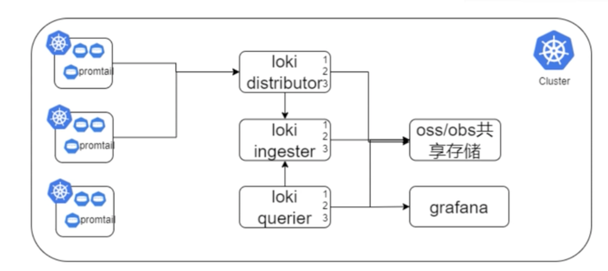
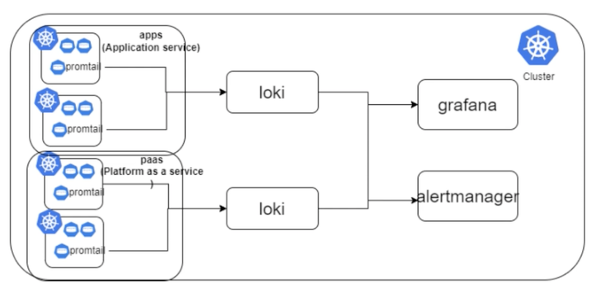

## loki的集群架构方案

#### 1、方案1

> 这个方案，适合中小企业，架构相对简单，容易维护！

loki单独部署，可以单独部署在宿主机中，也可以单独部署在pod中。

promtail以sidecar的方式部署在应用的pod中，负责采集日志到loki

#### 2、方案2

> 架构相对复杂，适合大型企业

loki的组件拆开且集群化部署，loki distributor部署3个pod、loki ingester部署3个pod、loki querier部署3个pod，loki的各个组件之间的数据共享oss的对象存储。

promtail以sidecar的方式部署在应用的pod中，负责采集日志到loki

#### 3、方案3

> 适合大型企业

loki部署多个，可以部署在pod中，也可以部署在宿主机上，不同的业务走不同的loki服务。

promtail以sidecar的方式部署在应用的pod中，负责采集日志到loki

