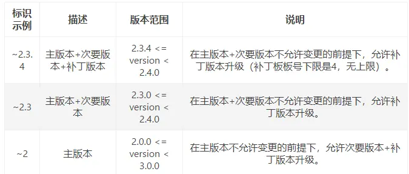
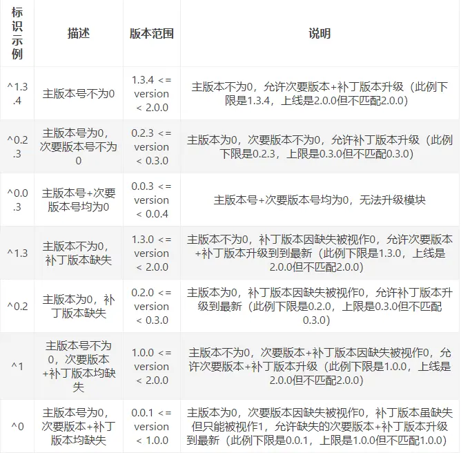

## package.json文件详解


#### 1、package.json属性说明

```json
{
    "name": "hello world", // 项目名称
    "version": "0.0.1", // 版本号：大版本.次要版本.小版本
    "author": "张三",
    "description": "第一个node.js程序",
    "keywords":["node.js","javascript"], // 关键词，有助于 npm search 发现
    "repository": { // 存储库，指定代码所在位置（如果git repo在GitHub上，那么该npm docs 命令将能够找到文件位置。）
        "type": "git",
        "url": "https://path/to/url"
    },
    "license":"MIT", // 指定包许可证，详细可见[SPDX许可证ID的完整列表](https://spdx.org/licenses/)
    "engines": {"node": "0.10.x"}, // 指定该模块运行的平台，可以指定 node 版本、npm 版本等
    "bugs":{"url":"http://path/to/bug","email":"bug@example.com"}, // 项目问题跟踪器的URL和应报告问题的电子邮件地址。
    "contributors":[{"name":"李四","email":"lisi@example.com"}], //指定贡献者
    "bin": { // 假如你的项目是一个 npm 包，用户全局安装， 我们就可以在命令行中执行这个文件， 本地安装我们可以在当前工程目录的命令行中执行该文件
        "webpack": "./bin/webpack.js"
    },
    "main": "lib/webpack.js", // 用来指定加载的入口文件。假如你的项目是一个 npm 包，当用户安装你的包后，require('my-module') 返回的是 main 字段中所列出文件的 module.exports 属性。当不指定main 字段时，默认值是模块根目录下面的 index.js 文件
    "config" : { "port" : "8080" }, // 用于添加命令行的环境变量（用户在运行 scripts 命令时，就默认在脚本文件中添加 process.env.npm_package_config_port，用户可以通过 npm config set foo:port 80 命令更改这个值）
    "scripts": { // 用于列出在运行 npm run 时将要执行的小型 js 脚本
        "start": "node index.js"
    },
    "peerDependencies": { // 指定项目安装必须一起安装的模块及其版本号，（注意：从 npm 3.0 开始，peerDependencies不会再默认安装）
        "chai": "1.x"
    },
    "dependencies": { // 指定项目运行所依赖的模块
        "express": "latest",
        "mongoose": "~3.8.3",
        "handlebars-runtime": "~1.0.12",
        "express3-handlebars": "~0.5.0",
        "MD5": "~1.2.0"
    },
    "devDependencies": { // 指定项目开发所需要的模块
        "bower": "~1.2.8",
        "grunt": "~0.4.1",
        "grunt-contrib-concat": "~0.3.0",
        "grunt-contrib-jshint": "~0.7.2",
        "grunt-contrib-uglify": "~0.2.7",
        "grunt-contrib-clean": "~0.5.0",
        "browserify": "2.36.1",
        "grunt-browserify": "~1.3.0",
    },
    "browser": { // 指定该模板供浏览器使用的版本
        "tipso": "./node_modules/tipso/src/tipso.js"
    },
    "preferGlobal": true, // 表示当用户不将该模块安装为全局模块时（即不用–global参数），要不要显示警告，表示该模块的本意就是安装为全局模块。
}
```


#### 2、版本说明

npm模块的完整的版本号一般是【主版本 . 次要版本 . 补丁版本】，一般情况下，次要版本号发生改变的话，表示程序有重大更新。

- 指定版本：比如1.2.2，遵循“大版本.次要版本.小版本”的格式规定，安装时只安装指定版本。

- 波浪号（tilde）+指定版本：比如~1.2.2，表示安装1.2.x的最新版本（不低于1.2.2），但是不安装1.3.x，也就是说安装时不改变大版本号和次要版本号。

  

- 插入号（caret）+指定版本：比如ˆ1.2.2，表示安装1.x.x的最新版本（不低于1.2.2），但是不安装2.x.x，也就是说安装时不改变大版本号。需要注意的是，如果大版本号为0，则插入号的行为与波浪号相同，这是因为此时处于开发阶段，即使是次要版本号变动，也可能带来程序的不兼容。

  


- latest：安装最新版本。