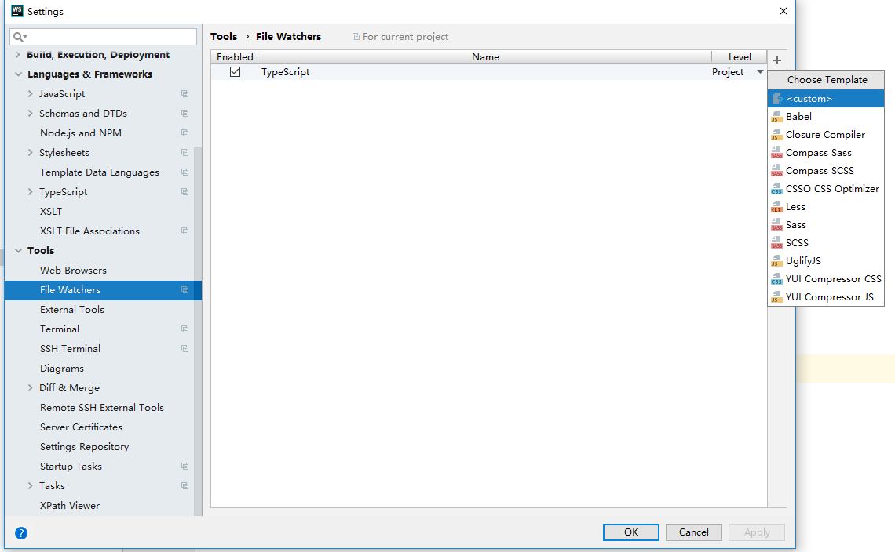
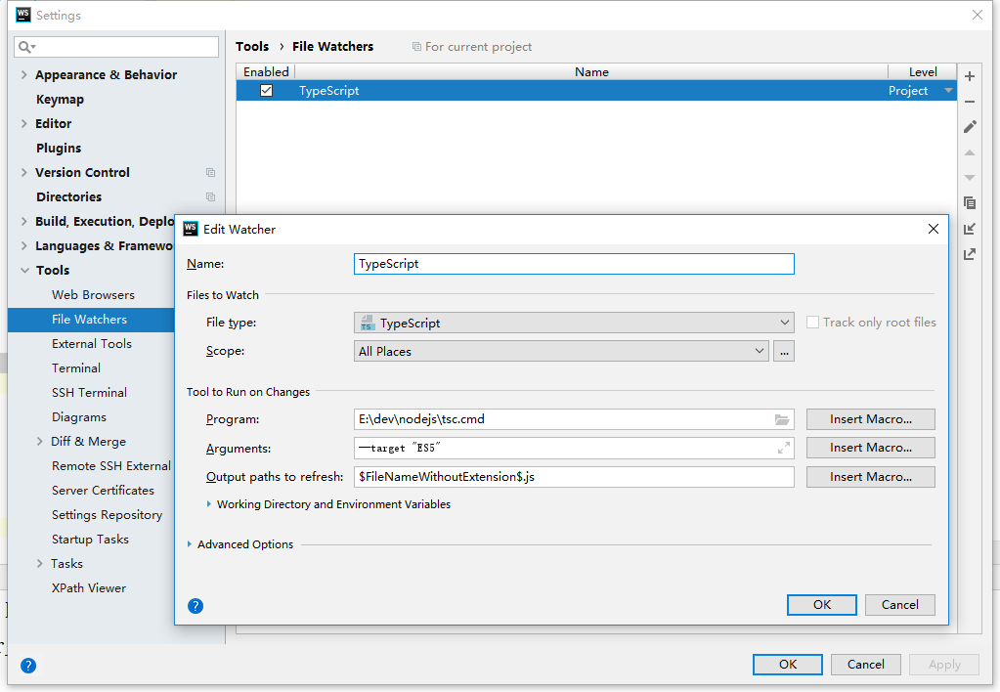

## webstorm配置自动编译.ts文件


- 在项目根目录，使用如下命令生成一个tsconfig.json文件

  ```shell
  tsc --init
  ```

​		如果后续修改了tsconfig.json需要重启webstorm才能生效！


- 打开WebStorm，找到File->Setting->File Watchers，默认情况下是空的，点击右侧的“+”号，选择<custom>：

  (如果执行上面过程的时候webstorm是打开的，那么这里要关闭重新打开一次)

  

  新建Watcher，名字为TypeScript，File type 选择“TypeScript”，Program为nodejs下tsc.cmd文件，Arguments为--target "ES5"，Output paths to refresh 为 $FileNameWithoutExtension$.js，点击“ok”按钮。如下图所示：

  

  3.选中“TypeScript”前面的“Enabled”，点击“ok”。

  


- 然后每次编辑完.ts文件，保存后会自动编译生成.js文件