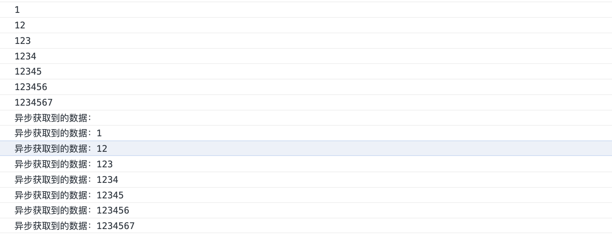
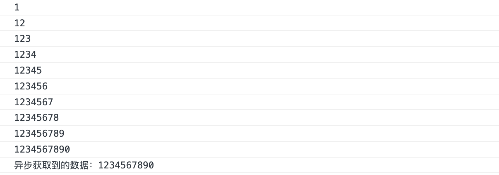

## watchEffect的使用


watchEffect追踪哪个数据，被追踪的数据一旦变更，就会触发watchEffect的执行


- 追踪普通的响应式数据

  ```vue
  <template>
    index
    <br />
    {{a}}
  </template>
  
  <script>
  
  import {ref, watchEffect} from 'vue'
  
  export default {
  
    //入口
    setup() {
  
      const a = ref(0) //定义了一个响应式的数据
  
      //默认页面第一次渲染已经
      watchEffect(()=>{
        
        //watchEffect但凡使用了a，哪怕是输出，就已经自动追踪了a，一旦a发生了数据改变，就会触发watchEffect的执行。
        console.log(a.value)
      })
  
      //a数据发生了改变，就会触发watchEffect的改变
      a.value = 1
  
      return {
        a
      }
  
    }
  }
  </script>
  
  
  ```

- 追踪响应式对象数据

  ```vue
  <template>
    index
    <br />
    {{a.name}}
  </template>
  
  <script>
  
  import {ref, watchEffect, reactive} from 'vue'
  
  export default {
  
    //入口
    setup() {
  
      const a = reactive({
        name: "tangwei",
        age: 32
      })
  
      watchEffect(()=>{
        console.log(a.name)
      })
  
      a.name = "litong"
  
      return {
        a
      }
    }
  }
  </script>
  
  
  ```

- 手动中断追踪

  ```vue
  <template>
    index
    <br />
  </template>
  
  <script>
  
  import {ref, watchEffect, reactive} from 'vue'
  
  export default {
  
    //入口
    setup() {
  
      const a = reactive({
        name: "tangwei",
        age: 32
      })
  
      const stop = watchEffect(()=>{
        console.log(a.name)
      })
  
      setTimeout(()=>{
        a.name = "litong"
      },1000)
  
      setTimeout(()=>{
        a.name = "tangxinhe"
      },2000)
  
      setTimeout(()=>{
        a.name = "tangxinyu"
      },3000)
  
      setTimeout(()=>{
        stop() //手动关闭追踪
      },4000)
  
  
  
      setTimeout(()=>{
        a.name = "xxx"
      },5000)
  
      return {
        a
      }
    }
  }
  </script>
  
  
  ```

  为什么每次更改都使用setTimeout呢？因为watchEffect默认已经开启了清理副作用了！连续写a.name=xxx会被清理副作用，只保留最后一次的结果。

- 清理副作用

  什么叫副作用：比如我有一个输入框，每次用户输入一个字符就会触发ajax去后台调用数据，然后以下拉的形式出现在输入框的下边，那么现在监听输入框的输入，每次有变化就去触发ajax，但是每次触发ajax后都需要网络请求，那么用户输入了10个字符就会请求10次，那么下拉的数据以哪一次请求的ajax为准呢？

  清理副作用就是，即便是用户输入了10次，都以最后一次的ajax请求为准，另外9次被清理掉。

  没清理之前的代码，如下：

  ```vue
  <template>
    index
    <br />
    <input type="text" v-model="words">
    {{words}}
  </template>
  
  <script>
  
  import {ref, watchEffect, reactive} from 'vue'
  
  export default {
  
    //入口
    setup() {
  
      const words = ref("")
  
      const doajax = (val)=>{
        return setTimeout(()=>{
            console.log("异步获取到的数据：" + val)
        },1000)
      }
  
      watchEffect(()=>{
        const timer = doajax(words.value)
        console.log(words.value)
  
  
      })
  
      return {
        words
      }
  
    }
  }
  </script>
  
  
  ```

  当在输入框快速输入的时候，终端打印如下的样子：

  

  使用清理副作用之后的代码，如下：

  ```vue
  <template>
    index
    <br />
    <input type="text" v-model="words">
    {{words}}
  </template>
  
  <script>
  
  import {ref, watchEffect, reactive} from 'vue'
  
  export default {
  
    //入口
    setup() {
  
      const words = ref("")
  
      const doajax = (val)=>{
        return setTimeout(()=>{
            console.log("异步获取到的数据：" + val)
        },1000)
      }
  
      watchEffect((onInvalidate)=>{
        const timer = doajax(words.value)
        console.log(words.value)
  
        onInvalidate(()=>{ //每次监听到变化都会执行一次清理副作用，以最后一次的为准
          clearTimeout(timer)
        })
      })
  
      return {
        words
      }
  
    }
  }
  </script>
  
  
  ```

  当在输入框快速输入的时候，终端打印如下的样子：

  