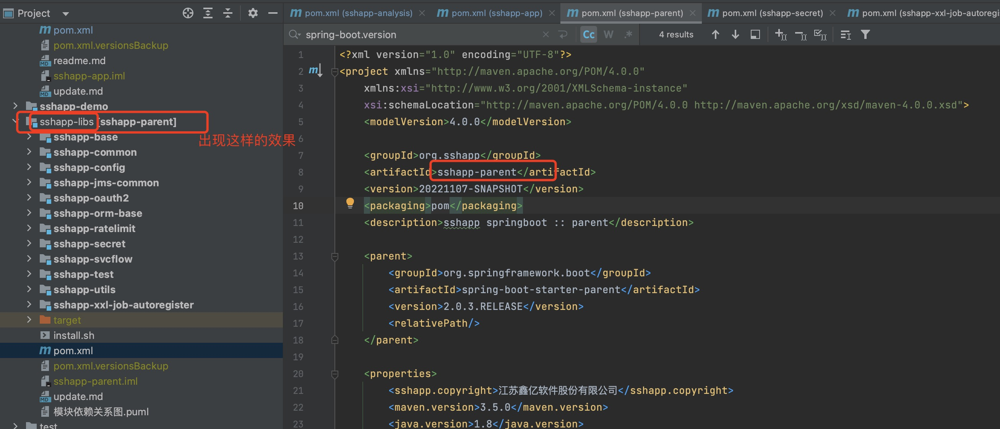

## 基本标签


#### 1、使用范例

```xml
<project xmlns="http://maven.apache.org/POM/4.0.0"
  xmlns:xsi="http://www.w3.org/2001/XMLSchema-instance"
  xsi:schemaLocation="http://maven.apache.org/POM/4.0.0
                      http://maven.apache.org/xsd/maven-4.0.0.xsd">
  <modelVersion>4.0.0</modelVersion>
  <groupId>org.codehaus.mojo</groupId>
  <artifactId>my-project</artifactId>
  <version>1.0</version>
  <packaging>war</packaging>
  
  
  ......
  
  
</project>
```


#### 2、范例详述

1. <project>标签，是pom.xml 中描述符的根，后续所讲的所有标签都需要写在该标签内部。该标签中的`xmlns`等属性写法都是固定的，这儿不需要展开。

2. <modelVersion>标签，是指定 pom.xml 符合哪个版本的描述符。固定为4.0.0即可，不用改。

3. <groupId>标签，是当前项目的团体、组织的标识符。一般对应着项目的包结构。

4. <artifactId>标签，是当前项目的唯一标识符。填写在该标签中的字符串，不要包含点号(.)。当项目名称与<artifactId>标签值不一致的时候，会有如下效果

   

5. <version>标签，声明项目的版本。在版本管理时候可以使用几个特殊的字符串 SNAPSHOT、LATEST、RELEASE。比如1.0-SNAPSHOT。

   1. SNAPSHOT：代表当前版本为快照版本。这个版本一般用于开发过程中，表示不稳定的版本。
   2. LATEST：代表当前版本为最新发布版本。
   3. RELEASE：代表当前版本为最后一个发布版，表示稳定的版本。

6. <packaging>标签，项目的类型，描述了项目打包后的输出，默认是 jar。所以该标签默认是可以省略的。常见的输出类型为pom, jar,war。

   1. war，指定项目打成war包
   2. jar，指定项目打成jar包
   3. pom，如果该项目为一个父项目，则一定要配置为这个。或者为了聚合项目也一定要配置这个。