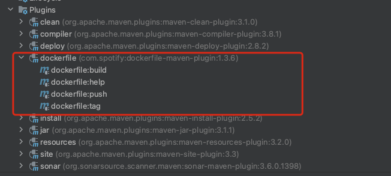

## 插件使用中lifecycle, phase 和 goal的概念


#### 什么是lifecycle

其实就是maven的生命周期


#### 什么是goal

我们在项目中引入`dockerfile-maven-plugin`看下效果



其中的build、help、push、tag就是goal


#### 什么是phase

指定将使用的插件绑定到maven的哪个生命周期上，在运行maven生命周期命令的时候，也就会运行指定插件的goal了。


#### 举例说明

我们引入如下插件

```xml
    <build>
        <plugins>
            <plugin>
                <groupId>org.springframework.boot</groupId>
                <artifactId>spring-boot-maven-plugin</artifactId>
            </plugin>
            <!-- 使用Maven插件直接将应用打包为一个Docker镜像 -->
            <plugin>
                <groupId>com.spotify</groupId>
                <artifactId>dockerfile-maven-plugin</artifactId>
                <version>1.3.6</version>
                <configuration>
                    <useMavenSettingsForAuth>true</useMavenSettingsForAuth>
                    <repository>${docker.image.prefix}/${docker.image.midfix}/${project.artifactId}</repository>
                    <tag>1.0</tag>
                    <buildArgs>
                        <JAR_FILE>xxxx.jar</JAR_FILE>
                    </buildArgs>
                    <useMavenSettingsForAuth>true</useMavenSettingsForAuth>
                </configuration>
                <!-- 镜像构建完毕之后自动推送到仓库 -->
                <executions>
                    <execution>
                        <id>default</id>
                        <phase>install</phase> <!-- 绑定到生命周期的install阶段 -->
                        <goals>
                            <goal>build</goal>
                            <goal>push</goal>
                        </goals>
                    </execution>
                </executions>
            </plugin>
        </plugins>
    </build>

```

那么就完成了如下绑定


当运行maven install的时候，就会执行dockerfile插件的 build和push操作