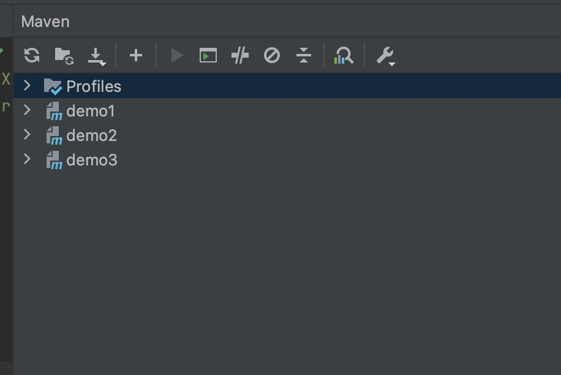
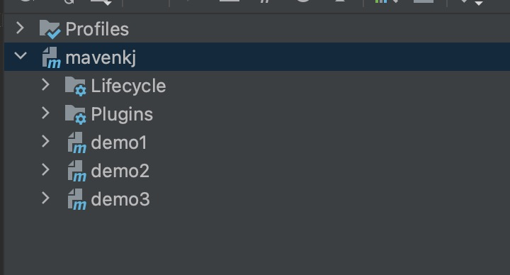

## 操作步骤

> 这儿以springboot项目为例


#### 1、创建一个maven-kj的文件夹


#### 2、IDEA打开文件夹修改项目的java版本

点击菜单栏 File >> Project Strcture 中Project 选择Project SDK的版本、Project language level


#### 3、创建多个子module

在项目根目录右击 New >> Module 新增module，可以循环操作多次分别创建出demo1、demo2、demo3的springboot项目


#### 4、项目根目录创建pom.xml文件

文件原始内容如下：

```xml
<?xml version="1.0" encoding="UTF-8"?>
<project xmlns="http://maven.apache.org/POM/4.0.0" xmlns:xsi="http://www.w3.org/2001/XMLSchema-instance"
         xsi:schemaLocation="http://maven.apache.org/POM/4.0.0 https://maven.apache.org/xsd/maven-4.0.0.xsd">
    <modelVersion>4.0.0</modelVersion>
    <groupId></groupId>
    <artifactId></artifactId>
    <version></version>
    <name></name>
    <description></description>
  
  
  
</project>
```

然后往pom.xml中添加如下代码：

```xml
<packaging>pom</packaging> <!-- 没有实际意义，只是用来聚合工程 -->
<modules>
  <module>demo1</module>
  <module>demo2</module>
  <module>demo3</module>
</modules>
```


#### 5、打开右侧的Maven视图窗口

打开菜单 > View > Tool Windows > Maven  就能打开maven视图窗口，此时，maven的整体结构应该入下图所示：



点击上图的 “+” 号，把我们在第4步新建的pom.xml文件加进来，加进来之后的效果如下图所示



注意：新版本idea，不会显示root标识了！


#### 6、验证多模块项目是否创建成功！

只需要在根项目的pom.xml文件上，运行mvn clean等命令，看看子module是否同步运行这些命令即可！如果，子module都同步运行，则证明多module的项目搭建成功！

