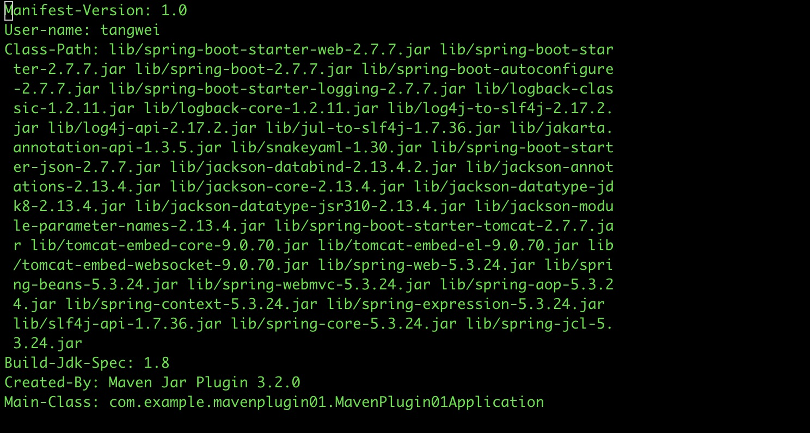

## 使用maven-jar-plugin配合maven-dependency-plugin的方式


#### 1、新建一个springboot项目


#### 2、去掉spring-boot-maven-plugin插件


#### 3、按文档写的添加上maven-jar-plugin插件、maven-dependency-plugin插件

```xml
<plugin>
  <groupId>org.apache.maven.plugins</groupId>
  <artifactId>maven-jar-plugin</artifactId>
  <version>3.2.0</version>
  <configuration>
    <archive>
      <!-- 修改manifest的配置 -->
      <manifest>
        <!-- 指定项目启动的入口class -->
        <mainClass>com.example.mavenplugin01.MavenPlugin01Application</mainClass>
        <!-- 是否在manifest文件中添加classpath。默认为false。如果为true，则会在manifest文件中添加classpath，这样在启动的时候就不用再手动指定classpath了, classpath是指项目所有依赖的jar所在的路径 -->
        <addClasspath>true</addClasspath>
        <!-- classpath的前缀，这儿配置是lib，则项目所有的依赖jar包都在lib这个目录中 -->
        <classpathPrefix>lib/</classpathPrefix>
        <addDefaultImplementationEntries>false</addDefaultImplementationEntries>
        <addDefaultSpecificationEntries>false</addDefaultSpecificationEntries>
      </manifest>

      <!-- manifestEntries的作用是给manifest文件添加键值对 -->
      <manifestEntries>
        <!-- 标签为key，内容为value -->
        <User-name>tangwei</User-name>
      </manifestEntries>
      <addMavenDescriptor>false</addMavenDescriptor>
    </archive>
    <!-- 需要添加到jar包中的文件。这儿是把当前项目下的所有文件都加进来的 -->
    <includes>
      <include>**/mavenplugin01/**</include>
    </includes>
  </configuration>
</plugin>
<plugin>
  <groupId>org.apache.maven.plugins</groupId>
  <artifactId>maven-dependency-plugin</artifactId>
  <version>3.2.0</version>
  <executions>
    <execution>
      <!-- id可以随便配置 -->
      <id>lib-copy-dependencies</id>
      <!-- 绑定maven的哪个生命周期 -->
      <phase>package</phase>
      <!--  -->
      <goals>
        <goal>copy-dependencies</goal>
      </goals>
      <configuration>
        <excludeArtifactIds>tools</excludeArtifactIds>
        <!-- 指定了要将所依赖的jar包copy到哪个目录, 要与maven-jar-plugin中的classpathPrefix一致-->
        <outputDirectory>${project.build.directory}/lib</outputDirectory>
        <overWriteReleases>false</overWriteReleases>
        <overWriteSnapshots>false</overWriteSnapshots>
        <overWriteIfNewer>true</overWriteIfNewer>
      </configuration>
    </execution>
  </executions>
</plugin>
```


#### 4、测试`includes`标签的作用

1. 到此直接运行`maven clean package` 命令，编辑jar包是否如图

   

2. 如果我创建一个controller的package，并新增一个IndexController，其中有个get方法，那么运行`maven clean package` 命令，编辑jar包是否如图

   

3. 此时运行项目 java -jar xxxxxx.jar，调用IndexController中的方法，是可以调用通的！

4. 如果我在pom.xml的`maven-jar-plugin`的配置中去掉<includes>标签，即如下代码

   ```xml
   <!-- 需要添加到jar包中的文件。这儿是把当前项目下的所有文件都加进来的 -->
   <includes>
     <include>**/mavenplugin01/**</include>
   </includes>
   ```

   再重新运行`maven clean package`进行项目打包，打包之后编辑jar入下图所示

   

   同时运行jar包，也是没有问题的！<font color="red">证明<includes>标签默认是可以缺省的！</font>

#### 5、我们继续编辑jar包中的META-INF/MANIFEST.MF文件

1. 打开发现是如下图的样子

   

   User-name是在配置maven-jar-plugin时使用<manifestEntries>中配置的。

   Class-Path使用<addClasspath>true</addClasspath>配置的，<font color="red">将项目所需依赖的第三方jar包都列在这儿了！注意：测试使用的包如junit相关包，是不用放到classpath中的！</font>

   Class-Path的每个jar包都是以lib/开发，就是通过<classpathPrefix>lib/</classpathPrefix>配置的。

   Main-Class是在配置maven-jar-plugin时使用<mainClass>配置的。

   

   所有的jar包都被maven-dependency-plugin插件的<outputDirectory>标签配置，整理到了项目打包的target目录下的指定目录下了！


