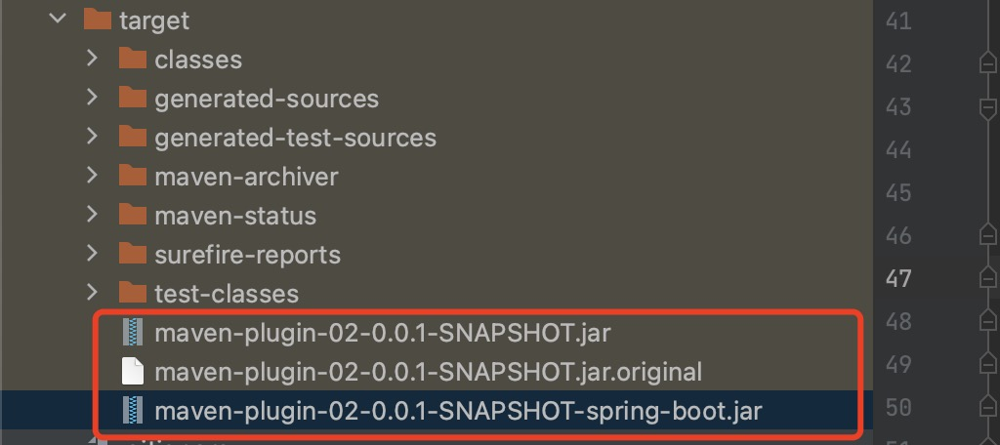

## 操作步骤


#### 1、新建一个springboot项目


#### 2、按文档写的添加上maven-jar-plugin插件、spring-boot-maven-plugin插件

因为springboot项目 默认已经带了maven-jar-plugin插件了，所以 这儿可以不配置maven-jar-plugin插件。

而且也默认带了spring-boot-maven-plugin插件了，不过我们要修改spring-boot-maven-plugin插件的用法。对不同的情况做测试


#### 3、测试所有情况

1. 不使用spring-boot-maven-plugin的时候，打出来的jar包如下图

   

   MANITEST.MF中的内容如下图

   

   会发现，这个打出来的包，跟我们自己使用maven-jar-plugin打出来的非常像！其实它就是maven-jar-plugin打出来的！

   <font color="red">记住一点，这样打出来的包，是没有第三方jar包的，是用来被其它项目引入使用的！</font>

2. 当使用spring-boot默认的maven-jar-plugin和spring-boot-maven-plugin的时候，打出来的jar包如下图

   

   

   咱们自己编写的类和配置文件被放到了BOOT-INF/classes中了，第三方jar包在BOOT-INF/lib中！org目录中，是spring-boot-maven-plugin在打包的过程中私自引入的spring-boot-loader依赖的相关class文件。其中JarLauncher是整个springboot项目的入口类！

   

   MANIFEST.MF文件内容如下图

   

   有个很明显的区别就是，第三方jar包都已经被包含进来了！存放到了BOOT-INF/lib中了！

   在MANIFEST.MF文件中，`Spring-Boot-Classes` 指定存放项目CLASS_PATH下的内容，包括应用代码和配置文件（比如application.yml等）。`Spring-Boot-Lib` 是指定存放应用依赖的jar包，具体参照Maven的pom.xml中的依赖内容。

   所以：<font color="red">Spring-Boot-Classes路径 + Spring-Boot-Lib路径 = classpath路径</font>

   在MANIFEST.MF文件中，`Main-Class`是做为项目的启动类。JarLauncher的依赖，在pom上并没有添加，是spring-boot-maven-plugin插件打包时添加。`Start-Class`是我们项目的入口类。

   在MANIFEST.MF文件中，`Spring-Boot-Classpath-Index` 指向一个文件，里面记录的都是第三方jar包的路径，基本上内容为"BOOT-INF/LIB/XXXXX.jar"这样。

   

3. 修改spring-boot-maven-plugin插件的配置，修改成如下的样子，测试`<goal>repackage</goal>`的作用

   ```xml
   <plugin>
     <groupId>org.springframework.boot</groupId>
     <artifactId>spring-boot-maven-plugin</artifactId>
     <executions>
       <execution>
         <goals>
           <!-- 一定要写成repackage，看下面的说明 -->
           <goal>repackage</goal>
         </goals>
         <configuration>
   
   
         </configuration>
       </execution>
     </executions>
   </plugin>
   ```

   打出来的jar包，跟上面是一致的，证明`<goal>repackage</goal>`就是默认值！

4. 修改spring-boot-maven-plugin插件的配置，修改成如下的样子，测试`<classifier>spring-boot</classifier>`的作用

   ```xml
   <plugin>
     <groupId>org.springframework.boot</groupId>
     <artifactId>spring-boot-maven-plugin</artifactId>
     <executions>
       <execution>
         <goals>
           <!-- 一定要写成repackage，看下面的说明 -->
           <goal>repackage</goal>
         </goals>
         <configuration>
           <!-- 配置了classifier，那么打出来的包一个是可执行的包，一个是可依赖的包 -->
           <classifier>spring-boot</classifier>
         </configuration>
       </execution>
     </executions>
   </plugin>
   ```

   打出来，确实是会有一个可执行包，一个依赖包

   

​		

#### 4、springboot项目启动过程

Java -jar启动项目，找到jar包中MANIFEST.MF文件的Main-Class指定的入口文件，即jar包中的org目录下的......JarLauncher.class文件。随后JarLauncher会创建一个LaunchedURLClassLoader来加载BOOT-INF/classes目录以及`/BOOT-INF/lib`下面的jar，并利用反射获取`Start-class`指定类中的main(Stirng[])方法并调用。