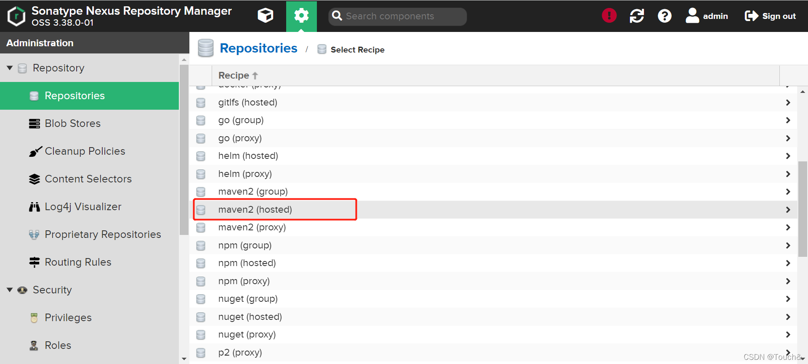
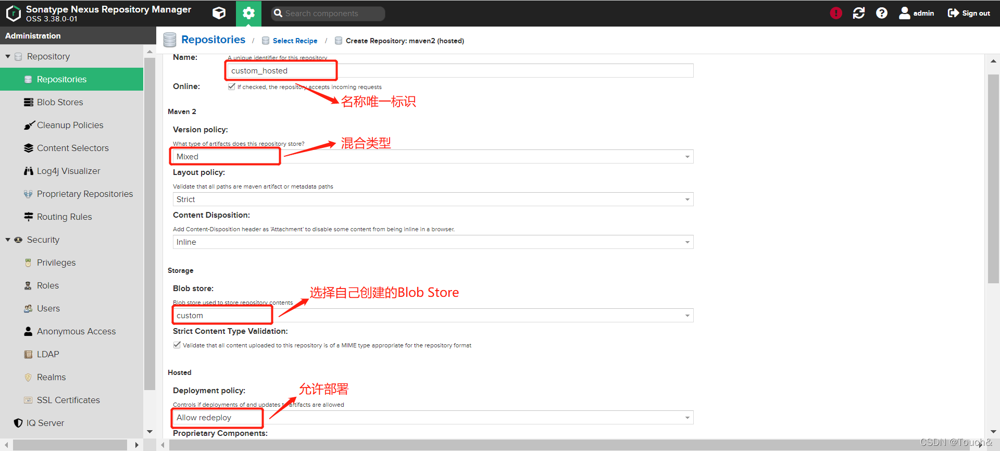

## 创建本地仓库

> 本地仓库有三种类型：
>
> 1. Releases，发行版
> 2. Snapshot，快照版
> 3. Mixed，发行版和快照版混合在一个仓库

过程如下：

Deployment policy有三个可选值：

1. Allow redeploy：允许同一个版本号下重复提交代码, nexus以时间区分
2. Disable redeploy：不允许同一个版本号下重复提交代码
3. Read-Only：不允许提交任何版本

然后点击提交，创建就完成了！