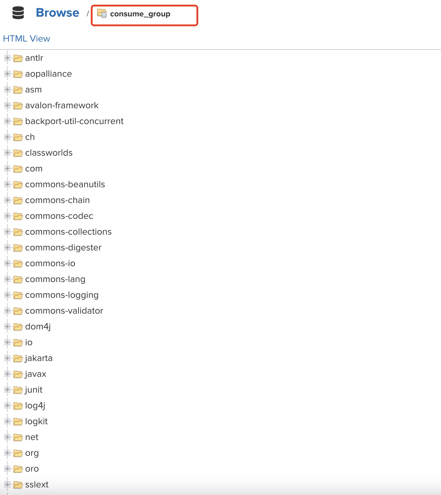

## 代理仓库+自定义中央仓库的使用

> 首先，我们前面配置的consume_proxy已经是一个代理仓库了，同时我们把consume_proxy、consume_hosted组合在一起形成了consume_group仓库了！
>
> 我们要明白，maven默认一定自带一个profile，其中repository的id为central，repository配置的是指向https://repo.maven.apache.org/maven2这个地主的中央仓库


一个项目拉取依赖的过程：本地仓库 > 私有仓库 > 中央仓库。只有本地仓库和私有仓库没有依赖才会去中央仓库拉。

那么，如果配置我们的maven，去拦截repository的id为central的所有请求，从我们的代理仓库走，那么我们的代理仓库会按照我们配置代理仓库的顺序一次查询有没有相关依赖


如果有就直接返回，没有就会去中央仓库拉取，然后会在代理仓库中保留一份拉取的依赖，下次拉取相同的依赖就不用再去中央仓库拉了！


步骤如下：

- 去setting.xml文件中，配置一个拦截中央仓库的请求的mirror，将请求指向到我们代理仓库的地址

  > 注意：mirror只能配置一个，配置多个，只有第一个有效

  ```xml
  <mirror>
    <id>dsynexus</id>
    <mirrorOf>central</mirrorOf>
    <name>dsy</name>
    <url>http://47.114.152.124:8081/repository/consume_group/</url>
  </mirror>
  ```

  

- 测试使用

  在项目中查看项目依赖，去本地仓库删除相关依赖，然后使用`mvn clean package -Dmaven.test.skip=true`运行打包命令，等命令运行完成，查看maven私库中的代理仓库中是否有了从中央仓库拉回来的依赖！

  