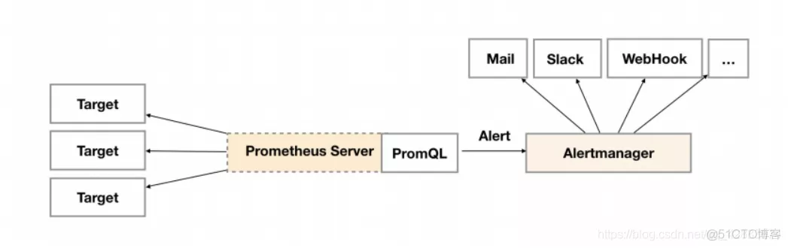

## 告警原理并配置告警测试


#### 1、告警原理



#### 2、在prometheus配置好一个告警规则之后，在prometheus的管理界面中的Alerts中可以查看到这个告警。


其中， Inactive表示非活动状态，表示正在监控，但是还未有任何警报触发。Pending表示这个警报已经被触发,如果在指定时间内没有恢复则转换为Firing。Firing它将按照配置将警报的发送给所有接收者(alertmanager)


#### 3、配置一个简单的告警测试

- 修改prometheus的prometheus.yml文件

  ```yaml
  global:
  
  ...       #添加
  alerting:
    alertmanagers:
    - static_configs:
      - targets:       #这里指定将告警发送到那里，发送到alertmanager
        - 192.168.1.20:9093     #我们刚部署的集群
        - 192.168.1.21:9093
        - 192.168.1.22:9093
  rule_files: #添加告警规则的匹配文件，告警规则就放在这个文件中
    - "rules/*.yml"
  ```

- 配置告警规则文件

  ```yaml
  groups:
  - name: jvm_alert    #组名
    rules:
    - alert: "jvm内存告警"   #告警规则名称
      expr: up{instance="192.168.4.251:11011",job="jvm_exporter"} != 1   #根据指标来匹配，当为true时触发
      for: 10s      #当上面的语句触发后，10s内没有恢复，则告警进入pending状态
      labels:   #自定义标签，允许在该告警上附件标签
        severity: warning
      annotations: #附加信息，通常用于描述告警信息
        summary: "发出的告警标题！{{ $labels.alertname }}"
        description: "发出的告警内容！{{ $labels.instance }}"
  ```

- 检查prometheus的配置文件语法是否正确

  ```shell
  promtool check config /xxx/xxx/prometheus.yml 
  ```

- 重启服务

  ```shell
  systemctl restart prometheus
  ```

  