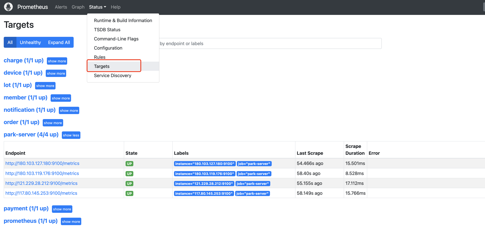

## 添加监控对象

> 部署好prometheus之后，点击 "Status > Targets" 之后，会有一个`[http://localhost:9090/metrics]`的监控。为什么会默认就监控自己了呢？
>
> 因为：在prometheus的配置文件prometheus.yml中已经配置好了！
>
> ```yaml
> global:
>   scrape_interval: 15s   #全局的抓取间隔时间,优先级低于子配置中的相同配置
> 
> scrape_configs:             #抓取操作
>   - job_name: 'prometheus'
>     metrics_path: /metrics      #抓取对象的路径,默认/metrics 可不写
>     scrape_interval: 5s         #抓取间隔时间，优先级比全局高
>     static_configs:             #静态抓取目标
>       - targets: ['localhost:9090'] #如果有多个target，可以写成 ['localhost:9090', 'localhost:9091', ......]
> ```
>
> 除了上面的配置，我们还可以使用“服务发现的方式”去配置监控目标，参考：https://blog.51cto.com/u_14205795/4561396
>
> 
>
> 查看已经生效的job和每个job底下的targets
>
> 

 


所以，想要让prometheus监控目标，只要暴露出prometheus能读懂的数据接口，到prometheus的配置文件中加上就可以了！

修改了配置文件，只需要重载下配置文件

```shell
curl -X POST http://IP:9090/-/reload
```


