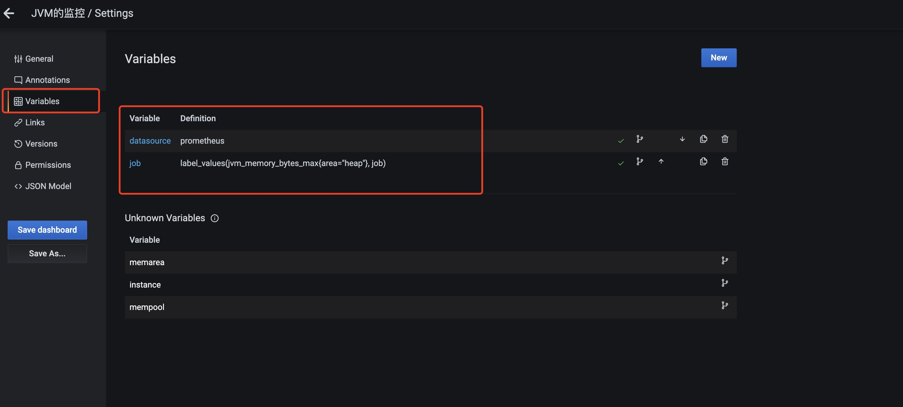
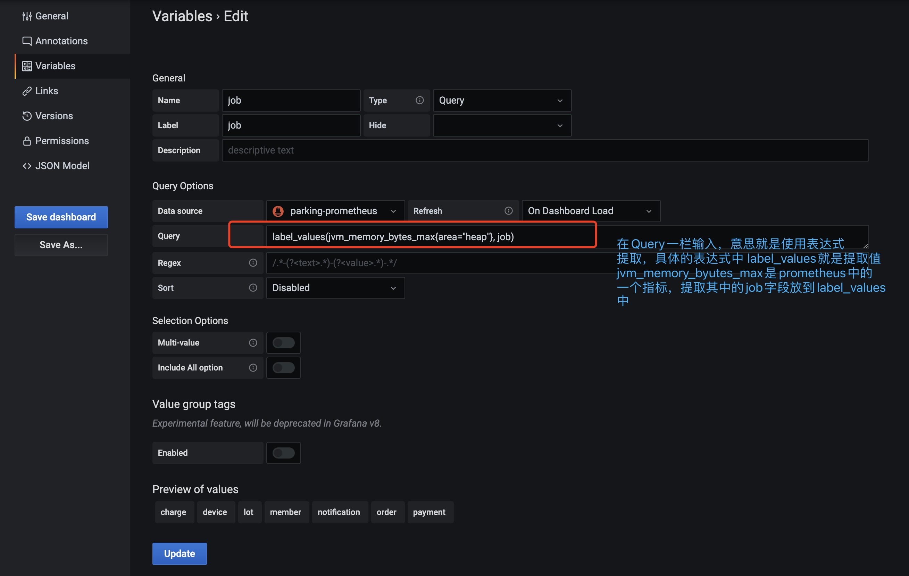

## 使用dashboard

> 在配置好了grafana的数据源之后，就需要找合适的dashboard去展示数据源中的数据了，那么这时候就需要用dashboard了。

dashboard在grafana中有独立的管理界面，我们一般选择Import别人的，那么别人的dashboard去哪里寻找呢？

寻找地址：https://grafana.com/grafana/dashboards/

dashboard的数据流转过程

针对每个图表，都是可以进行编辑的，具体的编辑页面的功能，如下：

那么具体有哪些指标可以提取呢？下面就要去详细学习下指标！

编辑顶上的下拉菜单时，下拉的参数是如何提取的？

然后点击需要编辑的变量进去编辑

最终效果

